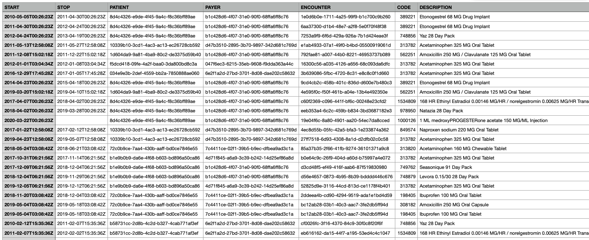
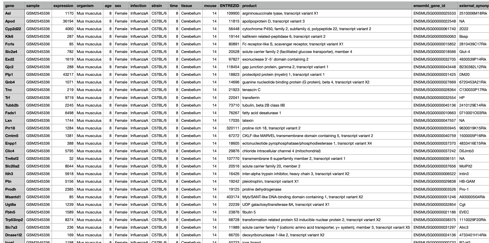
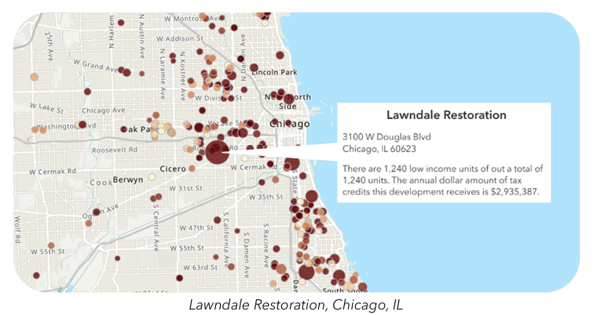
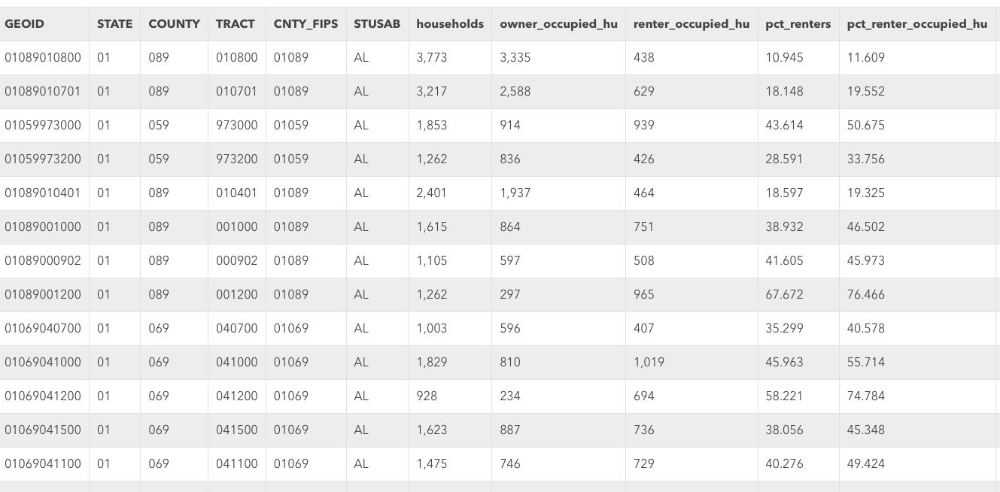

# 1.1 Health Data Sources

In the dynamic landscape of digital health, a multitude of data sources have arisen, each offering a unique lens into the realm of healthcare:

## Traditional Sources

### Electronic Health Records (EHRs) and Personal Health Records (PHRs)

These digital counterparts to traditional paper records are the backbone of modern healthcare. EHRs capture comprehensive patient health histories, treatment plans, and diagnoses within clinical settings, while PHRs empower individuals to manage their health data, facilitating informed decision-making and collaborative care. Prominent players in this domain include companies like Epic Systems, Cerner Corporation, and Allscripts.

In the below example dataset, which is a synthetic set of EMR-like data of what should be expected to be producted from a medications section. This was produced via [Synthea](https://synthetichealth.github.io/synthea/). We would expect to see columns (features) rleated to when the medicaiton was started (`start`) and stopped (`stop`), a unique patient identifier (`patient`), the patients insurance provider (`payer`), associated encounter (`encounter`), and associated NDC (national drug code) (`code`) and medication descriptions (`description`). We would likely also see many other related fields. 

### Claims Data

Claims data from insurance providers offer valuable information about healthcare utilization, treatments, and costs. This data source provides insights into the services individuals receive, prescriptions they are prescribed, and the financial aspects of healthcare delivery. Analyzing claims data can help identify trends in healthcare utilization and inform decisions about resource allocation.

In the below example dataset from [CMS - Synthetic Claims Data - Inpatient - Fee-For-Service Claims](https://data.cms.gov/collection/synthetic-medicare-enrollment-fee-for-service-claims-and-prescription-drug-event). In this example dataset below, which is also a synthetic dataset of CMS claims data, we see were are provided with a CSV file that has columns delenated by the ` | ` character. Claims data are highly specialized, and typically require a data dictionary to translate what the abbreviated column names are (e.g., what does BENE_ID stand for?). 

### Bioinformatics/Genetic Data

The emergence of '-omics' technologies, such as genomics, proteomics, and metabolomics, has unleashed a torrent of biological data. Companies like 23andMe and AncestryDNA offer direct-to-consumer genetic testing, enabling individuals to explore their ancestry, inherited traits, and potential genetic health risks. Large-scale research projects like the Human Genome Project and initiatives by the National Institutes of Health contribute to the growth of this data, fueling groundbreaking insights into our biology and diseases.

In the below example dataset from data published by [Blackmore et al. (2017)](https://www.ncbi.nlm.nih.gov/pmc/articles/PMC5544260/), The effect of upper-respiratory infection on transcriptomic changes in the CNS. The goal of the study was to determine the effect of an upper-respiratory infection on changes in RNA transcription occuring in the cerebellum and spinal cord post infection. Gender matched eight week old C57BL/6 mice were inoculated saline or with Influenza A by intranasal route and transcriptomic changes in the cerebellum and spinal cord tissues were evaluated by RNA-seq. 

## Non-Traditional

Beyond conventional sources, novel avenues for health data are emerging. These non-traditional data sources offer additional dimensions of understanding health and well-being:

### Internet of Things (IoT)/Sensor Devices

Smart home sensors, environmental monitors, and other IoT devices contribute data that can influence health outcomes and environmental impacts on health. Additionally, wearable health monitors and medical devices have ushered in an era of real-time health monitoring. Devices like Fitbit, Apple Watch, and continuous glucose monitors provide a continuous stream of physiological data, offering insights into activity levels, heart rate, sleep patterns, and more. These data sources have implications ranging from personal fitness tracking to managing chronic conditions like diabetes.

Example dataset: [Mobile App Data Collection Activities of Daily Living (ADLs) via a awit-mounted smarphone with inertial sensors](https://www.kaggle.com/datasets/uciml/human-activity-recognition-with-smartphones)

  

## Urban Planning Data 

Urban development and infrastructure data provide insights into the built environment's impact on health, including factors like air quality, access to green spaces, and walkability.

Example dataset: [HUD Dataset for Low Income Tax Credits](https://hub.arcgis.com/datasets/fedmaps::low-income-housing-tax-credit-properties/explore)

## Socioeconomic Indicators

Data related to income, education, employment, and other socioeconomic factors offer insights into how social determinants influence health disparities.

Example dataset: [HUD Dataset for Location Affordability Index](https://hudgis-hud.opendata.arcgis.com/datasets/HUD::location-affordability-index-v-1-0-1/explore)

## Satellite Imagery

Satellite data can reveal insights about environmental factors, natural disasters, and population density, all of which have implications for public health and emergency response.

Example dataset: [NASA Aerosol Index](https://www.earthdata.nasa.gov/learn/find-data/near-real-time/hazards-and-disasters/air-quality)

---

As the healthcare ecosystem continues to evolve, these diverse data sources intersect and intertwine, painting a comprehensive picture of individual and collective well-being. Understanding the nuances and potential of each data source is essential for harnessing the power of health informatics to its fullest extent.

The abundance of health data raises crucial questions about licensing, privacy, and ethical considerations. In the next subsection, we delve into the intricate landscape of health data ownership, sharing, and the ethical responsibilities that come with harnessing this invaluable resource.
