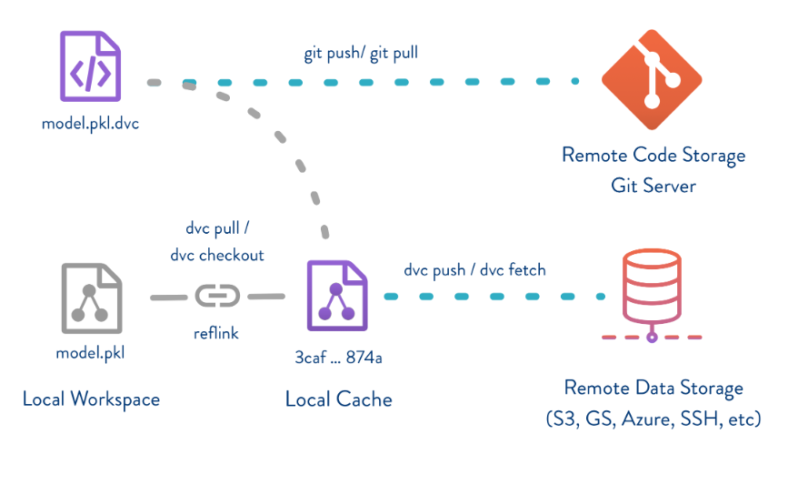

# 1.3 Data Provenance

Ensuring traceability of patient data is crucial for maintaining its integrity and validity, especially when decisions based on this data can impact patient care.

## Special Protections and Regulations for Health Data

Health data holds a unique position in the realm of data privacy due to its sensitive nature. Laws and regulations, such as the Health Insurance Portability and Accountability Act (HIPAA) in the United States, impose stringent requirements on the collection, storage, and handling of health-related information. One notable aspect is the retention period of health data, which varies across jurisdictions. For instance, HIPAA mandates that medical records be retained for at least six years from the date of creation or the date when it was last in effect, whereas certain states might have longer retention periods.

- **Example**: In California, the Medical Board of California requires patient records to be maintained for a minimum of seven years from the date of the last discharge.

- **Example**: In New York, healthcare providers must retain medical records for at least six years from the last patient encounter.

## Data Provenance in the Age of AI and Machine Learning

As artificial intelligence and machine learning become integral to healthcare diagnostics and decision-making, the importance of data provenance amplifies. Just as financial institutions must trace the lineage of financial transactions or credit assessments, healthcare organizations must ensure that the journey of patient data and the evolution of machine learning models are well-documented.

- **Accountability and Transparency**: Documenting the source of data, data preprocessing steps, model training methodologies, and hyperparameters becomes paramount. It ensures that outcomes can be traced back to specific versions of data and models, fostering accountability and transparency.

- **Regulatory Compliance and Audit Trails**: Similar to how banks and financial institutions are required to maintain records of financial transactions for regulatory compliance and audits, healthcare institutions will increasingly need to provide an audit trail of data and model versions used for diagnoses, treatments, and predictions.

## Emerging Data Provenance Technologies

In the evolving landscape of data provenance, various technologies are emerging to address the need for tracking the lineage of data and models. These technologies help maintain transparency, accountability, and trust in AI-powered clinical applications. Some examples include:

- **Git Large File Storage**: Just like Git is used for tracking code changes, tools like Git LFS (Large File Storage) can be employed to track large datasets used in AI models. [Visit Git LFS](https://git-lfs.com)

- **MLflow**: An open-source platform that manages the end-to-end machine learning lifecycle, including tracking experiments, packaging code, and sharing models. [Visit MLflow](https://mlflow.org)

- **Data Version Control (DVC)**: A version control system for data science and machine learning projects, allowing you to track changes to data, collaborate with others, and manage data pipelines. [Visit  DVC](https://dvc.org)

- **LakeFS**: A data lake management platform that provides version control for object storage systems like Amazon S3 and Google Cloud Storage. [Visit LakeFS](https://lakefs.io)

- **Pachyderm**: A data versioning and data lineage platform that enables reproducible data pipelines and end-to-end data lineage tracking. [Visit Pachyderm](https://www.pachyderm.com)

As an example, here is the workflow using DVC, which is very similar to git (github). In the below diagram, we can see that there is a traditional git workflow, which involves `git add .` followed by `git commit -m 'new code` then completed by `git push` to send those changes to a remote respository, with Github being a common example. Using DVC, there is a very similar workflow, but instead of adding and commiting changes to code that may exist within a python file or some other script, we are tracking changes to the data file. 

  
Image Source

  

    

        <a> MLOps Guide: https://mlops-guide.github.io/Versionamento/ </a>
    

  

In the rapidly evolving landscape of healthcare technology, establishing robust data provenance practices is not only a legal and ethical imperative but also a means to drive trust in AI-powered clinical applications.

