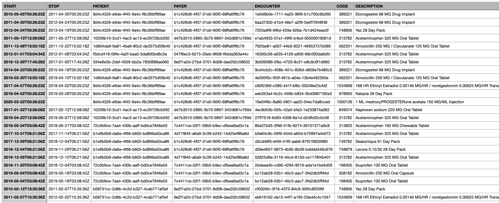
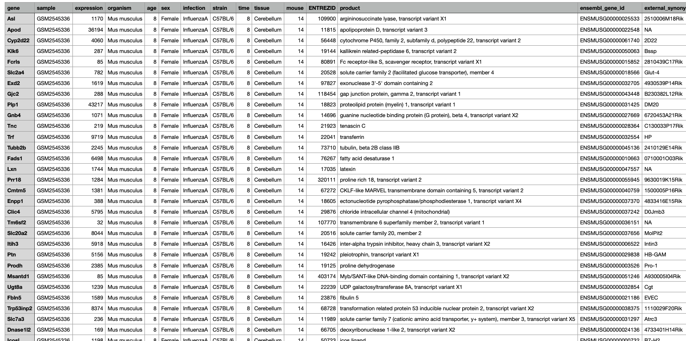
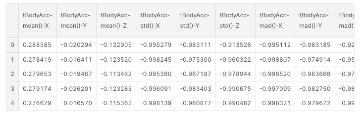
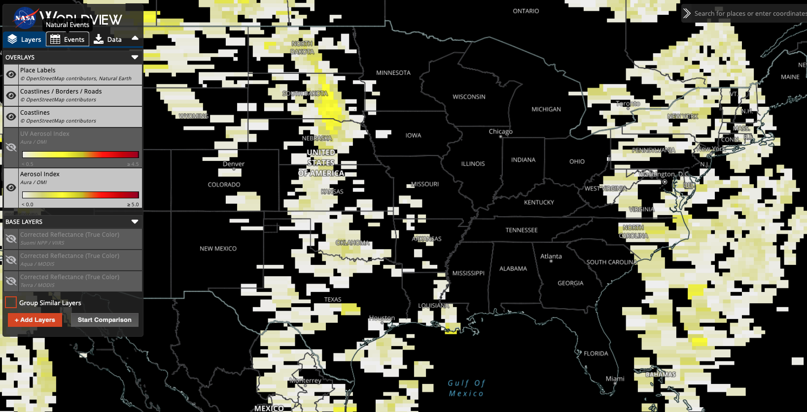

# 1.1 Health Data Sources

In the dynamic landscape of health-related data, a multitude of data sources have arisen. Each offering a unique lens into the realm of healthcare from a different perspective:

## Traditional Perspectives: 

### EMRs, EHRs, and PHRs

Electronic Medical Records (EMRs), Electronic Health Records (EHRs), and Personal Health Records (PHRs) are integral components of the digital transformation of healthcare information management. EMRs are digital versions of paper charts used in medical practices, containing patient medical and treatment histories. EHRs go beyond EMRs by not only storing patient information but also allowing seamless sharing of data across different healthcare organizations. EHRs support clinical workflows and decision-making, promoting coordinated patient care. On the other hand, PHRs are patient-centric health repositories managed by individuals themselves. They enable patients to store their medical histories, medications, allergies, and other health-related information, promoting patient engagement and self-care.

Prominent players in the healthcare information management sector include companies like Epic Systems, Cerner Corporation, and Allscripts, which provide software solutions and platforms for EMRs and EHRs. The utilization of these digital records is transforming healthcare by enhancing communication, improving patient outcomes, and streamlining administrative processes.

In the below example dataset, which is a synthetic set of EMR-like data of what should be expected to be producted from a medications section. This was produced via [Synthea](https://synthetichealth.github.io/synthea/). We would expect to see columns (features) rleated to when the medicaiton was started and stopped, a unique patient identifier, the patients insurance provider, associated encounter, and associated NDC (national drug code) and medication descriptions. We would likely also see many other related fields. 

### Claims Data

Claims data from insurance providers offer valuable information about healthcare utilization, treatments, and costs. This data source provides insights into the services individuals receive, prescriptions they are prescribed, and the financial aspects of healthcare delivery. Analyzing claims data can help identify trends in healthcare utilization and inform decisions about resource allocation.

In the below example dataset from [CMS - Synthetic Claims Data - Inpatient - Fee-For-Service Claims](https://data.cms.gov/collection/synthetic-medicare-enrollment-fee-for-service-claims-and-prescription-drug-event). In this example dataset below, which is also a synthetic dataset of CMS claims data, we see were are provided with a CSV file that has columns delenated by the ` | ` character. Claims data are highly specialized, and typically require a data dictionary to translate what the abbreviated column names are (e.g., what does BENE_ID stand for?). 

### Bioinformatics/Genetic Data

The emergence of '-omics' technologies, such as genomics, proteomics, and metabolomics, has unleashed a torrent of biological data. Companies like 23andMe and AncestryDNA offer direct-to-consumer genetic testing, enabling individuals to explore their ancestry, inherited traits, and potential genetic health risks. Large-scale research projects like the Human Genome Project and initiatives by the National Institutes of Health contribute to the growth of this data, fueling groundbreaking insights into our biology and diseases.

In the below example dataset which is a subset from data published by [Blackmore et al. (2017)](https://www.ncbi.nlm.nih.gov/pmc/articles/PMC5544260/) and can be access [here on github](https://github.com/UCLouvain-CBIO/WSBIM1207/tree/master/data). This dataset "...looks at the effect of upper-respiratory infection on transcriptomic changes in the CNS. The goal of the study was to determine the effect of an upper-respiratory infection on changes in RNA transcription occuring in the cerebellum and spinal cord post infection. Gender matched eight week old C57BL/6 mice were inoculated saline or with Influenza A by intranasal route and transcriptomic changes in the cerebellum and spinal cord tissues were evaluated by RNA-seq".  

## Non-Traditional Perspectives:

Beyond conventional sources, novel avenues for health data are emerging. These non-traditional data sources offer additional dimensions of understanding health and well-being:

### Internet of Things (IoT)/Sensor Devices

Smart home sensors, environmental monitors, and other IoT devices contribute data that can influence health outcomes and environmental impacts on health. Additionally, wearable health monitors and medical devices have ushered in an era of real-time health monitoring. Devices like Fitbit, Apple Watch, and continuous glucose monitors provide a continuous stream of physiological data, offering insights into activity levels, heart rate, sleep patterns, and more. These data sources have implications ranging from personal fitness tracking to managing chronic conditions like diabetes.

Example dataset: [Mobile App Data Collection Activities of Daily Living (ADLs) via a awit-mounted smarphone with inertial sensors](https://www.kaggle.com/datasets/uciml/human-activity-recognition-with-smartphones)

  

## Urban Planning Data 

Urban development and infrastructure data provide insights into the built environment's impact on health, including factors like air quality, access to green spaces, and walkability.

Example dataset: [HUD Dataset for Low Income Tax Credits](https://hub.arcgis.com/datasets/fedmaps::low-income-housing-tax-credit-properties/explore)

## Socioeconomic Indicators

Data related to income, education, employment, and other socioeconomic factors offer insights into how social determinants influence health disparities.

Example dataset: [HUD Dataset for Location Affordability Index](https://hudgis-hud.opendata.arcgis.com/datasets/HUD::location-affordability-index-v-1-0-1/explore)

## Satellite Imagery

Satellite data can reveal insights about environmental factors, natural disasters, and population density, all of which have implications for public health and emergency response.

Example dataset: [NASA Aerosol Index](https://www.earthdata.nasa.gov/learn/find-data/near-real-time/hazards-and-disasters/air-quality)

---

As the healthcare ecosystem continues to evolve, these diverse data sources intersect and intertwine, painting a comprehensive picture of individual and collective well-being. Understanding the nuances and potential of each data source is essential for harnessing the power of health informatics to its fullest extent.

The abundance of health data raises crucial questions about licensing, privacy, and ethical considerations. In the next subsection, we delve into the intricate landscape of health data ownership, sharing, and the ethical responsibilities that come with harnessing this invaluable resource.

## Why is Healthcare Data Different?

Healthcare data stands apart from many other types of data due to a multitude of reasons:

### 1. Nature of the Data
Healthcare data is often heterogeneous, not homogenious, encompassing a mix of quantitative and qualitative data, including patient demographics, diagnostic codes, laboratory results, and narrative clinical notes.

This heterogeneity manifests in various ways:

#### a. **Variety of Data Types**: 
- **Quantitative Data**: This includes measurable values such as vital signs (like blood pressure or heart rate), laboratory test results (like blood glucose levels or cholesterol), and imaging quantifications (like the size of a tumor on an MRI). 

- **Qualitative/Categorical Data**: This encapsulates non-measurable attributes. Examples include diagnostic categories (like the type of a specific cancer), types of surgical procedures, or even more subjective information like the severity of pain described using terms like 'mild', 'moderate', or 'severe'.

- **Narrative Data**: Clinical notes written by physicians, nurses, and other healthcare professionals provide a narrative description of a patient's condition, history, and treatment plans. These unstructured texts hold invaluable insights but require advanced techniques like Natural Language Processing (NLP) for analysis.

#### b. **Temporal Variations**:
- The same piece of data might change depending on when it was recorded. For instance, a patient's blood pressure can fluctuate throughout the day, influenced by factors like stress, medication, or physical activity. 

#### c. **Inter-patient Variability**:
- While one set of symptoms might be indicative of a particular disease in one patient, another patient with the same symptoms might be diagnosed differently based on their unique health history, genetics, or co-morbidities.

#### d. **Data Granularity**:
- The level of detail in healthcare data can vary widely. While some datasets might have broad categories (e.g., 'cardiovascular disease'), others might be more granular, specifying the exact type of ailment (e.g., 'atrial fibrillation' or 'ventricular tachycardia').

#### e. **External Influences**:
- Healthcare data can also be influenced by external factors such as the environment, socio-economic status, and lifestyle of the patients. For instance, the prevalence of certain diseases might be higher in areas with poor air quality or in communities with limited access to healthy food.

### 2. Volume and Velocity

The digital revolution in healthcare, marked notably by the rise of Electronic Health Records (EHRs) and wearable health technologies, has led to an explosion in the amount of data being produced. This unprecedented volume and the speed at which new data is generated presents both challenges and opportunities:

#### a. **Unprecedented Scale**:
- The adoption of EHRs means that every patient interaction, from a routine checkup to an intricate surgical procedure, generates digital data. In the U.S. alone, it's estimated that the healthcare system could amass over 2,314 exabytes of data by 2020, a tenfold increase from a decade prior.

#### b. **Real-time Data Generation**:
- With wearable health devices, data is no longer generated just during doctor visits. Wearables, ranging from fitness trackers to specialized medical devices like continuous glucose monitors, produce data in real-time, capturing a more comprehensive picture of a patient's health.

#### c. **Storage and Management Challenges**:
- The sheer volume and velocity of data generation necessitate robust data infrastructure. Hospitals and healthcare providers need to invest in secure and scalable storage solutions and ensure that data retrieval mechanisms are efficient.

#### d. **Potential for Real-time Analysis**:
- The rapid generation of data opens the door to real-time analysis. This is especially beneficial in critical care scenarios where timely interventions can be life-saving. For instance, monitoring systems can alert clinicians to deteriorating vital signs in ICU patients, allowing for swift action.

#### e. **Data Overwhelm**:
- While the wealth of data holds promise, it can also be overwhelming. Clinicians may suffer from "alert fatigue" if bombarded with too many notifications. Similarly, data analysts might find it challenging to sift through vast datasets to extract meaningful insights.

#### f. **Interoperability Concerns**:
- Given the multiple sources of data generation, ensuring interoperability (the ability for different IT systems to communicate seamlessly) is crucial. However, it remains a significant challenge as many systems aren't inherently designed to "talk" to one another.
### 3. Missing Data 

The reality of healthcare data is that it's often imperfect, and one of the most pervasive challenges is dealing with missing values. This phenomenon is far from random, and its implications can be far-reaching:

#### a. **Not At Random**:
- Unlike some industries where data might be missing purely by chance, in healthcare, there's often a systematic reason for its absence. 
- For instance, healthier patients might visit doctors less frequently, leading to gaps in their health records. Conversely, a particularly ill patient might miss an appointment due to their health, leading to missing data.

#### b. **Impact on Analysis**:
- Missing data can introduce bias into analyses. If not handled correctly, the results of any statistical model or prediction algorithm can be skewed, leading to incorrect conclusions.

#### c. **Different Types of Missingness**:
There are classifications for missing data:
   - **Missing Completely At Random (MCAR)**: The reason for the missing data is unrelated to any other variable, making it purely random.
   - **Missing At Random (MAR)**: The reason for the missing data can be explained by another variable in the dataset.
   - **Missing Not At Random (MNAR)**: The reason for the missing data is related to the variable that's missing, making it a more complex and challenging situation.

#### d. **Imputation Techniques**:
- To address missing data, various imputation methods have been developed. These range from simple methods like mean imputation to more complex techniques like multiple imputation and model-based imputation. The choice depends on the nature and extent of the missing data.

#### e. **Clinical Significance**:
- In healthcare, missing data might not just be a statistical problem but can have clinical implications. For example, if a lab result is missing, it could mean that the test was never ordered, the patient didn't get it done, or the result was lost or not recorded. Each scenario has different clinical implications.

#### f. **Operational Challenges**:
- Missing data can also pose operational challenges in healthcare settings. 
- For instance, missing patient contact information can hinder appointment scheduling, while incomplete medication lists can pose serious risks during treatment.
### 4. Longitudinal Data

Longitudinal data, or repeated measurements taken on the same subjects over time, is a hallmark of healthcare data. It offers a dynamic view of patients' health trajectories but also brings about its own set of challenges:

#### a. **Temporal Dynamics**:
- Unlike cross-sectional data, where each observation is independent, longitudinal data introduces time-dependent correlations. The same patient's measurements over time are likely correlated, with recent measurements potentially being more correlated than distant ones. This inherent time structure can be a gold mine for insights but also complicates analyses.

#### b. **Missing Data and Dropout**:
- The longer a study or observation period, the higher the likelihood of encountering missing data. Patients might drop out of a study or stop using a healthcare service, leading to incomplete trajectories. This missingness can introduce biases, especially if the dropout is related to the health outcome being studied.

#### c. **Variable Time Intervals**:
- While some longitudinal studies might have regular follow-up intervals, in real-world healthcare settings, the time between patient visits or measurements can vary widely. This irregularity needs to be accounted for in analyses.

#### d. **Complex Interactions**:
- Over time, various factors, like treatments, interventions, or lifestyle changes, can interact in complex ways, influencing a patient's health trajectory. Disentangling these interactions can be challenging.

#### e. **Advanced Analytical Techniques**:
- Standard regression techniques often fall short when dealing with longitudinal data. Instead, specialized methods like mixed-effects models, generalized estimating equations (GEE), or time-series analyses become essential. These account for the repeated measures and correlations within subjects.

#### f. **Clinical Insights**:
- From a clinical perspective, longitudinal data is invaluable. It helps in tracking disease progression, understanding long-term effects of treatments, and predicting future health outcomes. For chronic conditions like diabetes or hypertension, understanding individual trajectories can lead to personalized care.

### 5. Interconnectedness
*Health data points are not always independent*. For example, lab results can be influenced by various factors like the time of the day the test was done, recent patient activities, or even the devices used for testing.

The interrelated nature of health data points is a testament to the complexity of the human body and the environments in which health data is gathered. This interconnectedness implies that a change in one variable might influence several others. 

#### a. **Physiological Dependencies**:
- Different body systems are intertwined. A malfunction in the respiratory system can impact the cardiovascular system, and vice versa. For example, a heart ailment can lead to fluid accumulation in the lungs, while chronic respiratory conditions can strain the heart.

#### b. **Influence of External Factors**:
- Data from lab tests can be affected by numerous externalities. A blood glucose test might vary depending on meal timings, stress, recent physical activity, or even the specific lab equipment used. 

#### c. **Medication Interactions**:
- Patients on multiple medications can experience drug interactions, where one drug influences the effect of another, leading to amplified or diminished therapeutic effects, or even new side effects.

#### d. **Care Pathways**:
- In healthcare settings, different treatments and interventions are often interdependent. The outcome of a surgical procedure might be heavily influenced by the quality of post-operative care, physiotherapy sessions, and adherence to medication.

#### e. **Data Collection Interdependencies**:
- In hospital settings, one piece of recorded data can influence another. For instance, a diagnosis entered into an Electronic Health Record (EHR) can prompt the healthcare provider to order specific sets of tests, linking diagnosis codes with lab order codes.

#### f. **Social Determinants of Health**:
- Health isn't just a product of biology but also of environment, socio-economic status, education, and numerous other interconnected factors. These determinants can influence a myriad of health outcomes and are often deeply interwoven.

#### g. **Time-Varying Covariates**:
- In longitudinal data, certain variables can change over time and may influence others. For instance, a patient's weight might change over years and can impact various health parameters like blood pressure, cholesterol levels, or insulin sensitivity.

## Navigating These Challenges With
### 1. Feature Engineering

Feature engineering is the process of selecting, transforming, or creating variables (features) that best represent the underlying patterns in the data. In healthcare, this can be a nuanced task.

Given the domain's complexity, leveraging medical expertise can guide the crafting of features that capture the essence of patient health, disease progression, and treatment responses.

Examples:

- From a series of blood pressure readings taken over time, one might derive features like "average blood pressure," "variability of blood pressure," or "trend of blood pressure over the last six months." 

- Clinical notes often contain valuable information that isn't coded elsewhere in electronic health records. Using Natural Language Processing (NLP) techniques, one can extract features from this narrative text, like the sentiment of the note or the presence of specific terms indicating a rare side effect.

### 2. Regularization Techniques

Regularization adds a penalty to regression models to discourage overly complex models which can lead to overfitting. 

Both techniques below can help in generalizing the model better to unseen data and provide more stable coefficients.

Examples:

- In a dataset with hundreds of genes trying to predict a health outcome, Lasso regression might zero out the coefficients of genes that don't contribute much, leading to a simpler, more interpretable model.

- When predicting the risk of heart disease using multiple correlated predictors, Ridge regression can help in distributing the coefficient weights among these predictors without letting any single predictor dominate the model due to multicollinearity.

### 3. Advanced Models

Healthcare often demands models that can handle its data's unique structure and characteristics.

Choosing the right model requires understanding the problem, the nature of the data, and the end goal – be it prediction, understanding underlying mechanisms, or categorization.

Examples:

- When studying patient trajectories over time, mixed-effects models can account for both fixed effects (like treatment type) and random effects (individual patient variations).

- For image-based diagnostics, like detecting tumors in X-rays, deep learning models like Convolutional Neural Networks (CNNs) can be employed, which can capture complex patterns in the image data.

### 4. Collaboration

Healthcare is a multi-faceted domain, and producing actionable insights from its data is often a team effort.

Collaborative efforts ensure that the data analyses are not just technically sound but also contextually relevant and actionable in a clinical setting.

Examples:

- When developing a predictive model for patient readmission, clinicians can provide insights on which features are most clinically relevant, and statisticians can guide on the most appropriate modeling techniques.

- In genomic research, while bioinformaticians handle the massive genomic datasets, geneticists and molecular biologists provide the expertise to interpret the findings in a biologically meaningful way.
