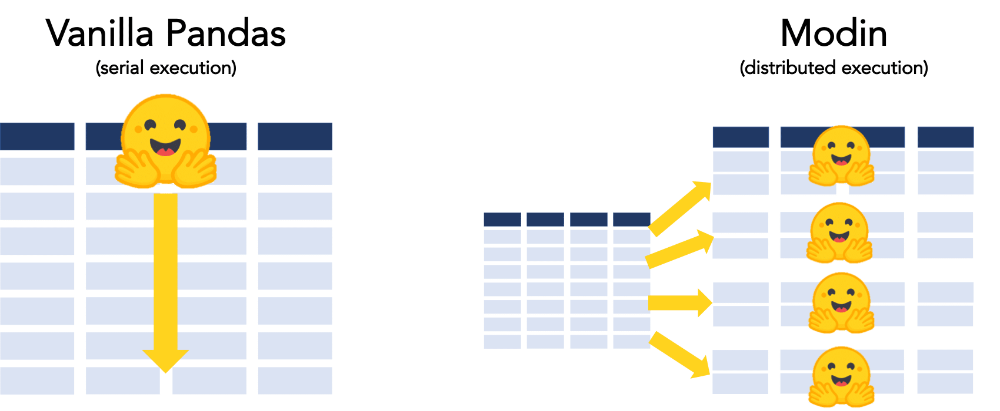
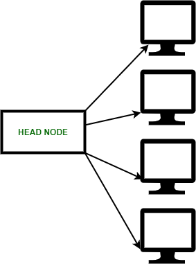
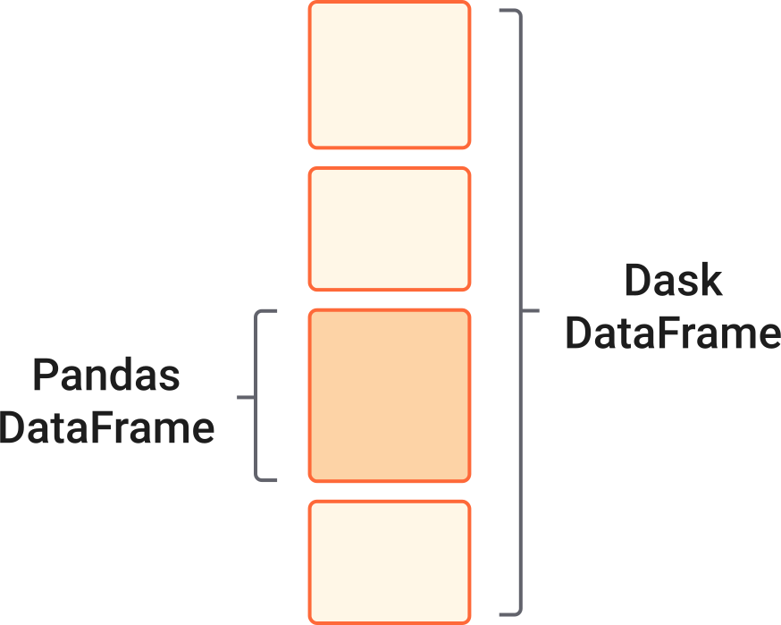

# 2.3 Distributed Computation with Dask, Ray, and Modin in Health Informatics

## Intro 

As previously discussed, POLARS is the next step up in the chain for dealing with big data, but still all on your own location machine.

Once you have a dataset that potentially exceeds the size of your own machine, its now time to look at other solutions that can handle distributed computing. 

For those gargantuan health datasets, Dask, Ray, and Modin come to the rescue:
- **Scaling Pandas**: These libraries enhance Pandas' capabilities, allowing it to handle large-scale health data smoothly.
- **Parallel Processing**: Accelerate computations, be it for genomic sequences or analyzing vast patient cohorts.
- **Use Cases**: Discover when and why to pivot to Dask or Modin from traditional Pandas operations.

[Dask](https://github.com/dask/dask), [Ray](https://github.com/ray-project/ray) and [Modin](https://github.com/modin-project/modin) are libraries that can be used to parallelize and distribute data processing tasks. This makes them well-suited for working with large datasets.

**Dask** is a low-level scheduler and a high-level partial Pandas replacement, geared toward running code on compute clusters.

**Ray** is also a low-level framework for parallelizing Python code across processors or clusters.

**Modin** is a newer library that is designed to be a user-friendly, drop-in replacement for Pandas, that is powered by either Dask or Ray underneath the hood. You can think of Modin as a [layer that sits on top](../../docs/Ch2/distributed-computation#modin) of either of these tools to simplify how use Dask or Ray to execute the code.



[image origin: https://ponder.io/faster-hugging-face-with-modin/](https://ponder.io/faster-hugging-face-with-modin/)

In addition to these tools, there exist `spark` or `pyspark`, and other tools like `celery` or `airflow` to taking care of long running (or short running) computation tasks or batch jobs. 

But first, we need to understand a key concept - distributed computing. 

---


## Distributed Computing

Distributed computing is a paradigm that involves utilizing multiple interconnected machines to collectively solve complex problems or process large amounts of data. This approach enables tasks to be divided into smaller subtasks, which are then distributed across different nodes for parallel processing. Distributed computing is crucial for handling massive datasets and resource-intensive computations in various domains, including health informatics.



### Key Concepts and Terminology

**Parallelism**:
Parallelism is the foundation of distributed computing. It involves executing multiple tasks simultaneously, leveraging the processing power of multiple nodes to achieve faster and more efficient computations.

**Distributed Data**:
In distributed computing, data is spread across different nodes. Efficient data distribution and management strategies are essential for ensuring optimal performance.

**Scalability**:
Scalability refers to the ability of a distributed system to handle an increasing amount of work, data, or users. Distributed systems can scale horizontally by adding more nodes to the system.

**Node (or Worker):** A node or worker is a computational unit within a distributed system. In the context of Dask, Ray, and Modin, it refers to a computing entity capable of executing tasks and processing data.

**Scheduler:** The scheduler is responsible for managing and coordinating tasks across nodes or workers. It decides which tasks to execute on which nodes, optimizing resource utilization and data locality.

**Tasks**: Tasks are individual units of computation or operations that need to be performed on data within a distributed computing framework, such as Dask, Ray, and Modin. They are designed to be executed in parallel across multiple nodes or workers, contributing to faster and more efficient data processing.

**Task Dependency:** In a distributed system, tasks can have dependencies on other tasks. A task must wait for its dependencies to be completed before it can execute.

**Fault Tolerance**:
Distributed systems need to be resilient to failures, as individual nodes may experience issues. Fault tolerance mechanisms ensure that the system continues to operate even in the presence of failures.

**Communication**:
Nodes in a distributed system communicate with each other to exchange data and coordinate tasks. Efficient communication protocols are vital for minimizing overhead and latency.

**Load Balancing**:
Load balancing involves distributing tasks evenly across nodes to ensure that resources are utilized optimally and that no single node is overwhelmed.

### Relevance to Health Informatics
In health informatics, distributed computing is particularly valuable due to the vast amount of data generated by various sources, such as electronic health records, medical imaging, genomics, and wearable devices. Healthcare applications often require sophisticated data analysis and modeling, which can benefit from the parallel processing capabilities of distributed systems.

Health informatics tasks that can benefit from distributed computing include:

Processing and analyzing large-scale genomics data for personalized medicine.
Analyzing medical images for early disease detection and diagnosis.
Simulating complex biological models for drug discovery and development.
Handling real-time data streams from medical sensors and wearable devices.
Distributed computing technologies, such as Dask, Ray, and Modin, offer solutions for effectively harnessing distributed resources to accelerate these tasks. Let's explore how these technologies provide distributed computing capabilities and how they relate to health informatics tasks.

---

## Dask 

A Dask DataFrame is a large parallel DataFrame composed of many smaller pandas DataFrames, split along the index. 

These pandas DataFrames may live on disk for larger-than-memory computing on a single machine, or on many different machines in a cluster. One Dask DataFrame operation triggers many operations on the constituent pandas DataFrames.

### Common Uses 

Dask DataFrame is used in situations where pandas is commonly needed, usually when pandas fails due to data size or computation speed:

- Manipulating large datasets, even when those datasets don’t fit in memory
- Accelerating long computations by using many cores
- Distributed computing on large datasets with standard pandas operations like groupby, join, and time series computations

### When to NOT use Dask:

- If your dataset fits comfortably into RAM on your laptop, then you may be better off just using pandas. There may be simpler ways to improve performance than through parallelism
- If your dataset doesn’t fit neatly into the pandas tabular model, then you might find more use in dask.bag or dask.array
- If you need functions that are not implemented in Dask DataFrame, then you might want to look at dask.delayed which offers more flexibility
- If you need a proper database with all that databases offer you might prefer something like Postgres

### Design
Dask DataFrames coordinate many pandas DataFrames/Series arranged along the index. A Dask DataFrame is partitioned row-wise, grouping rows by index value for efficiency. These pandas objects may live on disk or on other machines.



### Installation

Just like pandas, it is as simple as a `pip install ...` command. You can use pip to install everything required for most common uses of Dask, which also install dependencies, like NumPy and pandas, that are necessary for different workloads. This is often the right choice for Dask users:

```bash
pip install "dask[complete]"  
```

### Single-computer computation with Dask 

When initially exploring the functionality of Dask, it's recommended to start by running it on a single machine. This approach simplifies the setup and allows you to focus on learning the core concepts of parallel computing, distributed data processing, and task execution without the complexities of managing a multi-node cluster. 

Running Dask on a single machine provides a solid foundation for understanding how tasks are scheduled, data is partitioned, and computations are performed in a distributed environment. As you become comfortable with these principles, you can gradually transition to more advanced setups involving distributed clusters for larger-scale data processing and performance optimization.

#### Dask DF versus Pandas DF 

In dask, like pandas and polars, there are a couple of different object (collection) types that we have access to. 

**Dataframes** (dask Dataframes) exist just like in polars and pandas which represent 2-dimensional data stuctures, and are called the same thing. But in addition, we also have dask **Arrays** and **Bags**. 

- [Arrays](https://docs.dask.org/en/stable/array.html) are 1-dimensional data objects that contain data of all the same type (e.g., all numbers, all characters) and are typically used within machine learning models. 

- [Bags](https://docs.dask.org/en/stable/bag.html) are not per-say a mechanisms of storing data, but represent a collection (e.g., bag) of generic python operations that we execute with: `groupby`, `map`, or `filter` to modify/change a dataframe or array. 

##### With Dask: `.compute()`

Because the dask.DataFrame application programming interface (API) is a subset of the pd.DataFrame API, it should be familiar to pandas users. There are some slight alterations due to the parallel nature of Dask. 

The primary difference, is with all Dask collections, you trigger computation by calling the `.compute() `method. Everything that you may run/execute - the lines above - will not actually be run by Dask until the `.compute()` is called. This is similar to what we will see in future packages, such as with sending commands to a sqlite database using **sqlite3** and their `.commit()` method to push changes to a db. 

```python
import dask.dataframe as dd

# Read a Dask DataFrame from CSV files containing healthcare data
# In the example below, we use the wild-card character '*' to pull in multiple files, such as patient_data_MRN34533232, 
# patient_data_MRN539834984, etc., making it efficient for handling large datasets
df = dd.read_csv('patient_data_*.csv')

# Display the first few rows of the DataFrame
print(df.head())

# Select rows where patients have a medical condition 'Hypertension' ('y' column) and calculate a modified value
high_bp_patients = df[df.condition == 'Hypertension']
modified_values = high_bp_patients.sys_bp + 10

# Compute and display the modified values for high blood pressure patients
modified_values.compute()
```

Before we run `modified_values.compute()`, the calculation in the line `modified_values = high_bp_patients.sys_bp + 10` is not executed by dask, but is stored in memory as a task that should be executed once the `.compute()` is ran. 

##### With Pandas
```python
import pandas as pd
df = dd.read_csv('patient_data_*.csv')
print(df.head())
high_bp_patients = df[df.condition == 'Hypertension']
modified_values = high_bp_patients.sys_bp + 10
modified_values
```
Versus in pandas, once we run execute `modified_values = high_bp_patients.sys_bp + 10`, the changes/calculation automatically happens.

### Cluster computation with Dask 

When ready to explore the full potential of Dask and harness the benefits of distributed computing, setting up a cluster of machines becomes essential. Creating a Dask cluster enables you to leverage the combined processing power and memory of multiple nodes to handle larger datasets and complex computations. By distributing tasks across the cluster, you can significantly improve the performance and efficiency of your data processing tasks. 

Whether you're using cloud platforms like Azure or GCP or managing your own cluster infrastructure, the process involves setting up a coordinated network of worker nodes that work together under the guidance of a central scheduler. This advanced setup empowers you to tackle more substantial workloads and achieve true scalability while exploring the capabilities of Dask in a real-world distributed computing environment.

For detailed instructions and a brief tutorial on setting up a Dask cluster, please visit [***the resources section for this chapter***](../../docs/Ch2/resources.md) where we have sample code that can be copied and tested. 

#### Important Deployment Note with Clusters 

When deploying a distributed computing cluster for Dask, it's crucial to be mindful of cost considerations. Cloud platforms like Azure and GCP offer convenient solutions, but operating a cluster can accrue expenses. To mitigate costs, ensure that you manage resources efficiently by scaling up only when needed and tearing down or stopping services once your tasks are completed. By adopting this approach, you can optimize resource utilization, prevent unnecessary expenses, and make the most of the cloud's elasticity while experimenting with distributed computing using Dask.

---

## Ray 

Ray is a powerful distributed computing framework designed to enable parallel and distributed Python applications. It is particularly suited for machine learning, artificial intelligence, and data processing tasks that require scaling across multiple cores or machines.

### Key Concepts
Ray introduces the concept of tasks and actors for distributed computing. A task is a unit of work that can be executed in parallel, while actors are stateful objects that maintain their state across multiple invocations

#### Use Cases for Ray
Ray is particularly useful for:
- Distributing machine learning training across multiple GPUs or machines
- Parallelizing data processing and analysis tasks
- Scaling out computation-intensive simulations
- Maintaining shared state in distributed applications

### Installation
You can install Ray via pip using the following command:

```bash
pip install ray
```
### Usage: Single machine without a cluster 

The best way to get started running Ray is on a single machine, without setting up a cluster. Setting up a cluster of machines involves installing the software on each machine, then configuring communication and security on each, and much more, so be expected to spend some some time and money. Having said that, Ray provides a convenient way to parallelize your code across the cores of a single machine, which can significantly speed up computations that can be parallelized. Here's how you can use Ray on a single machine:

**1. Install Ray:** Start by installing Ray using pip:
```bash
pip install ray
```

**2. Import and Initialize Ray:** In your Python code, import Ray and initialize it. This step is necessary even when using Ray on a single machine:

```python
import ray

ray.init()
```

**3. Parallelize Your Code:** Ray provides a @ray.remote decorator that you can use to parallelize functions. Functions decorated with @ray.remote become "remote functions" that can be executed in parallel on different cores:
```python
# Define a remote function to calculate Body Mass Index (BMI)
@ray.remote
def calculate_bmi(weight_kg, height_m):
    bmi = weight_kg / (height_m ** 2)
    return bmi

# Simulate BMI calculation for two patients
patient1_weight = 70  # Weight in kilograms
patient1_height = 1.75  # Height in meters
patient2_weight = 90
patient2_height = 1.80

# Calculate BMI for both patients in parallel
result1 = calculate_bmi.remote(patient1_weight, patient1_height)
result2 = calculate_bmi.remote(patient2_weight, patient2_height)

# Get and print BMI results
print(f"Patient 1 BMI: {ray.get(result1):.2f}")
print(f"Patient 2 BMI: {ray.get(result2):.2f}")

# Shutdown Ray when done
ray.shutdown()
```
In this example, both calls to my_function.remote() are executed in parallel on different cores, leveraging the available processing power.

**4. Ray Dashboard (Optional):** Ray provides a dashboard that allows you to monitor the performance of your parallel tasks. You can access the dashboard by opening a web browser and navigating to the address specified when you initialized Ray (e.g., http://127.0.0.1:8265).

### Scaling with Ray 

Ray excels in scaling computations across clusters. It can dynamically allocate resources and distribute tasks across available CPUs or machines. Here's an example of how you might parallelize a time-consuming task across multiple cores:

- In order to setup and install Ray on multiple machines, you will need to have either physical access to multiple machines that can communicate with one another locally, or use a cloud provider. [Please visit the resources section of these chapter](../../docs/Ch2/resources.md#configuring-ray-cluster-on-azure-or-gcp), where you can find some example code for how you would go about installing Ray across a cluster of machines. 

Once you have the clusters setup, on the main node/leader machine, you could do the following and it will then segment out this code and distribute the run time across the cluster: 

```python
import ray

# Initialize Ray on the main node
ray.init()

# Define a remote function to simulate medical tests on patient blood pressure
@ray.remote
def perform_blood_pressure_test(patient_id, systolic_bp, diastolic_bp):
    # Calculate the sum of systolic and diastolic blood pressure values
    total_bp = systolic_bp + diastolic_bp
    
    # Determine if the blood pressure is high or low based on the sum
    if total_bp > 200:
        bp_status = "High"
    else:
        bp_status = "Low"
    
    # Prepare the test results
    test_results = {
        "Patient": patient_id,
        "Test": "Blood Pressure",
        "Systolic BP": systolic_bp,
        "Diastolic BP": diastolic_bp,
        "Status": bp_status
    }
    
    return test_results

# Create a list of patient IDs and their corresponding blood pressure values
patient_data = [
    {"id": 1, "systolic": 120, "diastolic": 80},
    {"id": 2, "systolic": 140, "diastolic": 90},
    {"id": 3, "systolic": 160, "diastolic": 100},
    {"id": 4, "systolic": 180, "diastolic": 110},
    {"id": 5, "systolic": 200, "diastolic": 120},
]

# Create a list of tasks to perform blood pressure tests in parallel on worker nodes
test_task_refs = [
    perform_blood_pressure_test.remote(data["id"], data["systolic"], data["diastolic"])
    for data in patient_data
]

# Get the results from the test tasks
test_results = ray.get(test_task_refs)

# Print the blood pressure test results
for result in test_results:
    print(result)

# Shutdown Ray when done
ray.shutdown()
```

In this healthcare-focused example, the main node initializes Ray and defines a remote function perform_blood_pressure_test(). This function simulates a blood pressure test on patient data, taking patient ID, systolic blood pressure, and diastolic blood pressure as input parameters. The total blood pressure value is calculated as the sum of systolic and diastolic values. Based on this sum, the function determines whether the blood pressure is categorized as "High" or "Low". The test results are prepared as a dictionary containing patient information and blood pressure test details.

The loop creates a list of tasks using perform_blood_pressure_test.remote() and collects the resulting references (test_task_refs).

After the tasks have been submitted, the ray.get() function retrieves the blood pressure test results from the worker nodes. The printed results will display the patient ID, systolic and diastolic blood pressure values, and the blood pressure status (high or low) for each patient in the simulated dataset.

It's important to note that this example assumes you have a Ray cluster set up and configured with worker nodes (following instructions from above). The main node orchestrates the parallel execution of blood pressure tests across the worker nodes. The worker nodes automatically perform the tests and return the results to the main node, demonstrating how Ray can effectively distribute and manage healthcare-related computations in a distributed environment.

### Distributed Actors

In addition to parallel tasks, Ray introduces the concept of actors, which are stateful objects that can maintain internal state across function calls. This is useful for scenarios where shared state needs to be maintained across parallel executions.

In the example beklow, the actor class PatientRecord simulates patient records in a healthcare setting. Each patient actor maintains their health status, and the actor method update_health_status() is used to update their status. The main program creates actor instances for multiple patients and updates their health statuses in parallel using the ray.get() function.

```python
import ray

# Initialize Ray
ray.init()

# Define an actor class to simulate patient records
@ray.remote
class PatientRecord:
    def __init__(self, patient_id, initial_health_status):
        self.patient_id = patient_id
        self.health_status = initial_health_status

    def update_health_status(self, new_status):
        self.health_status = new_status
        return self.health_status

# Create actor instances for multiple patients
patient_actors = [PatientRecord.remote(patient_id, "Stable") for patient_id in range(1, 6)]

# Simulate updating health status in parallel
new_health_statuses = ["Critical", "Serious", "Stable", "Improved", "Critical"]
updated_statuses = ray.get([actor.update_health_status.remote(new_status) for actor, new_status in zip(patient_actors, new_health_statuses)])

# Print updated health statuses
for patient_id, status in enumerate(updated_statuses, start=1):
    print(f"Patient {patient_id}: Health Status - {status}")

# Shutdown Ray
ray.shutdown()
```

Ray offers a versatile and efficient way to distribute and parallelize Python applications, making it a valuable tool for accelerating computations across clusters of machines. Its task and actor models provide the building blocks to create complex parallel and distributed workflows for data-intensive applications.

---

## Modin

Very similar to dask, Modin sits on top of and works along side pandas and its dataframes. 

The mainters of the project describe it as a 'drop-in replacement' to pandas that allows for paralel processing across all of your computers cores instantly.


[image origin: https://modin.readthedocs.io/en/stable/_images/modin_architecture.png](https://modin.readthedocs.io/en/stable/_images/modin_architecture.png)

In pandas, you are only able to use one core at a time when you are doing computation of any kind. With Modin, you are able to use all of the CPU cores on your machine. Even in read_csv, we see large gains by efficiently distributing the work across your entire machine.


### Official Quickstart Guide

Please visit [their website](https://modin.readthedocs.io/en/latest/getting_started/quickstart.html) for their 10-minute tutorial if you are interested. 

### Installation 

Simple as:

```python
pip install "modin[all]"
```

And then instead of importing pandas as pd, you can replace it with the following, keeping the same abbreviation, but getting some of the speed increases that we may require with largest datasets:

```python
# import pandas as pd
import modin.pandas as pd
```

### Simple Exercises 

Modin does an excellent job with providing example code in jupyter notebook enviroments. I recommend that you visit their tutorial on running modin locally (it ties into and utilizes `dask` - it sits on top of task, abstracting parts of it away - trying to make it simpler). They have the following notebooks for introducing their code, and increases in speed:

- Official Modin Exercise: [Speed Improvements](https://github.com/modin-project/modin/blob/master/examples/tutorial/jupyter/execution/pandas_on_dask/local/exercise_2.ipynb)

#### Non-cluster, single machine:

In the below example, we're using Modin to read a CSV file containing patient records. We then filter the data to select patients with a specific condition (e.g., 'Heart Disease') and calculate the average age of those patients. Modin's syntax is similar to Pandas, making it easy to transition from Pandas to Modin for data manipulation tasks.

```python
import modin.pandas as mpd

# Create a Modin DataFrame from a CSV file containing healthcare data
# For example, we have patient records with columns like 'Name', 'Age', 'Gender', 'Condition'
df = mpd.read_csv('patient_records.csv')

# Display the first few rows of the Modin DataFrame
print(df.head())

# Filter the data to select patients with a specific condition
heart_condition_patients = df[df['Condition'] == 'Heart Disease']

# Calculate the average age of patients with heart conditions
average_age = heart_condition_patients['Age'].mean()
print(f"Average age of patients with heart conditions: {average_age:.2f} years")
```

### Advanced Exercises 

In addition, modin provides working examples of how to use modin with ray. In their tutorial, they utilize the AWS cloud, and provide code for setting up a cluster of machines (8 in total; 1 commander and 7 workers) which will total 768 CPUs - this is alot! Keep in mind that your local computer, may have somewhere between 8 to 32 CPUs. 

- Official Modin Exercise: [Setting up AWS cluster for Modin](https://github.com/modin-project/modin/blob/master/examples/tutorial/jupyter/execution/pandas_on_ray/cluster/exercise_5.ipynb)
  - I recommend that you do not perform this exercise, unless you are ok with spending a few dollars - 
- Official Modin Exercise: [Executing commands on the AWS cluster](https://github.com/modin-project/modin/blob/master/examples/tutorial/jupyter/execution/pandas_on_ray/cluster/exercise_6.ipynb)

#### Speed test with BIG data

In this example, we're loading the synthetic patient medical records dataset using both Modin and Pandas. We then filter the data to select patients with a specific condition ('Heart Disease') and calculate the average age of those patients. Finally, we measure the execution times for both Modin and Pandas using the 'time' package. This will give you an idea of the speed difference between the two libraries for data processing tasks. Make sure to replace 'path_to_dataset.gz' with the actual path to the downloaded dataset file.

***Important Note for Testing:***

*When working with a large dataset like the 21GB SyntheticMass data, efficient memory management becomes crucial. If you have set up Modin to utilize a cluster of machines via Ray or Dask, Modin's parallel processing capabilities can help execute the code efficiently. However, if you are using traditional Pandas on a single remote VM, you might encounter memory limitations. With Modin and distributed computing frameworks like Ray or Dask, the code should be able to execute effectively, as the data processing and memory usage are distributed across multiple machines. Modin leverages the power of these frameworks to handle large datasets without overwhelming a single machine's resources. However, when working with traditional Pandas on a single remote VM, it's essential to be mindful of the machine's specifications. For example, if your VM has around 32GB of RAM, loading a 21GB dataset might exceed the available memory, leading to crashes or slowdowns. To comfortably work with such datasets using traditional Pandas, you might need a machine with more RAM—ideally around 42GB to account for data processing and other system operations. Alternatively, consider using distributed computing solutions to manage memory-intensive tasks like this.So before running the code, thoroughly assess the resources available to your setup to ensure a smooth execution experience. If using traditional Pandas on a single machine, upgrading the machine's RAM or employing distributed computing strategies can help mitigate memory-related challenges.* 

**1. Download the Data:** The SyntheticMass data set is available for download in bulk as gzip archives. Each archive contains one million synthetic patient medical records, encoded in HL7 FHIR, C-CDA, and CSV.
  - SyntheticMass Data, Version 2 (24 May, 2017): 21GB. FHIR 3.0.1, CSV, C-CDA: [DOWNLOAD HERE](https://synthea.mitre.org/downloads) 

**2. Load in the Data and Perform Speed Test:** 

```python
import modin.pandas as mpd
import pandas as pd
import time

# Define the dataset path
dataset_path = 'path_to_dataset.gz'

# Using Modin
start_time = time.time()
modin_df = mpd.read_csv(dataset_path)
modin_filtered = modin_df[modin_df['condition'] == 'Heart Disease']
modin_average_age = modin_filtered['age'].mean()
modin_time = time.time() - start_time

# Using Pandas
start_time = time.time()
pandas_df = pd.read_csv(dataset_path)
pandas_filtered = pandas_df[pandas_df['condition'] == 'Heart Disease']
pandas_average_age = pandas_filtered['age'].mean()
pandas_time = time.time() - start_time

# Print results and execution times
print(f"Modin Average Age of Patients with Heart Disease: {modin_average_age:.2f} years")
print(f"Pandas Average Age of Patients with Heart Disease: {pandas_average_age:.2f} years")
print(f"Modin Execution Time: {modin_time:.4f} seconds")
print(f"Pandas Execution Time: {pandas_time:.4f} seconds")
```


---

## Conclusions

### Dask vs Modin 

Dask, designed as a higher-level Dataframe, recognizes the constraints of the Pandas API. While it does incorporate some Pandas-like features for familiarity, its objective isn't complete Pandas compatibility. Transitioning from Pandas to Dask.Dataframe might not seamlessly translate complex existing Pandas code into desired outcomes. Conversely, Modin aims squarely at achieving 100% Pandas coverage. While Modin can utilize Dask as a foundation, its original integration with Ray has matured further.

### Dask vs Ray 

Dask, functioning as a lower-level scheduler, and Ray share common ground in their pursuit of enhancing parallel Python code execution across clusters of machines. Dask has a stronger focus on the data science sphere, offering higher-level APIs that partially replace Pandas, NumPy, and scikit-learn. Alongside this, it provides a foundation for low-level scheduling and cluster management. A GitHub discussion between the creators of Dask and Ray highlights the comparison between these libraries. A distinct factor is their scheduling strategy. Dask employs a centralized scheduler to distribute tasks across multiple cores, while Ray employs a distributed bottom-up scheduling approach.

### Ray vs Modin
Ray and Modin present differing approaches despite sharing a common goal of enhancing distributed computation in Python. Ray, designed as a distributed computing framework, focuses on achieving efficient parallelism and scaling for a wide range of applications. Its versatile features extend to distributed machine learning, reinforcement learning, and more. On the other hand, Modin aims to optimize data processing, particularly in the context of Pandas operations. Its primary objective is to seamlessly leverage multi-core processors and distributed clusters to accelerate Pandas-based data manipulations.

While both Ray and Modin contribute to distributed computation, they cater to distinct aspects of the Python ecosystem. Ray provides a comprehensive framework for diverse parallel and distributed tasks, while Modin is tailored specifically to enhance the performance of Pandas operations. Consider the nature of your computation requirements to choose the framework that aligns best with your project's needs.