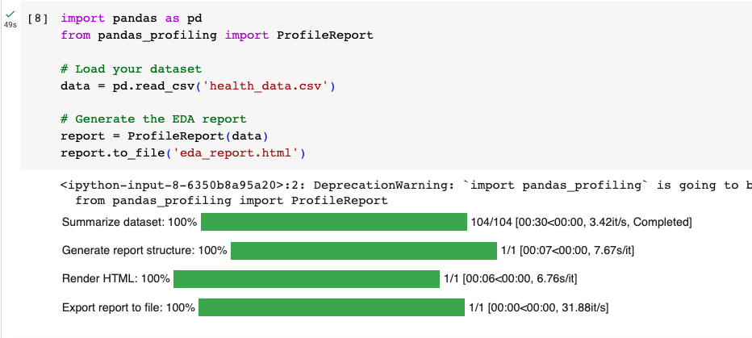
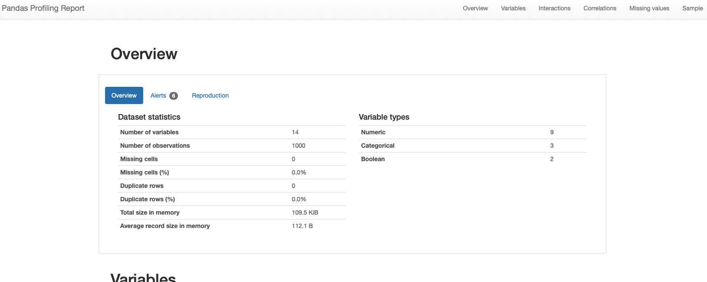
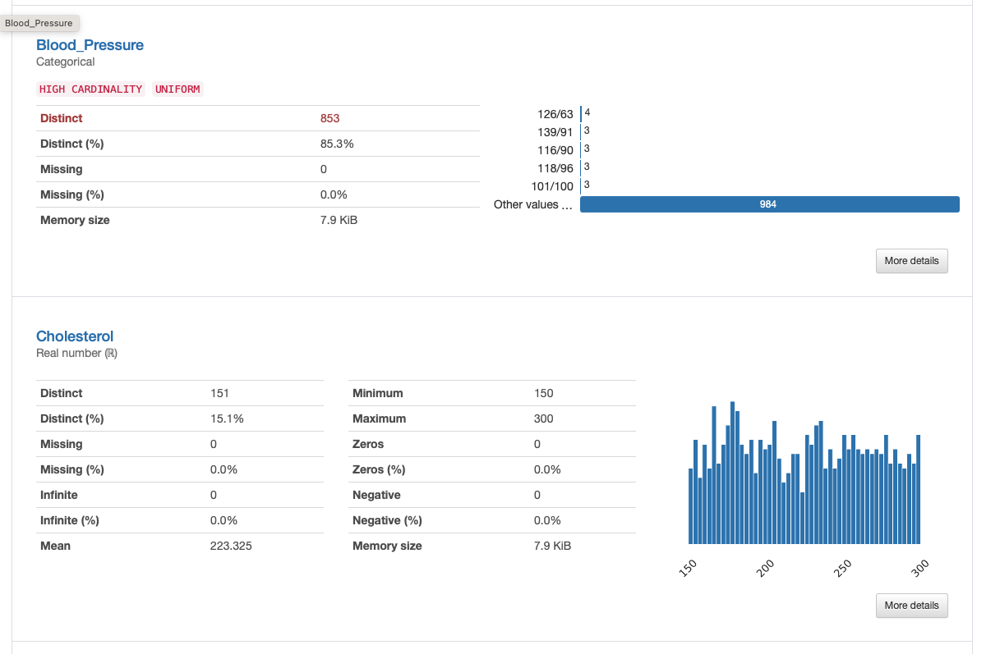
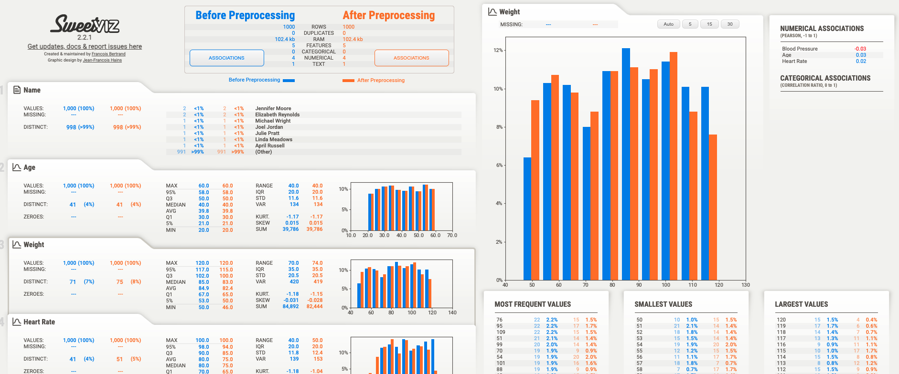
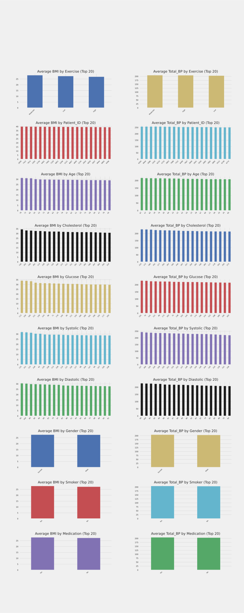
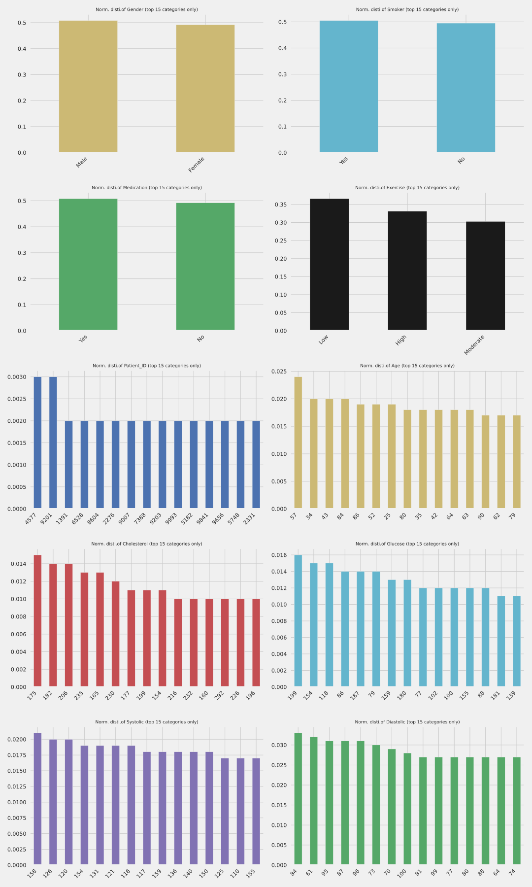
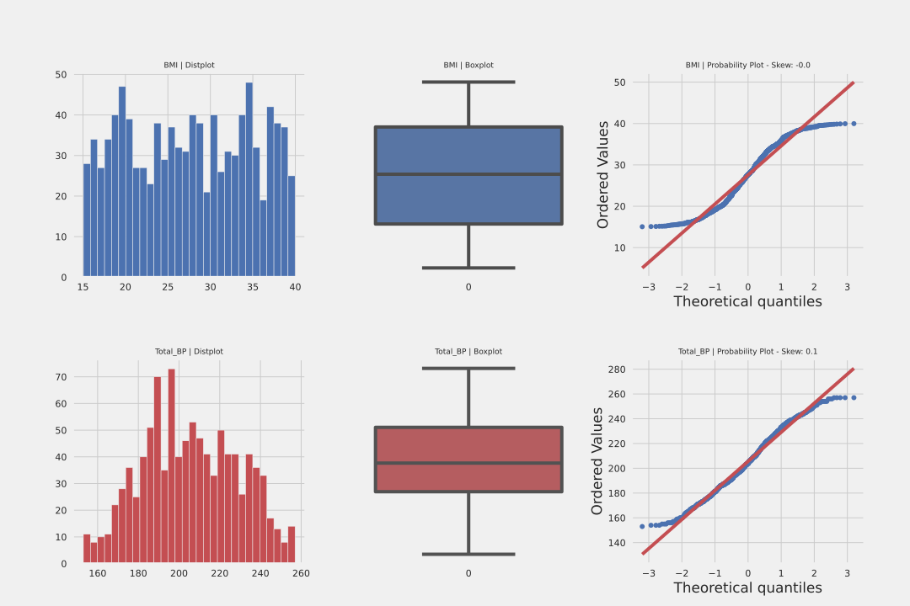
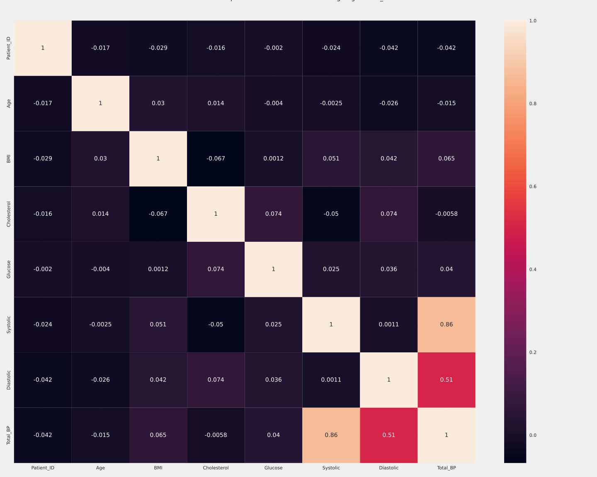
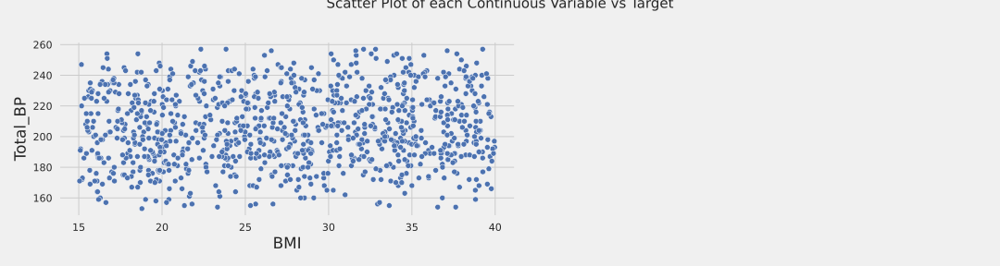
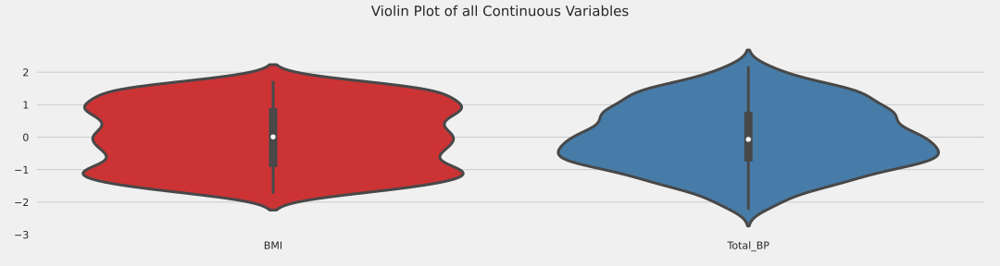

# 3.4 Automated Exploratory Data Analysis (EDA) with Python

Automated Exploratory Data Analysis (EDA) tools can significantly speed up the process of understanding your health data's distribution, identifying patterns, and gaining insights. These tools often provide a comprehensive overview of your data's characteristics without requiring manual scripting. Here are a few popular Python packages that can assist in automated EDA:

## Pandas Profiling
Pandas Profiling is a versatile library that generates a detailed summary report of your dataset. It provides essential statistics, correlation matrices, missing value analysis, and visualizations for each column. The generated report can help you quickly identify potential issues, relationships, and patterns in your data.


```python
import pandas as pd
from pandas_profiling import ProfileReport

# Load your dataset
data = pd.read_csv('health_data.csv')

# Generate the EDA report
report = ProfileReport(data)
report.to_file('eda_report.html')
```

So when you run it, you will get the descriptives produced automatically into a functional .html file:




With the following output examples: 






## SweetViz
SweetViz is another powerful library for automated EDA. It generates comparative visualizations between your dataset's target variable and other features, highlighting differences, correlations, and distribution disparities. It's especially useful for classification problems.

Example for creating some pre/post data:

```python

import pandas as pd
from faker import Faker

# Create a Faker generator
fake = Faker()

# Number of patients
n_patients = 1000

# Generate data for 'before' the intervention
data_before = {
    'Name': [fake.name() for _ in range(n_patients)],
    'Age': [fake.random_int(min=20, max=60) for _ in range(n_patients)],
    'Weight': [fake.random_int(min=50, max=120) for _ in range(n_patients)],
    'Heart Rate': [fake.random_int(min=60, max=100) for _ in range(n_patients)],
    'Blood Pressure': [fake.random_int(min=110, max=160) for _ in range(n_patients)]
}

df_before = pd.DataFrame(data_before)

# Generate data for 'after' the intervention with changes
data_after = {
    'Name': data_before['Name'],
    'Age': data_before['Age'],
    'Weight': [weight - fake.random_int(min=0, max=5) for weight in data_before['Weight']],
    'Heart Rate': [hr - fake.random_int(min=0, max=10) for hr in data_before['Heart Rate']],
    'Blood Pressure': [bp - fake.random_int(min=0, max=5) for bp in data_before['Blood Pressure']]
}

df_after = pd.DataFrame(data_after)

# Save them to CSV for your usage
df_before.to_csv('data_before.csv', index=False)
df_after.to_csv('data_after.csv', index=False)


```


```python
import sweetviz as sv

# Compare two datasets (e.g., before and after preprocessing)
data_before = pd.read_csv('data_before.csv')
data_after = pd.read_csv('data_after.csv')

# Generate the comparison report
report = sv.compare([data_before, 'Before Preprocessing'], [data_after, 'After Preprocessing'])
report.show_html('eda_comparison_report.html')
```



## AutoViz
AutoViz is designed to automatically visualize any dataset with minimal configuration. It generates a wide variety of charts and plots for each feature in your dataset. It can be particularly helpful for quickly understanding the distribution and relationship of variables.

Lets use the same health_data.csv that we created previously for this example: 

```python
from autoviz import AutoViz_Class
AV = AutoViz_Class()

filename = "health_data.csv"
target_variable = "Total_BP"

dft = AV.AutoViz(
    filename,
    sep=",",
    depVar=target_variable,
    dfte=None,
    header=0,
    verbose=2,
    lowess=False,
    chart_format="svg",
    max_rows_analyzed=150000,
    max_cols_analyzed=30,
    save_plot_dir=None
)
```

Example output from autoviz:

Bar plots: 


Distribution plots for categorical:


Distribution plots for numeric: 


Heatmaps:


Scatterplots:


And finally violin plots:


---

Importantly, while automated EDA tools are powerful and efficient for exploring smaller datasets, they can face challenges when dealing with larger datasets. Here are a few considerations to keep in mind:

- *Performance and Memory Usage*: Automated EDA tools generate a wide range of visualizations and statistical summaries. With larger datasets, these tools may consume significant memory and processing power, leading to slower performance and potential memory issues.

- *Configuring Relevance*: In large datasets, not all features or columns may be relevant to your analysis. Configuring the tools to only include the data elements you care about can help streamline the analysis and reduce the load on system resources.

- *Customization*: Automated EDA tools often provide options for customization, allowing you to choose specific analyses, visualizations, and summaries that are most relevant to your analysis goals. This customization can help focus the analysis on critical aspects of the data.

- *Parallel Processing*: Some tools offer parallel processing capabilities, which can help distribute the computational load across multiple cores or processors. This can improve performance when dealing with large datasets.

In summary, these automated EDA tools help you generate comprehensive reports and visualizations without extensive manual coding. They are useful for quickly identifying trends, patterns, and potential issues in your health data. Keep in mind that while these tools are efficient, it's still important to perform domain-specific analyses and data validation to ensure the accuracy and reliability of your findings.

