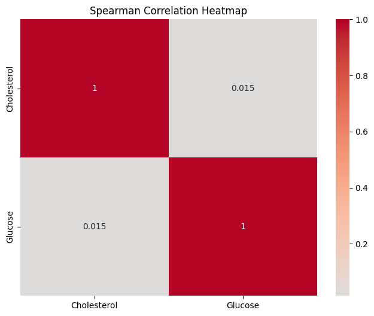
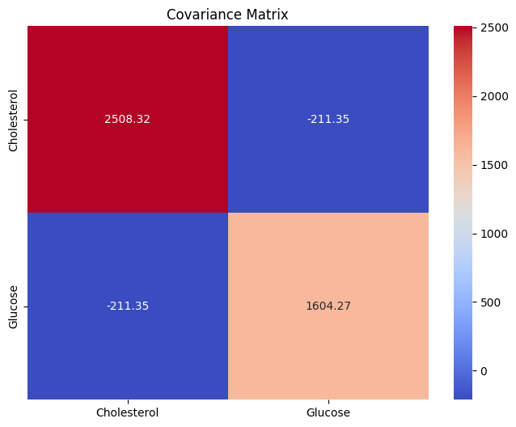

# 3.4 Correlations and Covariances in Medical Metrics

In healthcare, understanding relationships between medical metrics is invaluable for clinical decision-making and research. Correlations and covariances provide insights into how two variables change together, enabling us to uncover patterns and dependencies. For instance, correlations can highlight whether an increase in cholesterol levels corresponds to an increase in blood pressure.

This section delves into the concepts of correlations and covariances within healthcare data. We'll explore Pearson correlation coefficient, Spearman rank correlation, and Kendall's tau-b coefficient as common measures of association. Using Python and pandas, we'll demonstrate how to calculate these coefficients and visualize correlations. We'll also address the nuances of interpreting correlation values and their implications for medical insights. Additionally, we'll discuss the role of covariances in understanding the joint variability of two variables and the differences between covariance and correlation.

## Exploring Correlations

### Pearson Correlation Coefficient

The Pearson correlation coefficient measures the linear relationship between two continuous variables. It quantifies the degree to which the variables tend to increase or decrease together. A coefficient close to +1 indicates a strong positive correlation, while a coefficient close to -1 indicates a strong negative correlation. A coefficient near 0 suggests a weak or no linear relationship.

In a healthcare context, we might explore correlations between metrics like BMI and blood pressure, or age and cholesterol levels. Using Python's pandas library, you can calculate the Pearson correlation coefficient with the `.corr()` method, and visualize the correlation matrix with a heatmap using libraries like seaborn.


**Research Quesiton** 
Does the body mass index (BMI) of patients have a significant correlation with their blood pressure measurements?

**Dataset Description**
We collected data from a group of patients, including their BMI and systolic blood pressure measurements. The dataset contains information for 100 patients.

**Data Preparation**
We used the `faker` library to generate synthetic patient data for BMI and systolic blood pressure, and then conducted a Pearson correlation analysis to understand the relationship between these variables. Next we use the the pandas library and conducted a Pearson correlation analysis to understand the relationship between BMI and systolic blood pressure.

```python
import pandas as pd
from faker import Faker
import random
from scipy.stats import pearsonr

# Initialize faker and random seed
faker = Faker()
random.seed(42)

# Generate synthetic patient data
num_patients = 100
data = {
    "BMI": [random.uniform(18.5, 40.0) for _ in range(num_patients)],
    "Systolic_BP": [random.randint(90, 180) for _ in range(num_patients)]
}

df = pd.DataFrame(data)

# Calculate Pearson correlation coefficient and p-value
pearson_corr, p_value = pearsonr(df["BMI"], df["Systolic_BP"])

print(f"Pearson Correlation Coefficient: {pearson_corr:.2f}")
print(f"P-value: {p_value:.4f}")

```

Expected output:

```yaml
Pearson Correlation Coefficient: -0.03
P-value: 0.7655
```

The Pearson correlation coefficient (r) measures the strength and direction of the linear relationship between two variables. In this case, the Pearson correlation coefficient is approximately -0.03. Since the value is close to zero, it indicates a very weak linear relationship between the "BMI" (Body Mass Index) and "Systolic_BP" (Systolic Blood Pressure) variables.

The P-value associated with the correlation coefficient is 0.7655. This p-value represents the probability of observing a correlation as extreme as the one calculated in the sample data, assuming there is no correlation in the population. In other words, a high p-value suggests that there is no significant evidence to conclude that the correlation is different from zero.

In this scenario, with a p-value of 0.7655, we fail to reject the null hypothesis that there is no correlation between BMI and Systolic Blood Pressure. This implies that the weak correlation we observed is likely due to random chance rather than a true relationship in the population.

### Spearman Rank Correlation

The Spearman rank correlation measures the monotonic relationship between two variables. It's suitable when the variables don't have a linear association but still exhibit a consistent trend. Spearman's coefficient ranges between -1 and +1, with similar interpretations to the Pearson correlation coefficient.

Healthcare examples where Spearman correlation can be insightful include analyzing the association between pain scores and medication effectiveness, where the relationship may not be linear.

#### Case study for Spearman

Let's consider a scenario where a medical research team aims to investigate the relationship between patients' cholesterol levels and their blood glucose levels. 

**Research Question:** We aim to explore the potential relationship between cholesterol levels and glucose levels in a group of patients. Specifically, we want to understand whether there is a monotonic correlation between these two health metrics. By calculating the Spearman correlation coefficient and visualizing it, we can determine whether higher cholesterol levels tend to correspond with higher or lower glucose levels, or if there is no significant correlation.

**Dataset:** Our dataset consists of synthetic patient data, containing two health metrics: "Cholesterol" and "Glucose". Each row in the dataset represents a unique patient, and the values in the columns represent the cholesterol and glucose levels for that patient. The dataset contains 100 patient records, each with a randomly generated cholesterol level (ranging from 120 to 300) and glucose level (ranging from 70 to 200).

**Data Preparation:** To conduct our analysis, we first create a DataFrame named `df` using the Pandas library. We populate this DataFrame with fake patient data, where each row represents a patient and contains cholesterol and glucose measurements. We then calculate the Spearman correlation matrix using the `corr()` function with the method parameter set to '`spearman`'. Finally, we visualize the Spearman correlation matrix using the Seaborn library to create a heatmap. The heatmap helps us visually interpret the strength and direction of the monotonic relationship between cholesterol and glucose levels. Warmer colors indicate positive correlations, while cooler colors represent negative correlations.


**Python Implementation:**

```python
import pandas as pd
import numpy as np
import seaborn as sns
import matplotlib.pyplot as plt

# Create a DataFrame with fake patient data
data = {
    'Cholesterol': np.random.randint(120, 300, size=100),
    'Glucose': np.random.randint(70, 200, size=100)
}
df = pd.DataFrame(data)

# Calculate the Spearman correlation matrix
spearman_corr = df.corr(method='spearman')

print("Spearman Correlation Matrix:")
print(spearman_corr)

# Create a heatmap of the Spearman correlation matrix
plt.figure(figsize=(8, 6))
sns.heatmap(spearman_corr, annot=True, cmap='coolwarm', center=0)
plt.title("Spearman Correlation Heatmap")
plt.show()

```

Output:

```yaml
Spearman Correlation Matrix:
             Cholesterol   Glucose
Cholesterol     1.000000  0.014716
Glucose         0.014716  1.000000
```



**Results Interpretation**

The Spearman correlation matrix provides insights into the relationship between cholesterol and glucose levels among the patients. The values in the matrix range from -1 to 1, with values closer to 1 indicating a strong positive monotonic relationship, values closer to -1 indicating a strong negative monotonic relationship, and values closer to 0 indicating little to no monotonic relationship.

In our case, the Spearman correlation coefficient between "Cholesterol" and "Glucose" levels is approximately 0.0147. This value is close to zero, suggesting a very weak monotonic relationship between these two health metrics. This implies that changes in cholesterol levels are not systematically associated with changes in glucose levels among the patients.

The p-value associated with this Spearman correlation coefficient will help determine the statistical significance of the observed relationship. If the p-value is small (typically less than 0.05), we can conclude that the observed correlation is statistically significant and not likely due to random chance. On the other hand, if the p-value is large, the observed correlation may be attributed to random variability.

### Pearson vs. Spearman Correlation

In healthcare, both Pearson and Spearman correlations have their place. If you're studying the linear relationship between blood pressure and age, Pearson correlation might be suitable. On the other hand, if you're exploring the relationship between pain levels (ordinal data) and medication dosage, Spearman correlation would be more appropriate.

Selecting the right correlation method depends on the nature of your data and the research question you're addressing. Understanding when to use Pearson and when to opt for Spearman is crucial for drawing accurate insights from your healthcare data.

**When to Use Pearson Correlation:**
- The variables being examined are continuous and have a linear relationship.
- The data is normally distributed or close to normal distribution.
- You're interested in determining how a unit change in one variable is associated with a unit change in another variable.

**When to Use Spearman Correlation:**
- The variables are not normally distributed or don't have a linear relationship.
- The variables are ordinal or ranked rather than continuous.
- There's evidence of a monotonic relationship but not necessarily a linear one.

## Covariance: Understanding Joint Variability

Covariance quantifies the degree to which two variables change together. However, it doesn't provide a standardized measure of the strength of the relationship. Positive covariance indicates that the variables tend to increase together, while negative covariance suggests that one variable increases as the other decreases.

In healthcare, we might explore the covariance between patient age and the number of medications prescribed. Python's pandas library allows you to calculate the covariance using the `.cov()` method.

```python
# Calculate covariance between age and number of medications
covariance = data['Age'].cov(data['Num_Medications'])
print(f'Covariance: {covariance:.2f}')
```

---

Here's another example of generating fake patient data using the Faker package and then demonstrating the concept of covariance:

```python
from faker import Faker
import pandas as pd
import numpy as np

# Initialize the Faker generator
fake = Faker()

# Generate fake patient data
num_patients = 100
data = {
    "Patient_ID": [fake.unique.random_int(min=1000, max=9999) for _ in range(num_patients)],
    "Age": [fake.random_int(min=18, max=80) for _ in range(num_patients)],
    "Blood_Pressure": [f"{fake.random_int(min=100, max=150)}/{fake.random_int(min=60, max=100)}" for _ in range(num_patients)],
    "Cholesterol": [fake.random_int(min=120, max=300) for _ in range(num_patients)],
    "Glucose": [fake.random_int(min=70, max=200) for _ in range(num_patients)]
}

df = pd.DataFrame(data)

# Calculate the covariance matrix
covariance_matrix = np.cov(df[["Cholesterol", "Glucose"]].values.T)

print("Fake Patient Data:")
print(df.head())

print("\nCovariance Matrix:")
print(covariance_matrix)
```

Expected output:

```yaml
Fake Patient Data:
   Patient_ID  Age Blood_Pressure  Cholesterol  Glucose
0        2757   31         116/87          217      140
1        8092   19         140/90          122      106
2        1851   65         141/93          220      113
3        4462   75         129/67          258      111
4        6569   48         148/70          257      160

Covariance Matrix:
[[2508.31555556 -211.34505051]
 [-211.34505051 1604.26707071]]
 ```

In this example, we generate fake patient data including the patient's age, blood pressure, cholesterol level, and glucose level. We then calculate the covariance matrix between the "Cholesterol" and "Glucose" variables to understand the joint variability between these two health metrics. The covariance matrix provides insights into how these two variables change together and whether their changes are positively or negatively related.

The covariance values themselves don't provide a standardized measure of the strength of the relationship between variables. They give us information about the direction and extent to which variables change together. 

However, interpreting these values can be challenging due to their scale and dependence on the units of measurement. 

```yaml
[[2508.32  -211.35]
 [-211.35  1604.27]]
```

- The value in the top-left cell (2508.32) represents the covariance between "Cholesterol" and "Cholesterol." This is the variance of the "Cholesterol" variable itself.

- The value in the bottom-right cell (1604.27) represents the covariance between "Glucose" and "Glucose." This is the variance of the "Glucose" variable itself.

- The value in the top-right cell (-211.35) and the value in the bottom-left cell (-211.35) represent the covariance between "Cholesterol" and "Glucose," and vice versa. These values indicate the degree to which "Cholesterol" and "Glucose" change together. A negative covariance suggests that as one variable increases, the other tends to decrease, and vice versa.

To better understand the strength of the relationship, we often use the correlation coefficient, which is a normalized measure that ranges from -1 to 1.

Since the covariance matrix is somewhat hard to interpret here, so lets use a visualization package `seaborn` to help:

```python
import matplotlib.pyplot as plt
import seaborn as sns

# Generate fake patient data (same as previous example)
# ...
# ......previous code goes here

covariance_matrix = np.cov(df[["Cholesterol", "Glucose"]].values.T)

# Create a heatmap of the covariance matrix
plt.figure(figsize=(8, 6))
sns.heatmap(covariance_matrix, annot=True, fmt=".2f", cmap="coolwarm", 
            xticklabels=["Cholesterol", "Glucose"], yticklabels=["Cholesterol", "Glucose"])
plt.title("Covariance Matrix")
plt.show()
```



The heatmap visually represents the covariance values between the "Cholesterol" and "Glucose" variables. Positive values are indicated by warmer colors (reds), while negative values are indicated by cooler colors (blues). The annotations inside the cells of the heatmap show the covariance values. This visualization helps us understand the strength and direction of the relationship between the two variables.

Understanding the joint variability of medical metrics can reveal important insights, especially when considering factors that might influence patient health.

## Covariance vs. Correlation

While both covariance and correlation provide insights into relationships between variables, they have distinct interpretations. Covariance depends on the units of measurement and doesn't provide a standardized measure. Correlation, on the other hand, ranges between -1 and +1, making it easier to interpret the strength and direction of the relationship.

--- 

To summarize, exploring correlations and covariances is a fundamental step in healthcare data analysis. These measures enable us to uncover hidden relationships, identify potential confounding factors, and guide further research to improve patient care and outcomes.