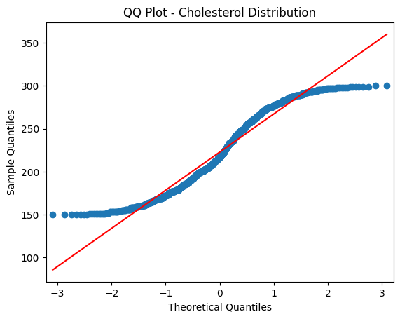

# 3.2 Understanding Health Data Distribution

Before embarking on in-depth analyses or predictive modeling, understanding the distribution of health data is paramount. Descriptive statistics provide an initial glimpse into the data's central tendency and spread, while distribution curves offer insights into the prevalence of specific medical conditions within a population. While traditional statistics often assume a normal distribution, healthcare data rarely adheres to this idealized curve.

This section will guide you through the fundamentals of descriptive statistics and distribution curves in the context of healthcare data. We'll showcase Python tools to calculate mean, median, variance, and visualize distribution curves. Furthermore, we'll explain the significance of various distribution shapes, including skewed, bimodal, and uniform, and provide real-world healthcare examples to contextualize these concepts.

## Descriptive Statistics

Descriptive Statistics: Descriptive statistics are fundamental tools in the realm of data exploration. They provide a snapshot of the data's central tendencies, spread, and shape. For health data, these statistics are particularly valuable as they enable insights into medical trends, patient conditions, and treatment outcomes. Some key descriptive statistics and their relevance in the healthcare context include:

### Mean

The mean, or average, is a fundamental descriptive statistic that holds significant importance in healthcare data analysis. It offers insights into the central tendency of a dataset and helps identify the typical value of a health metric. Here are some additional healthcare examples that illustrate the importance of the mean:

- *Laboratory Test Results*: Medical laboratory tests provide insights into various health markers. Calculating the mean values of these markers can help establish normal ranges for different patient groups. Deviations from the mean might indicate the presence of underlying medical conditions.

- *Drug Dosages*: Healthcare professionals often prescribe medications based on dosages appropriate for a patient's age, weight, and condition. Calculating the mean dosage of a specific medication within a patient population can guide clinicians in determining suitable dosages for individual patients.

- *Patient Satisfaction Ratings*: Measuring patient satisfaction is essential for improving healthcare services. Calculating the mean satisfaction scores can offer insights into the overall patient experience and guide efforts to enhance the quality of care.

### Standard Deviation (SD)

The standard deviation is a crucial statistical measure that is closely linked to the mean. It provides valuable insights into the spread or dispersion of data points around the mean. First, the standard deviation measures the average amount by which individual data points in a dataset deviate from the mean. In other words, it quantifies the spread or dispersion of data around the mean. **A small standard deviation indicates that data points are close to the mean, while a larger standard deviation suggests that data points are more spread out**. 


[Image Source](https://www.statisticshowto.com/wp-content/uploads/2013/09/The_Normal_Distribution.svg_1.png)
  
- Relationship to the mean: The standard deviation and the mean have a strong relationship. When data points are clustered closely around the mean, the standard deviation is small. Conversely, when data points are more widely spread out from the mean, the standard deviation is larger.
  - In a symmetric, normal distribution, the mean and standard deviation are closely related. The standard deviation gives you an idea of how data points are dispersed around the mean. In a normal distribution, about 68% of the data falls within one standard deviation of the mean, about 95% falls within two standard deviations, and about 99.7% falls within three standard deviations.
  - A telltale sign of potentially highly skewed or non-normal data is **when the standard deviation is considerably larger than the mean**. This can indicate that the data distribution is stretched out due to extreme values in the tail of the distribution.
    
- Our prior examples: 
  - *Laboratory Test Results*: In medical tests, such as blood tests or imaging studies, the standard deviation can indicate the variability of results within a patient population. A smaller standard deviation indicates that test results are relatively consistent, while a larger standard deviation suggests greater variability.
  - *Drug Dosages*: When evaluating the effectiveness of a drug, clinicians often consider both the mean response and the standard deviation of the response. A small standard deviation indicates that patients' responses are consistent, while a larger standard deviation may suggest variable responses.
  - *Patient Satisfaction Ratings*: Standard deviation is used to assess variations in patient satisfaction scores, such as their satisfaction with nursing care with their in-patient stay. A smaller standard deviation implies more consistent satisfaction scores, while a larger standard deviation indicates greater variability in satisfaction. 


### Median
The median is the middle value when data is ordered. It's a measure of central tendency that's less affected by extreme values. In healthcare, the median can be used to describe the middle value of a set of patient ages, which might be more representative than the mean when dealing with skewed age distributions.

### Mode
The mode is the most frequently occurring value in a dataset. Identifying the mode in healthcare data can highlight the most common symptom reported by patients, aiding in understanding prevalent conditions.

### Variance
Variance measures the spread or dispersion of data points from the mean. In healthcare, variance can indicate the variability of blood pressure readings within a patient population.

### Quantiles and Quartiles
Quartiles and quantiles are both measures used to divide a dataset into specific segments or parts. Quantiles are a more general concept that includes quartiles as a specific case. Let's break down the differences and importance of each:

**Quartiles**: Quartiles are a specific type of quantile that divides data into four equal parts, each containing a quarter of the data. The three quartiles are:
- First Quartile (Q1): This is the value below which 25% of the data falls. It's also known as the 25th percentile.
- Second Quartile (Q2): This is the median of the data and divides it into two halves, with 50% of the data falling below and 50% above. It's also known as the 50th percentile.
- Third Quartile (Q3): This is the value below which 75% of the data falls. It's also known as the 75th percentile.

**Quantiles**: Quantiles are a broader concept and refer to dividing a dataset into equal parts. While quartiles divide into four parts, other quantiles can divide data into any number of parts. For instance, quintiles divide into five parts, deciles into ten parts, and percentiles into 100 parts.
- Percentiles: Percentiles are a common form of quantiles, where data is divided into 100 equal parts. The nth percentile is the value below which n% of the data falls.

Quartiles and quantiles play a crucial role in healthcare data analysis for various reasons:

- Understanding Distribution: Dividing data into quartiles or other quantiles helps in visualizing how data is distributed across different segments. This is especially valuable for understanding the spread of patient metrics like cholesterol levels, blood pressure readings, or BMI scores.
- Cutoff Points and Percentiles: Quartiles and percentiles allow us to establish cutoff points. For example, knowing the 25th and 75th percentiles of cholesterol levels helps identify the range within which most patients fall. This aids in defining healthy ranges and identifying outliers or potential health concerns.
- Segmenting Survey Data: In healthcare surveys, quantiles are useful for segmenting respondents based on their answers. For instance, if a survey asks about pain intensity, dividing responses into quartiles can help classify respondents into categories like "low pain," "moderate pain," "high pain," and "severe pain."
- Comparative Analysis: Quartiles and quantiles aid in comparative analysis. You can compare how specific patient metrics or health indicators vary across different percentiles or quartiles, helping to identify trends or disparities.

#### Quartile Example: 
Let's take an example of cholesterol levels in a population and divide it into quartiles to create four groups. Suppose we have the following cholesterol levels for a sample of individuals:

```text
15, 18, 20, 22, 25, 28, 30, 33, 35, 40, 45, 50, 55, 60
```
**Step 1 Calculate Quartiles:**  
- First Quartile (Q1): This is the value below which 25% of the data falls. In our case, 25% of 14 (total data points) is 3.5, so the value at the 3.5th position is the first quartile. In our dataset, this corresponds to the 4th value, which is 22.
- Second Quartile (Q2): This is the median, which is the value that divides the data into two halves. Since we have an even number of data points (14), the median is the average of the 7th and 8th values, which is (30 + 33) / 2 = 31.5.
- Third Quartile (Q3): This is the value below which 75% of the data falls. 75% of 14 is 10.5, so the value at the 10.5th position is the third quartile. In our dataset, this corresponds to the 11th value, which is 45.

**Step 2: Create Quartile Groups:** Now we'll use these quartile values to divide the data into four groups:
- Group 1: Below 1st Quartile (Q1) - Cholesterol levels below 22
- Group 2: Between 1st Quartile (Q1) and 2nd Quartile (Q2) - Cholesterol levels between 22 and 31.5
- Group 3: Between 2nd Quartile (Q2) and 3rd Quartile (Q3) - Cholesterol levels between 31.5 and 45
- Group 4: Above 3rd Quartile (Q3) - Cholesterol levels above 45

**Step 3: Interpretation:** 
- Group 1: 25% of individuals have cholesterol levels below 22.
- Group 2: The middle 25% of individuals have cholesterol levels between 22 and 31.5.
- Group 3: Another 25% of individuals have cholesterol levels between 31.5 and 45.
- Group 4: The top 25% of individuals have cholesterol levels above 45.

### Range
The range is the difference between the maximum and minimum values in a dataset. It can highlight the span of variation in health metrics like heart rate.

### Python Examples

Start by loading your health data into a Pandas DataFrame (df). Once your data is organized, you can apply a range of statistical functions to explore its key attributes. Pandas provides convenient methods to compute some of these statistics automatically. For example, you can use the `.describe()` function to generate a summary of key statistics for each column in the DataFrame.


Lets first create a fake df that contains some patient records:

```python
import pandas as pd
from faker import Faker
import random
from tabulate import tabulate

fake = Faker()

# Generate fake health data for 1000 patients
num_patients = 1000
data = {
    "Patient_ID": [fake.random_int(min=1000, max=9999) for _ in range(num_patients)],
    "Age": [random.randint(18, 90) for _ in range(num_patients)],
    "Gender": [fake.random_element(elements=("Male", "Female")) for _ in range(num_patients)],
    "BMI": [round(random.uniform(15, 40), 2) for _ in range(num_patients)],
    "Blood_Pressure": [f"{random.randint(90, 160)}/{random.randint(60, 100)}" for _ in range(num_patients)],
    "Cholesterol": [random.randint(150, 300) for _ in range(num_patients)],
    "Glucose": [random.randint(70, 200) for _ in range(num_patients)],
    "Smoker": [fake.random_element(elements=("Yes", "No")) for _ in range(num_patients)],
    "Exercise": [fake.random_element(elements=("High", "Moderate", "Low")) for _ in range(num_patients)],
    "Medication": [fake.random_element(elements=("Yes", "No")) for _ in range(num_patients)]
}

df = pd.DataFrame(data)

# Split "Blood_Pressure" column into "Systolic" and "Diastolic" columns
df[["Systolic", "Diastolic"]] = df["Blood_Pressure"].str.split("/", expand=True)

# Convert "Systolic" and "Diastolic" columns to numeric
df[["Systolic", "Diastolic"]] = df[["Systolic", "Diastolic"]].apply(pd.to_numeric)

# Create a "Total_BP" column that sums "Systolic" and "Diastolic" values
df["Total_BP"] = df["Systolic"] + df["Diastolic"]

## print df
print(tabulate(df.head(10), headers='keys', tablefmt='psql'))


df.to_csv("health_data.csv")
```

Expected table structure:

```psql

+----+--------------+-------+----------+-------+------------------+---------------+-----------+----------+------------+--------------+------------+-------------+------------+
|    |   Patient_ID |   Age | Gender   |   BMI | Blood_Pressure   |   Cholesterol |   Glucose | Smoker   | Exercise   | Medication   |   Systolic |   Diastolic |   Total_BP |
|----+--------------+-------+----------+-------+------------------+---------------+-----------+----------+------------+--------------+------------+-------------+------------|
|  0 |         5796 |    41 | Male     | 30.83 | 103/68           |           227 |       167 | Yes      | High       | Yes          |        103 |          68 |        171 |
|  1 |         6310 |    64 | Female   | 38.59 | 103/93           |           186 |       184 | Yes      | High       | Yes          |        103 |          93 |        196 |
|  2 |         2233 |    67 | Female   | 17.56 | 147/95           |           158 |       111 | No       | Low        | Yes          |        147 |          95 |        242 |
|  3 |         2200 |    58 | Female   | 24.54 | 131/78           |           169 |       153 | No       | Moderate   | No           |        131 |          78 |        209 |
|  4 |         9327 |    67 | Female   | 33.66 | 112/90           |           172 |       142 | Yes      | Moderate   | No           |        112 |          90 |        202 |
|  5 |         3648 |    43 | Female   | 33.13 | 90/71            |           262 |       149 | Yes      | High       | Yes          |         90 |          71 |        161 |
|  6 |         8946 |    64 | Male     | 37.42 | 92/97            |           158 |        96 | No       | High       | Yes          |         92 |          97 |        189 |
|  7 |         7754 |    80 | Male     | 35.37 | 128/80           |           184 |       182 | Yes      | High       | Yes          |        128 |          80 |        208 |
|  8 |         7097 |    37 | Female   | 35.97 | 133/89           |           231 |       112 | Yes      | Moderate   | No           |        133 |          89 |        222 |
|  9 |         4895 |    45 | Female   | 20.61 | 122/87           |           249 |       104 | No       | Low        | Yes          |        122 |          87 |        209 |
+----+--------------+-------+----------+-------+------------------+---------------+-----------+----------+------------+--------------+------------+-------------+------------+

```

Great, now lets see how the `.describe()` works: 

```python
import pandas as pd

data = pd.read_csv('health_data.csv')
data_description = data.describe()
print(data_description)
```

*Data description output example:*

```yaml
        Unnamed: 0   Patient_ID          Age         BMI  Cholesterol  \
count  1000.000000  1000.000000  1000.000000  1000.00000  1000.000000   
mean    499.500000  5574.086000    55.100000    27.82143   222.766000   
std     288.819436  2596.754523    20.893984     7.25352    44.414862   
min       0.000000  1002.000000    18.000000    15.01000   150.000000   
25%     249.750000  3446.500000    38.000000    21.24750   184.000000   
50%     499.500000  5659.000000    56.000000    28.24000   217.500000   
75%     749.250000  7760.500000    73.000000    34.07750   263.000000   
max     999.000000  9994.000000    90.000000    39.99000   300.000000   

           Glucose    Systolic    Diastolic    Total_BP  
count  1000.000000  1000.00000  1000.000000  1000.00000  
mean    135.710000   124.08400    79.976000   204.06000  
std      37.394174    20.52438    11.697874    23.36181  
min      70.000000    90.00000    60.000000   151.00000  
25%     104.000000   107.00000    70.000000   187.00000  
50%     136.000000   123.00000    80.000000   203.00000  
75%     167.000000   142.00000    90.000000   221.00000  
max     200.000000   160.00000   100.000000   259.00000 
```

Additionally, the .value_counts() function is useful for understanding the frequency distribution of categorical variables. It displays the count of unique values in a column:

```python
import pandas as pd

data = pd.read_csv('health_data.csv')
gender_counts = data['Gender'].value_counts()
print(gender_counts)
```

Incorporating these functions into your analysis workflow allows for quick insights into the distribution and characteristics of your health data, aiding in making informed decisions for healthcare research and outcomes.

Below is a snippet of Python code demonstrating how to perform some of these descriptive statistics using Pandas and NumPy:

```python
import pandas as pd
import numpy as np

# Load health data into a Pandas DataFrame
data = pd.read_csv('health_data.csv')

# Calculate mean, median, and mode of a health metric
mean_value_bp = data['Total_BP'].mean()
median_value_chol = data['Cholesterol'].median()
mode_value_glucose = data['Glucose'].mode().iloc[0]

# Calculate variance and standard deviation for BP
variance_bp = np.var(data['Total_BP'])
std_deviation_bp = np.std(data['Total_BP'])

# Calculate percentiles for Glucose
percentile_25_glucose = np.percentile(data['Glucose'], 25)
percentile_75_glucose = np.percentile(data['Glucose'], 75)

# Calculate range for Age
data_range_age = data['Age'].max() - data['Age'].min()

# Calculate correlation and covariance
correlation_matrix_1 = data[['BMI', 'Total_BP', 'Cholesterol']].corr()
covariance_matrix_2 = data[['Glucose', 'Age', 'Total_BP']].cov()

# Print results
print("Mean Blood Pressure:", mean_value_bp)
print("Median Cholesterol:", median_value_chol)
print("Mode Glucose:", mode_value_glucose)
print("Variance Glucose Blood Pressure:", variance_bp)
print("Standard Deviation Blood Pressure:", std_deviation_bp)
print("25th Percentile Glucose:", percentile_25_glucose)
print("75th Percentile Glucose:", percentile_75_glucose)
print("Data Range (Age):", data_range_age)
print("Correlation Matrix 1:\n", correlation_matrix_1)
print("Covariance Matrix 2:\n", covariance_matrix_2)
```
  
## Distribution Curves

Distribution curves play a crucial role in understanding the underlying patterns and characteristics of health data. In traditional statistics, the bell-shaped normal distribution curve is often sought after, indicating that data follows a symmetrical pattern around the mean. However, healthcare data is often more complex and does not always adhere to the idealized normal distribution.

Here's an example of how we can generate fake data that follows a normal distribution using Python and the NumPy library. We'll use the numpy.random.normal() function to generate random numbers from a normal distribution. Then, we can visualize the distribution using a histogram and a probability density function (PDF) curve.

```python
import numpy as np
import matplotlib.pyplot as plt

# Generate fake data with a normal distribution
mean = 60  # Mean value
std_dev = 10  # Standard deviation
num_samples = 1000  # Number of data points

fake_data = np.random.normal(mean, std_dev, num_samples)

# Create a histogram
plt.hist(fake_data, bins=30, density=True, alpha=0.7, color='blue', label='Histogram')

# Create a probability density function (PDF) curve
x = np.linspace(min(fake_data), max(fake_data), 100)
pdf = (1/(std_dev * np.sqrt(2*np.pi))) * np.exp(-(x - mean)**2 / (2*std_dev**2))
plt.plot(x, pdf, color='red', label='PDF')

plt.title('Normal Distribution')
plt.xlabel('Value')
plt.ylabel('Probability Density')
plt.legend()
plt.grid(True)
plt.show()
```


In this example, we generate 1000 fake data points with a mean of 60 and a standard deviation of 10. We then create a histogram to visualize the frequency distribution of the data and overlay a PDF curve to show the theoretical normal distribution. The `density=True` argument in the `plt.hist()` function ensures that the histogram is normalized to represent a probability distribution.

You can modify the `mean`, `std_dev`, and `num_samples` values to see how they affect the shape of the distribution. Keep in mind that generating a perfect normal distribution in real-world data is unlikely due to the factors discussed earlier. However, this example helps you understand what a normal distribution looks like and how it can be generated using Python.

### Non-normal curves

Healthcare data often deviates from the idealized normal distribution due to a variety of factors inherent to medical and clinical contexts. Here are some reasons why healthcare data may not follow a perfect bell curve:

- **Biological Variability:** Human health and medical conditions are influenced by complex biological processes. Variability in genetic factors, disease progression, and individual responses to treatments can lead to non-standard distributions in health metrics.

- **Outliers and Extremes:** Healthcare data frequently contains outliers and extreme values that can skew the distribution. These outliers can represent rare medical conditions, unusual patient responses, or measurement errors.

- **Categorical Data:** Healthcare data often includes categorical variables such as disease diagnoses, medication types, and medical procedures. Categorical data does not naturally fit a normal distribution; instead, it follows discrete distributions.

- **Sample Selection:** In medical studies, data is often collected from specific patient populations or groups with specific conditions. This targeted sampling can result in distributions that are different from the general population.

- **Medical Interventions:** Interventions, treatments, and medications can significantly impact health metrics. For example, certain medications may lead to a bimodal distribution of a particular health parameter.

- **Biases and Skewness:** Biases in data collection, such as the underrepresentation of certain demographics, can lead to skewed distributions. Skewed distributions can occur when one tail of the curve is longer than the other.

- **Nonlinear Relationships:** Health metrics may have nonlinear relationships with other variables. This can lead to skewed or irregular distributions as data points cluster around certain values.

- **Complex Interactions:** Medical conditions often involve complex interactions between multiple factors, making the data distribution more intricate. Multiple modes or peaks may emerge in the distribution.

- **Time Series Data:** Health data collected over time, such as patient vitals, may exhibit temporal trends, seasonality, and cyclic patterns that deviate from the normal distribution.

- **Measurement Errors:** Measurement errors, instrument calibration, and data recording inconsistencies can introduce noise and deviations from normality.

So in summary, health data distribution curves can take various shapes, each providing insights into different aspects of the data. 

### Common Shapes

Some common distribution shapes in healthcare data include:

- **Normal Distribution (Bell Curve)**: While not always common in healthcare data, a normal distribution indicates that values cluster around the mean, with fewer extreme values. It suggests that health metrics are relatively consistent within the population.

- **Skewed Distribution**: A skewed distribution occurs when the data is asymmetric. Positively skewed data (skewed to the right) has a tail on the right side, indicating a larger number of lower values and fewer high values. Conversely, negatively skewed data (skewed to the left) has a tail on the left side, with more high values and fewer low values. Skewed distributions can arise from factors such as outliers or limitations in measurement precision.


Let's generate a right-skewed distribution:

```python
import numpy as np
import matplotlib.pyplot as plt

# Generate fake data with a right-skewed distribution
skewed_data = np.random.exponential(scale=2, size=1000)

plt.hist(skewed_data, bins=30, density=True, alpha=0.7, color='green', label='Skewed Distribution')
plt.title('Right-Skewed Distribution')
plt.xlabel('Value')
plt.ylabel('Probability Density')
plt.legend()
plt.grid(True)
plt.show()

```

- **Bimodal Distribution**: In healthcare, data may exhibit bimodal distribution, indicating the presence of two distinct groups within the population. This could suggest the existence of different patient cohorts or subpopulations with varying health characteristics.

A bimodal distribution has two distinct peaks. Let's generate a bimodal distribution:


```python
# Generate fake data with a bimodal distribution
bimodal_data = np.concatenate([np.random.normal(loc=30, scale=5, size=500),
                               np.random.normal(loc=70, scale=10, size=500)])

plt.hist(bimodal_data, bins=30, density=True, alpha=0.7, color='purple', label='Bimodal Distribution')
plt.title('Bimodal Distribution')
plt.xlabel('Value')
plt.ylabel('Probability Density')
plt.legend()
plt.grid(True)
plt.show()
```

- **Uniform Distribution**: A uniform distribution signifies that values are spread evenly across the range, indicating no dominant trend or pattern. In healthcare, this might be seen in situations where health metrics are evenly distributed among patients.


Let's generate a uniform distribution:

```python
# Generate fake data with a uniform distribution
uniform_data = np.random.uniform(low=20, high=80, size=1000)

plt.hist(uniform_data, bins=30, density=True, alpha=0.7, color='orange', label='Uniform Distribution')
plt.title('Uniform Distribution')
plt.xlabel('Value')
plt.ylabel('Probability Density')
plt.legend()
plt.grid(True)
plt.show()
```

Understanding the shape and skewness of distribution curves is crucial for accurate data analysis and interpretation. While the idealized normal distribution is rare in healthcare due to the complexities and individual variability in health data, recognizing and working with different distribution shapes can lead to more meaningful insights and informed decision-making in healthcare research and practice.

In addition to these shapes, many other non-normal distributions exist:

- Beta Distribution.
- Exponential Distribution.
- Gamma Distribution.
- Inverse Gamma Distribution.
- Log-Normal Distribution.
- Logistic Distribution.
- Maxwell-Boltzmann Distribution.
- Poisson Distribution.
- Skewed Distribution.
- Symmetric Distribution.
- Uniform Distribution.
- Unimodal Distribution.
- Weibull Distribution.


Python provides powerful libraries and tools for analyzing and visualizing distribution curves in health data. You can use these tools to gain insights into the shape of the data, identify outliers, and make informed decisions in healthcare analysis. Here are some ways you can use Python for distribution analysis:

### Visualizing Distributions

**Matplotlib and Seaborn**: Matplotlib and Seaborn are popular data visualization libraries in Python. You can create histograms, density plots, box plots, and violin plots to visualize the distribution of health metrics. These plots help you quickly identify the shape of the data and the presence of outliers.

Below, lets use are same dataset from above:

```python
import matplotlib.pyplot as plt
import seaborn as sns

# Create a histogram
sns.histplot(data['Age'], bins=20, kde=True)
plt.xlabel('Age')
plt.ylabel('Frequency')
plt.title('Age Distribution')
plt.show()
```


### Quantile-Quantile (QQ) Plots

**Statsmodels**: The Statsmodels library provides QQ plots that compare the quantiles of your data against the quantiles of a theoretical distribution. QQ plots help you assess whether your data follows a particular distribution, such as the normal distribution.

```python
import statsmodels.api as sm

# Create a QQ plot
sm.qqplot(data['Cholesterol'], line='s')
plt.xlabel('Theoretical Quantiles')
plt.ylabel('Sample Quantiles')
plt.title('QQ Plot - Cholesterol Distribution')
plt.show()
```



### Shapiro-Wilk Test for Normality

**SciPy**: The SciPy library includes statistical tests, such as the Shapiro-Wilk test, which assesses whether data follows a normal distribution. This is particularly useful for checking the normality assumption, especially in healthcare data.

```python
from scipy.stats import shapiro

stat, p = shapiro(data['temperature'])
if p > 0.05:
    print("Temperature data follows a normal distribution.")
else:
    print("Temperature data does not follow a normal distribution.")
```

### Skewness and Kurtosis

**SciPy**: You can calculate skewness and kurtosis to quantify the degree of skewness and the shape of the tails in your data distribution.

```python
from scipy.stats import skew, kurtosis

skewness = skew(data['heart_rate'])
kurt = kurtosis(data['heart_rate'])

print(f"Skewness: {skewness}")
print(f"Kurtosis: {kurt}")
```

## Automated Exploratory Data Analysis (EDA) with Python

Automated Exploratory Data Analysis (EDA) tools can significantly speed up the process of understanding your health data's distribution, identifying patterns, and gaining insights. These tools often provide a comprehensive overview of your data's characteristics without requiring manual scripting. Here are a few popular Python packages that can assist in automated EDA:

### Pandas Profiling
Pandas Profiling is a versatile library that generates a detailed summary report of your dataset. It provides essential statistics, correlation matrices, missing value analysis, and visualizations for each column. The generated report can help you quickly identify potential issues, relationships, and patterns in your data.

```python
import pandas as pd
from pandas_profiling import ProfileReport

# Load your dataset
data = pd.read_csv('health_data.csv')

# Generate the EDA report
report = ProfileReport(data)
report.to_file('eda_report.html')
```

### SweetViz
SweetViz is another powerful library for automated EDA. It generates comparative visualizations between your dataset's target variable and other features, highlighting differences, correlations, and distribution disparities. It's especially useful for classification problems.

```python
import sweetviz as sv

# Compare two datasets (e.g., before and after preprocessing)
data_before = pd.read_csv('data_before.csv')
data_after = pd.read_csv('data_after.csv')

# Generate the comparison report
report = sv.compare([data_before, 'Before Preprocessing'], [data_after, 'After Preprocessing'])
report.show_html('eda_comparison_report.html')
```

### AutoViz
AutoViz is designed to automatically visualize any dataset with minimal configuration. It generates a wide variety of charts and plots for each feature in your dataset. It can be particularly helpful for quickly understanding the distribution and relationship of variables.

```python
from autoviz.AutoViz_Class import AutoViz_Class

# Load your dataset
data = pd.read_csv('health_data.csv')

# Generate the automated visualizations
AV = AutoViz_Class()
report = AV.AutoViz(filename='', dfte=data, depVar='target_column')
```

Importantly, while automated EDA tools are powerful and efficient for exploring smaller datasets, they can face challenges when dealing with larger datasets. Here are a few considerations to keep in mind:

- *Performance and Memory Usage*: Automated EDA tools generate a wide range of visualizations and statistical summaries. With larger datasets, these tools may consume significant memory and processing power, leading to slower performance and potential memory issues.

- *Configuring Relevance*: In large datasets, not all features or columns may be relevant to your analysis. Configuring the tools to only include the data elements you care about can help streamline the analysis and reduce the load on system resources.

- *Customization*: Automated EDA tools often provide options for customization, allowing you to choose specific analyses, visualizations, and summaries that are most relevant to your analysis goals. This customization can help focus the analysis on critical aspects of the data.

- *Parallel Processing*: Some tools offer parallel processing capabilities, which can help distribute the computational load across multiple cores or processors. This can improve performance when dealing with large datasets.

In summary, these automated EDA tools help you generate comprehensive reports and visualizations without extensive manual coding. They are useful for quickly identifying trends, patterns, and potential issues in your health data. Keep in mind that while these tools are efficient, it's still important to perform domain-specific analyses and data validation to ensure the accuracy and reliability of your findings.


---

Using these Python tools, you can gain a deeper understanding of the distribution of health data, identify any departures from normality, and make informed decisions in healthcare analysis based on the shape of the distribution curves.

