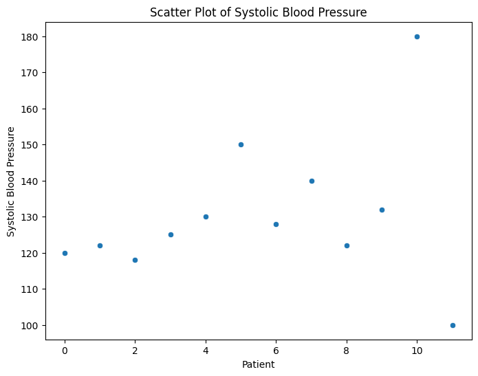

# 3.2 Outlier Detection and Handling in Health Data

After handling missingness, we can now move on to outliers, and then finally the EDA. 

Outliers, or extreme values, can significantly impact analyses and model performance in healthcare data. These anomalies can arise due to measurement errors, rare conditions, or other data irregularities. Detecting and appropriately handling outliers is crucial to maintaining the integrity of our insights.

In this section, we delve into methods for detecting outliers, such as visual inspection, Z-score, IQR, modified Z-score, and Local Outlier Factor (LOF). We'll illustrate each method with Python code and walk you through their application using practical healthcare examples. After identifying outliers, we explore diverse strategies for handling them, including exclusion, transformation, binning, specialized analysis, and modeling. We emphasize the importance of selecting an approach that aligns with the goals of your analysis and the nature of the data.

## Detection Methods

### Visual Inspection
Plotting the data using scatter plots, box plots, or histograms can help visualize extreme values that stand out from the rest.

Let's say you're analyzing patient blood pressure data. You could create a scatter plot with systolic blood pressure on the x-axis and diastolic blood pressure on the y-axis. Outliers could be points that are significantly distant from the main cluster of data points.

```python
import matplotlib.pyplot as plt
import seaborn as sns

# Sample blood pressure data
systolic_bp = [120, 122, 118, 125, 130, 150, 128, 140, 122, 132, 180, 100]

# Scatter plot
plt.figure(figsize=(8, 6))
sns.scatterplot(x=range(len(systolic_bp)), y=systolic_bp)
plt.xlabel("Patient")
plt.ylabel("Systolic Blood Pressure")
plt.title("Scatter Plot of Systolic Blood Pressure")
plt.show()
```



### Z-Score
The Z-score measures how many standard deviations an observation is away from the mean. If the Z-score is above a certain threshold (usually 2 or 3), the data point is considered an outlier.

Suppose you have a dataset of patient cholesterol levels. You want to detect cholesterol values that are significantly higher than the average.

```python
import numpy as np
from scipy.stats import zscore

# Sample cholesterol data
cholesterol_levels = [180, 210, 190, 220, 500, 280, 230, 195, 200, 290]

# Calculate Z-scores
z_scores = zscore(cholesterol_levels)

# Set threshold for outlier detection
threshold = 2

# Identify outliers
outliers = np.where(np.abs(z_scores) > threshold)

# Fetch outlier values using the identified indices
outlier_values = [cholesterol_levels[i] for i in outlier_indices]

print("Outlier Indices in Array:", outliers)
print("Outlier Values:", outlier_values)

```

```yaml
Outlier Indices in Array: (array([4]),)
Outlier Values: [500]
```

### IQR (Interquartile Range)
This method uses the Q1 and Q3 quartiles. Any data point below Q1 - 1.5 * IQR or above Q3 + 1.5 * IQR is an outlier.

Now consider a dataset of patient heart rates. You want to identify heart rates that are unusually high or low.

```python
# Sample heart rate data
heart_rates = [70, 75, 78, 80, 82, 85, 88, 90, 92, 100, 120, 50]

# Calculate quartiles and IQR
q1 = np.percentile(heart_rates, 25)
q3 = np.percentile(heart_rates, 75)
iqr = q3 - q1

# Set threshold for outlier detection
threshold_lower = q1 - 1.5 * iqr
threshold_upper = q3 + 1.5 * iqr

# Identify outliers
outliers = [x for x in heart_rates if x < threshold_lower or x > threshold_upper]

print("Outliers:", outliers)
```

```yaml
Outliers: [120, 50]
```

### Modified Z-Score
Similar to the Z-score but using the median and median absolute deviation (MAD) instead of the mean and standard deviation. This makes it more robust to extreme values.

Suppose you have a dataset of patient glucose levels. You want to identify extreme values that may indicate abnormal glucose levels.

```python
from statsmodels import robust
import numpy as np

# Sample glucose data
glucose_levels = [100, 105, 102, 98, 108, 140, 95, 110, 112, 120, 90]

# Calculate median and median absolute deviation (MAD)
median = np.median(glucose_levels)
mad = robust.mad(glucose_levels)

# Calculate modified Z-scores
modified_z_scores = 0.6745 * (glucose_levels - median) / mad

# Set threshold for outlier detection
threshold = 2

# Identify outlier indices
outlier_indices = np.where(np.abs(modified_z_scores) > threshold)[0]

# Fetch outlier values using the identified indices
outlier_values = [glucose_levels[i] for i in outlier_indices]

print("Indices of outliers:", outlier_indices)
print("Values of outliers:", outlier_values)

```

```yaml
Indices of outliers: [5]
Values of outliers: [140]
```

In the above example, the value 0.6745 in the modified Z-score formula is a constant factor that makes the modified Z-score comparable to the standard Z-score when dealing with normally distributed data. In a standard normal distribution, about 0.6745 of the data falls within one standard deviation from the mean. By using this constant, the modified Z-score retains a similar scale and interpretation.

The threshold of 2 is commonly used as a cutoff point for detecting outliers using Z-scores or modified Z-scores. A threshold of 2 means that data points with Z-scores (or modified Z-scores) greater than 2 or less than -2 are considered potential outliers. This threshold is chosen somewhat arbitrarily but is often used because it captures data points that are relatively far from the mean. However, the threshold value can be adjusted based on the specific context and requirements of your analysis.

In practice, the choice of threshold can depend on factors such as the characteristics of your data, the degree of sensitivity to outliers, and domain expertise. It's important to note that outlier detection thresholds should be chosen carefully and validated against the context of your analysis and the domain knowledge.

### Local Outlier Factor (LOF)
A density-based method that measures the local deviation of density of a data point with respect to its neighbors. It's useful for identifying outliers in non-uniform datasets.

Imagine you have a dataset of patient response times to a specific treatment. You want to identify patients with significantly different response times.

In the Local Outlier Factor (LOF) method:
- 1 is used to label an instance as "inlier" or a regular point.
- -1 is used to label an instance as "outlier".

Here's how to interpret the expected output:
- If an entry in the output has the value 1, it means that corresponding data point (from the original response_times list) is considered normal or an inlier by the LOF algorithm.
- If an entry in the output has the value -1, it means that the corresponding data point is considered anomalous or an outlier by the LOF algorithm.

```python
from sklearn.neighbors import LocalOutlierFactor
import numpy as np

# Sample response time data
response_times = [10, 12, 15, 18, 20, 25, 30, 5, 40, 22, 50]

# Reshape the data
X = np.array(response_times).reshape(-1, 1)

# Create LOF model
lof = LocalOutlierFactor(n_neighbors=5, contamination=0.1)

# Fit the model and predict outliers
outlier_labels = lof.fit_predict(X)

# Fetch the outlier values using the identified labels (-1)
outlier_values = [response_times[i] for i, label in enumerate(outlier_labels) if label == -1]

print("Outlier labels:", outlier_labels)
print("Values of outliers:", outlier_values)

```

```yaml
Outlier labels: [ 1  1  1  1  1  1  1  1  1  1 -1]
Values of outliers: [50]
```


## Outlier Management Strategies

Once outliers are detected, different strategies can be employed depending on the context and goals of the analysis:

### Include
Sometimes, outliers contain valuable information. They might represent rare but valid cases or anomalies that warrant further investigation.

### Remove
If the outliers are the result of data entry errors or measurement issues, removing them might improve the quality of the dataset and analysis.

Let's say you have a dataset of patient ages, and you want to remove any ages that are above 100 as they are likely outliers due to data entry errors:

```python
import pandas as pd

# Sample dataset of patient ages
data = {'patient_id': [1, 2, 3, 4, 5],
        'age': [35, 28, 42, 120, 52]}  # Including an outlier age

# Create a DataFrame
df = pd.DataFrame(data)

# Define the threshold for outlier removal
age_threshold = 100

# Remove data points above the age threshold
df_cleaned = df[df['age'] <= age_threshold]

print("Original DataFrame:")
print(df)
print("\nDataFrame after outlier removal:")
print(df_cleaned)
```

And the output would then look something like this:

```yaml
Original DataFrame:
   patient_id  age
0           1   35
1           2   28
2           3   42
3           4  120
4           5   52

DataFrame after outlier removal:
   patient_id  age
0           1   35
1           2   28
2           3   42
4           5   52
```

In this example, the data point with an age of 120 is removed because it's above the specified threshold of 100. You can adjust the threshold value as needed based on your data and domain knowledge.

### Transform
Applying mathematical transformations like logarithm, square root, inverse, or re-coding to categorical values can reduce the impact of extreme values.

As a interesting clinical example lets focus on diabetic ketoacidosis (DKA), a serious complication of diabetes that occurs when the body produces high levels of blood acids called ketones. Below we have a dataset containing blood glucose values of patients, ranging from those with typical glucose levels to extreme values indicative of DKA. To address this skewness and to help normalize the data, we will apply a log transformation method. The log transformation compresses the scale of high values while expanding the scale of lower values, making the distribution more symmetrical and aiding in the identification of patterns and trends across different glucose levels. This process enhances our ability to draw meaningful insights from the data and offers a clearer understanding of the distinctive characteristics associated with diabetic ketoacidosis.

```python
import pandas as pd
import numpy as np

# Sample dataset of blood glucose values
data = {'patient_id': [1, 2, 3, 4, 5],
        'glucose': [120, 550, 85, 75, 130]}

# Create a DataFrame
df = pd.DataFrame(data)

# Apply log transformation to glucose values
df['log_glucose'] = np.log(df['glucose'])

print("DataFrame with Log-Transformed Glucose:")
print(df)
```

With the expected output:

```yaml
   patient_id  glucose  log_glucose
0           1      120     4.787492
1           2      550     6.309918
2           3       85     4.442651
3           4       75     4.317488
4           5      130     4.867534
```

In this example, the blood glucose values are log-transformed using the numpy np.log() function. Log transformation can help mitigate the impact of extreme values and provide a more normalized distribution for analysis. Keep in mind that log-transformed values should be interpreted accordingly in your analysis.


### Binning
Binning involves grouping continuous data into discrete intervals or "bins." This strategy is particularly useful when dealing with outliers or extreme values that can skew visualization or analysis. Binning helps create a more balanced representation of data and can be especially valuable when presenting information to non-technical stakeholders.

Consider a dataset containing patients' ages. Instead of displaying age as a continuous variable, we can bin the ages into groups such as "Child" (0-17), "Adult" (18-64), and "Senior" (65+). This grouping provides a clearer way to analyze age distributions within different patient groups.

```python
import pandas as pd

# Sample age data
ages = [22, 45, 60, 17, 80, 30, 55, 10, 70, 25]

# Define bin edges
bin_edges = [0, 17, 64, 120]  # Child, Adult, Senior

# Create age categories
age_categories = ['Child', 'Adult', 'Senior']

# Add age category column
df = pd.DataFrame({'Age': ages})
df['Age_Category'] = pd.cut(df['Age'], bins=bin_edges, labels=age_categories)

# Display binned data
print(df)
```

Which would then produce the following output:

```yaml
   patient_id  age age_category
0           1   35        Adult
1           2   12        Child
2           3   42        Adult
3           4   75       Senior
4           5   52        Adult
```

In this example, we've grouped ages into "Child," "Adult," and "Senior" categories based on the specified bin edges. This approach simplifies the interpretation of age distribution and allows for easier comparisons between different age groups.


### Specialized Analysis
Sometimes, analyzing outliers separately can provide valuable insights into unique cases or extreme conditions that are not representative of the general population. Specialized analysis of outliers can reveal trends or patterns that might be obscured by the presence of more typical data points.

Imagine a study focusing on heart rate variability (HRV) in athletes. Most individuals might have relatively consistent HRV readings, but some athletes could exhibit unusually high HRV due to their exceptional fitness levels. By analyzing the extreme HRV values as a separate group, researchers can gain insights into the impact of extreme physical conditioning on cardiac health.

```python
import pandas as pd

# Sample heart rate variability (HRV) data
hrv_values = [85, 90, 92, 78, 110, 95, 100, 120, 80, 150]

# Calculate mean and standard deviation
mean_hrv = sum(hrv_values) / len(hrv_values)
std_hrv = pd.Series(hrv_values).std()

# Define threshold for extreme HRV
threshold = mean_hrv + 2 * std_hrv  # Example: Values more than 2 SD above the mean

# Identify extreme HRV values
extreme_hrv_values = [value for value in hrv_values if value > threshold]

# Create a DataFrame for all HRV values
hrv_df = pd.DataFrame({"HRV": hrv_values})

# Create a DataFrame for extreme HRV values
extreme_hrv_df = pd.DataFrame({"Extreme HRV": extreme_hrv_values})

# Display DataFrames
print("All HRV values:")
print(hrv_df)

print("\nExtreme HRV values:")
print(extreme_hrv_df)
```

Output:

```yaml
Extreme HRV values: [110, 120, 150]
Mean HRV: 101.0
```

In this example, we're focusing on extreme HRV values that are more than 2 standard deviations above the mean. Analyzing these extreme values separately allows us to gain insights into potential physiological adaptations in highly trained athletes. We then produce a separate dataframe that would contain only those extreme participants for further analysis. 

