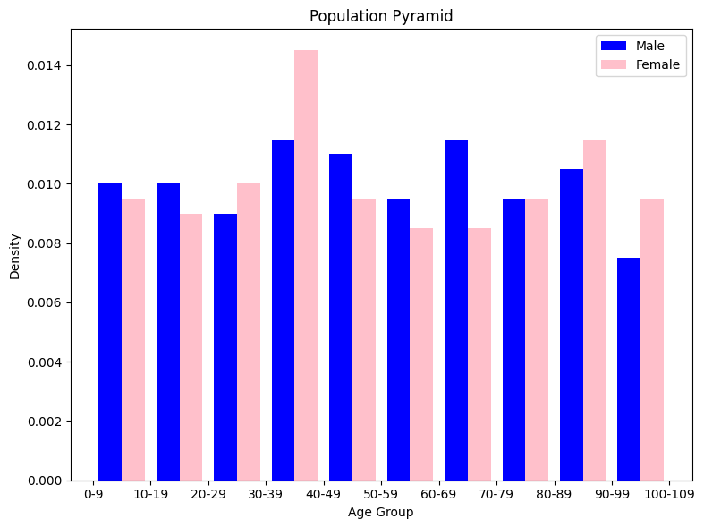

# 3.6 Population Level Health Analysis

Population-level health analysis involves examining healthcare data on a broader scale to derive insights about health trends, disease prevalence, and population characteristics. This type of analysis is crucial for public health planning, resource allocation, and policy development. In this section, we'll delve into techniques and concepts used for population-level health analysis.

## Understanding Disease Prevalence

Disease prevalence is a key metric in population health analysis. It represents the proportion of individuals in a population who have a specific disease or condition at a given point in time. Calculating disease prevalence helps public health officials allocate resources, plan interventions, and measure the impact of healthcare programs.

Here's an example scenario for understanding disease prevalence along with the corresponding Python code:

*Research Question:*What is the prevalence of diabetes among a sample of patients in a primary care clinic?

*Scenario:*Imagine you are working with a primary care clinic that has patient records. You want to calculate the prevalence of diabetes in the clinic's patient population to better understand the healthcare needs of the community.

*Dataset Generation:* You can use the Faker library to generate a synthetic dataset of patient records, including information such as age, sex, and diabetes status.

```python
from faker import Faker
import pandas as pd
import random

fake = Faker()

# Generate patient data
num_patients = 1000
data = []
for _ in range(num_patients):
    age = random.randint(18, 90)
    sex = random.choice(["Male", "Female"])
    diabetes = random.choice([True, False, False, False])  # 25% prevalence of diabetes

    data.append((age, sex, diabetes))

columns = ["Age", "Sex", "Diabetes"]
df = pd.DataFrame(data, columns=columns)
print(df.head())
df.to_csv("patient_data.csv", index=False)
```

*Data Analysis:*Now, let's analyze the generated dataset to calculate the prevalence of diabetes.

```python
# Read the generated dataset
df = pd.read_csv("patient_data.csv")

# Calculate disease prevalence
total_patients = len(df)
diabetes_count = df["Diabetes"].sum()
prevalence = diabetes_count / total_patients

print(f"Total patients: {total_patients}")
print(f"Patients with diabetes: {diabetes_count}")
print(f"Disease prevalence: {prevalence:.2%}")
```

*Example Output*:

```yaml
Total patients: 1000
Patients with diabetes: 242
Disease prevalence: 24.20%
```

In this example, we generate a dataset of 1000 patients with synthetic information, including age, sex, and diabetes status. We then calculate the prevalence of diabetes by dividing the number of patients with diabetes by the total number of patients. The prevalence is expressed as a percentage. This information can provide insights into the burden of diabetes in the clinic's patient population, helping healthcare providers make informed decisions about resource allocation and intervention strategies.


## Incidence and Mortality Rates

Incidence and mortality rates are vital indicators of disease burden and health outcomes. Incidence rate measures the number of new cases of a disease within a specific population and time period. Mortality rate, on the other hand, represents the number of deaths due to a specific cause within the population during a defined period.

*Research Question:*What are the incidence and mortality rates of a specific disease in a given region over a certain time period?

*Scenario:*Imagine you are conducting a health analysis of a region to understand the impact of a specific disease on the population. You want to calculate both the incidence rate (new cases) and mortality rate (deaths) related to the disease within a specific time frame.

*Dataset Generation:*You can use the Faker library to generate synthetic data representing disease cases and outcomes in the given region.

```python
from faker import Faker
import pandas as pd
import random

fake = Faker()

# Generate disease data
num_cases = 500
data = []
for _ in range(num_cases):
    age = random.randint(18, 90)
    sex = random.choice(["Male", "Female"])
    disease_status = random.choice(["Infected", "Deceased"])

    data.append((age, sex, disease_status))

columns = ["Age", "Sex", "Disease_Status"]
df = pd.DataFrame(data, columns=columns)
print(df.head())
df.to_csv("disease_data.csv", index=False)
```

*Data Analysis:*Now, let's analyze the generated dataset to calculate the incidence and mortality rates of the disease.

```python
# Read the generated dataset
df = pd.read_csv("disease_data.csv")

# Calculate incidence rate
total_cases = len(df)
infected_cases = df["Disease_Status"].eq("Infected").sum()
incidence_rate = (infected_cases / total_cases) * 1000  # Per 1000 population

# Calculate mortality rate
deceased_cases = df["Disease_Status"].eq("Deceased").sum()
mortality_rate = (deceased_cases / total_cases) * 1000  # Per 1000 infected cases

print(f"Total cases: {total_cases}")
print(f"Infected cases: {infected_cases}")
print(f"Incidence rate: {incidence_rate:.2f} per 1000 population")
print(f"Mortality rate: {mortality_rate:.2f} per 1000 infected cases")
```

*Example Output*:

```yaml
Total cases: 500
Infected cases: 246
Incidence rate: 492.00 per 1000 population
Mortality rate: 508.00 per 1000 infected cases
```

In this example, we generate a dataset of 500 cases with synthetic information, including age, sex, and disease status (infected or deceased). We then calculate the incidence rate by dividing the number of infected cases by the total number of cases and multiplying by 1000 to express it per 1000 population. Similarly, we calculate the mortality rate by dividing the number of deceased cases by the total number of cases and multiplying by 1000 to express it per 1000 infected cases. These rates provide valuable insights into the disease's impact on the population and healthcare system.


## Age-Standardization

Age-standardization is a technique used to compare health indicators across populations with different age distributions. It accounts for age-related differences in disease prevalence and helps researchers and policymakers make valid comparisons.

*Research Question:*How can we compare the disease prevalence between two populations with different age distributions?

*Scenario:*You're comparing the prevalence of a specific disease between two regions. However, the age distributions of the populations in these regions are significantly different, and this could affect the comparison. To make a valid comparison, you want to age-standardize the disease prevalence rates.

*Dataset Generation:*You can generate synthetic data for disease cases and age distributions in the two regions using the Faker library.

```python
from faker import Faker
import pandas as pd
import random

fake = Faker()

# Generate disease data for Region A
num_cases_a = 500
data_a = []
for _ in range(num_cases_a):
    age = random.randint(18, 90)
    disease_status = random.choice(["Infected", "Healthy"])
    data_a.append((age, disease_status))

# Generate disease data for Region B (different age distribution)
num_cases_b = 600
data_b = []
for _ in range(num_cases_b):
    age = random.randint(30, 85)  # Different age distribution
    disease_status = random.choice(["Infected", "Healthy"])
    data_b.append((age, disease_status))

columns = ["Age", "Disease_Status"]
df_a = pd.DataFrame(data_a, columns=columns)
df_b = pd.DataFrame(data_b, columns=columns)

# Save datasets to CSV
df_a.to_csv("region_a_data.csv", index=False)
df_b.to_csv("region_b_data.csv", index=False)
```

*Data Analysis:*Now, let's analyze the generated datasets to age-standardize the disease prevalence rates between the two regions.

The numbers below used for age-standardization represent a reference population distribution, that would typically derived from actual demographic data. In the context of age-standardization, the reference population is often a standard population with a known age distribution.

In this example, the reference population distribution indicates the proportion of individuals in each age group (e.g., 0-9 years, 10-19 years, and so on). These proportions should sum up to 1 or 100%, representing the entire population.

```python
# Read the generated datasets
df_a = pd.read_csv("region_a_data.csv")
df_b = pd.read_csv("region_b_data.csv")

# Age groups
age_group = [18, 30, 40, 50, 60, 70, 80, 90]

# Calculate disease prevalence rates
prevalence_a = df_a["Disease_Status"].eq("Infected").mean()
prevalence_b = df_b["Disease_Status"].eq("Infected").mean()

# Print raw prevalence rates
print(f"Raw Prevalence in Region A: {prevalence_a:.4f}")
print(f"Raw Prevalence in Region B: {prevalence_b:.4f}")

# Age-standardization (assuming a reference population distribution)
reference_population_distribution = [0.05, 0.08, 0.10, 0.12, 0.15, 0.13, 0.12, 0.10, 0.08, 0.07]

# Calculate standardized rates for each region
standardized_prevalence_a = 0
standardized_prevalence_b = 0

for i in range(len(age_group) - 1):
    age_range = f"{age_group[i]}-{age_group[i+1]}"
    prevalence_age_a = df_a[df_a["Age"].between(age_group[i], age_group[i+1])]["Disease_Status"].eq("Infected").mean()
    prevalence_age_b = df_b[df_b["Age"].between(age_group[i], age_group[i+1])]["Disease_Status"].eq("Infected").mean()
    standardized_prevalence_a += prevalence_age_a * reference_population_distribution[i]
    standardized_prevalence_b += prevalence_age_b * reference_population_distribution[i]

# Print standardized prevalence rates
print(f"Standardized Prevalence in Region A: {standardized_prevalence_a:.4f}")
print(f"Standardized Prevalence in Region B: {standardized_prevalence_b:.4f}")

# Calculate age-specific prevalence rates for each region
age_specific_prevalence_a = []
age_specific_prevalence_b = []

for i in range(len(age_group) - 1):
    age_range = f"{age_group[i]}-{age_group[i+1]}"
    prevalence_age_a = df_a[df_a["Age"].between(age_group[i], age_group[i+1])]["Disease_Status"].eq("Infected").mean()
    prevalence_age_b = df_b[df_b["Age"].between(age_group[i], age_group[i+1])]["Disease_Status"].eq("Infected").mean()
    age_specific_prevalence_a.append((age_range, prevalence_age_a))
    age_specific_prevalence_b.append((age_range, prevalence_age_b))


# Print age-specific prevalence rates for each region
print("\nAge-Specific Prevalence Rates in Region A:")
for age_range, prevalence in age_specific_prevalence_a:
    print(f"Age Group {age_range}: {prevalence:.4f}")

print("\nAge-Specific Prevalence Rates in Region B:")
for age_range, prevalence in age_specific_prevalence_b:
    print(f"Age Group {age_range}: {prevalence:.4f}")

```

*Example output*:

```yaml
Raw Prevalence in Region A: 0.4860
Raw Prevalence in Region B: 0.4683
Standardized Prevalence in Region A: 0.3655
Standardized Prevalence in Region B: 0.3422

Age-Specific Prevalence Rates in Region A:
Age Group 18-30: 0.4881
Age Group 30-40: 0.5316
Age Group 40-50: 0.4627
Age Group 50-60: 0.4713
Age Group 60-70: 0.4557
Age Group 70-80: 0.4545
Age Group 80-90: 0.5694

Age-Specific Prevalence Rates in Region B:
Age Group 18-30: 0.4000
Age Group 30-40: 0.5288
Age Group 40-50: 0.4841
Age Group 50-60: 0.4773
Age Group 60-70: 0.4151
Age Group 70-80: 0.4390
Age Group 80-90: 0.4576
```


In this example, we generate datasets for two distinct regions, Region A and Region B, each characterized by a unique age distribution. Initially, we compute the raw disease prevalence rates for both regions, offering a snapshot of the proportion of infected individuals in each. To ensure a meaningful and unbiased comparison, we then employ age-standardization techniques. Leveraging a predefined reference population distribution, we adjust the prevalence rates to neutralize the impact of age disparities between the regions. 

To break apart the complex part of this code at *# Calculate age-specific prevalence rates for each region*: 

1. **standardized_prevalence_a = 0** and **standardized_prevalence_b = 0**: Initialize variables to hold the standardized prevalence rates for regions A and B.

2. **for i in range(len(age_group) - 1):**: Iterate over the indices of the age groups, excluding the last one. The reason for excluding the last one is that the age groups define ranges, and the last range doesn't have an upper bound.

3. **age_range = f"{age_group[i]}-{age_group[i+1]}"**: Create a string representation of the age range for better readability.

4. **prevalence_age_a = df_a[df_a["Age"].between(age_group[i], age_group[i+1])]["Disease_Status"].eq("Infected").mean()**: This line calculates the prevalence of the disease (cases) within the specified age range for region A. The between method filters the rows where the age falls within the specified range, and the .eq("Infected").mean() part calculates the mean of the "Infected" cases within that range.

5. **prevalence_age_b = df_b[df_b["Age"].between(age_group[i], age_group[i+1])]["Disease_Status"].eq("Infected").mean()**: Similar to the previous line, this calculates the prevalence of the disease (cases) within the specified age range for region B.

6. **standardized_prevalence_a += prevalence_age_a * reference_population_distribution[i]**: This line updates the standardized_prevalence_a by adding the product of the prevalence of disease in the specific age range and the corresponding value from the reference population distribution.

7. **standardized_prevalence_b += prevalence_age_b * reference_population_distribution[i]**: Similar to the previous line, this updates the standardized_prevalence_b for region B.

The standardized prevalence rates furnish a balanced basis for comparing disease prevalence between the two regions, effectively accounting for the potential confounding factor of age distribution. This allows for a more accurate assessment of disease burden and facilitates equitable decision-making for healthcare interventions.


## Case-Control Studies

Case-control studies are observational studies that compare individuals with a specific condition (cases) to individuals without the condition (controls). These studies are useful for investigating potential risk factors or associations between exposures and outcomes.

Case-Control Study Example: Investigating Hypertension and Coffee Consumption

*Research Question:* Is there an association between coffee consumption and the likelihood of developing hypertension?

*Dataset Generation:* We'll generate a synthetic dataset for our case-control study using the Faker library to simulate patient data.

```python
from faker import Faker
import pandas as pd
import random

fake = Faker()

# Generate case (hypertension) data
num_cases = 300
case_data = []
for _ in range(num_cases):
    age = random.randint(30, 70)
    coffee_consumption = random.choice(["Low", "Moderate", "High"])
    case_data.append((age, coffee_consumption, "Hypertension"))

# Generate control (no hypertension) data
num_controls = 300
control_data = []
for _ in range(num_controls):
    age = random.randint(30, 70)
    coffee_consumption = random.choice(["Low", "Moderate", "High"])
    control_data.append((age, coffee_consumption, "No Hypertension"))

columns = ["Age", "Coffee_Consumption", "Group"]
case_df = pd.DataFrame(case_data, columns=columns)
control_df = pd.DataFrame(control_data, columns=columns)

# Combine case and control datasets
combined_df = pd.concat([case_df, control_df], ignore_index=True)
```

*Analysis:* We will calculate the odds ratio and perform a statistical test (Chi-square test) to assess the association between coffee consumption and hypertension.

```python
# Create a 2x2 contingency table
contingency_table = pd.crosstab(combined_df["Coffee_Consumption"], combined_df["Group"])

# Calculate odds ratio
odds_ratio = (contingency_table.iloc[0, 0] * contingency_table.iloc[1, 1]) / \
             (contingency_table.iloc[0, 1] * contingency_table.iloc[1, 0])

# Perform Chi-square test
from scipy.stats import chi2_contingency
chi2, p_value, _, _ = chi2_contingency(contingency_table)

# Print results
print(f"Odds Ratio: {odds_ratio:.4f}")
print(f"P-value: {p_value:.4f}")
```

*Example output*:

```yaml
Odds Ratio: 0.8679
P-value: 0.5301
```

In this case-control study investigating the association between coffee consumption and the likelihood of developing hypertension, we calculated an odds ratio of approximately 0.8679. The odds ratio measures the odds of developing hypertension among individuals with different levels of coffee consumption. In our analysis, an odds ratio of 0.8679 suggests that the odds of developing hypertension are slightly lower among individuals with high coffee consumption compared to those with low coffee consumption. However, this difference is not statistically significant, as evidenced by the calculated p-value of 0.5301 from the Chi-square test.

The p-value indicates the probability of observing the observed data or more extreme data if there is no true association between coffee consumption and hypertension. With a p-value of 0.5301, we do not have enough evidence to reject the null hypothesis of no association. This implies that the observed difference in hypertension prevalence among individuals with varying levels of coffee consumption could likely be due to random chance, rather than a meaningful relationship.

Therefore, based on our analysis, we conclude that there is no statistically significant association between coffee consumption and the likelihood of developing hypertension in our study population. Further investigation with larger sample sizes or additional variables may be needed to provide more conclusive insights.

## Population Pyramid

A population pyramid is a graphical representation of a population's age and sex distribution. It provides insights into demographic trends, such as aging populations, birth rates, and gender imbalances.

In this example, we'll generate a population pyramid to visualize the age and sex distribution of a hypothetical population. Let's assume we have a dataset containing age and sex information of individuals. We'll use this dataset to create a population pyramid.

```python
import matplotlib.pyplot as plt
import numpy as np

# Generate synthetic age and sex data
np.random.seed(0)
ages_male = np.random.randint(0, 100, size=200)
ages_female = np.random.randint(0, 100, size=200)
sex_male = np.repeat("Male", 200)
sex_female = np.repeat("Female", 200)

# Combine age and sex data
ages = np.concatenate([ages_male, ages_female])
sex = np.concatenate([sex_male, sex_female])

# Create a population pyramid
fig, ax = plt.subplots(figsize=(8, 6))

bins = np.arange(0, 101, 10)
ax.hist([ages[sex == "Male"], ages[sex == "Female"]],
         bins=bins, color=['blue', 'pink'], label=['Male', 'Female'], density=True)

ax.set_xticks(bins)
ax.set_xticklabels([f"{bin}-{bin+9}" for bin in bins])
ax.set_xlabel("Age Group")
ax.set_ylabel("Density")
ax.set_title("Population Pyramid")
ax.legend()

plt.tight_layout()
plt.show()
```



In this example, we generate synthetic age and sex data for 400 individuals (200 males and 200 females). We then create a population pyramid using a histogram with separate bins for males and females. The resulting plot provides a visual representation of the age and sex distribution, allowing us to observe trends in the population's demographics.

This kind of visualization can be helpful in understanding population dynamics, identifying age-related health trends, and making informed decisions about healthcare resource allocation and planning.

---

Population-level health analysis plays a critical role in guiding public health policies, resource allocation, and interventions aimed at improving the health and well-being of entire populations. By leveraging data analysis techniques, statistical methods, and visualizations, researchers and policymakers can gain valuable insights to inform evidence-based decision-making.
