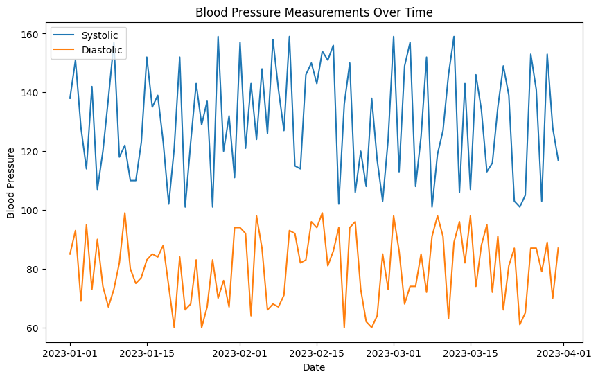
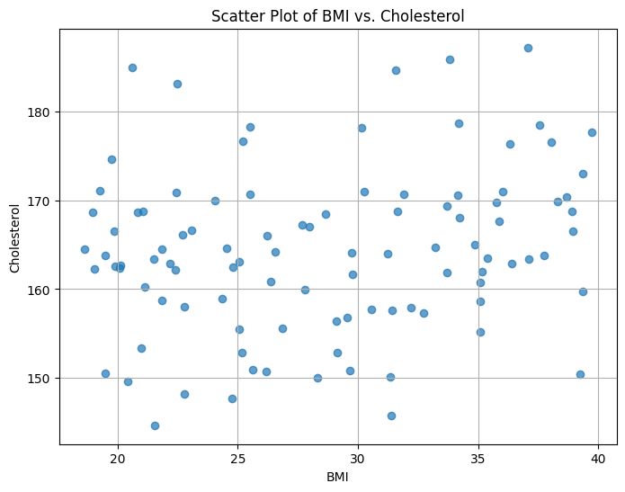
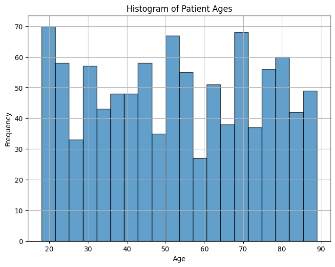
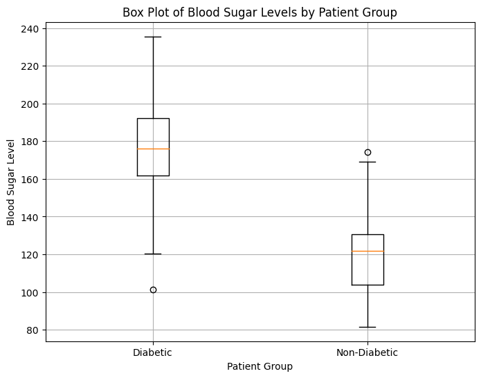
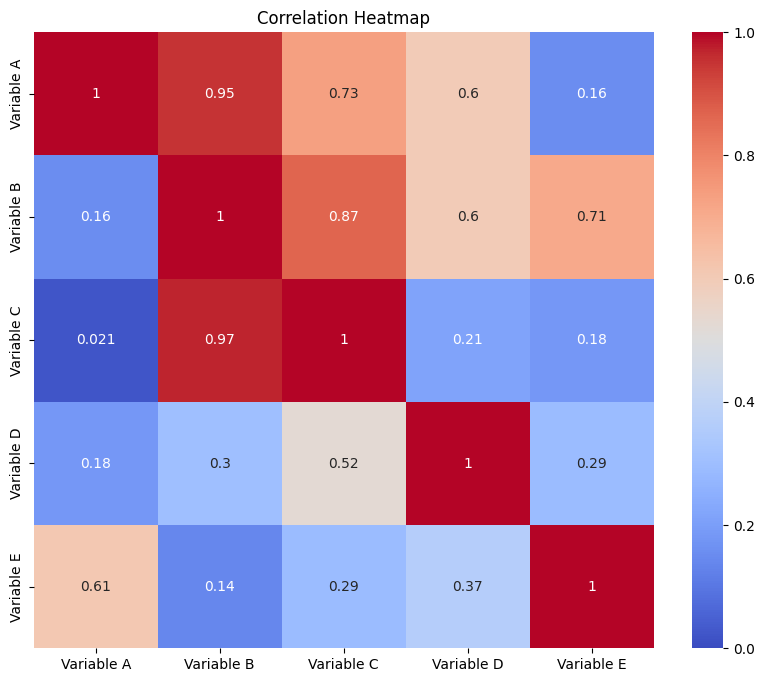

# 3.7 Visualization Techniques in Health EDA

Visualizing healthcare data is an essential step in exploratory data analysis (EDA). Visualization techniques provide insights that raw numbers often fail to convey. By creating meaningful visual representations, patterns, trends, and anomalies within the data can be easily spotted, leading to better decision-making and actionable insights.

In addition to the resources provided within this chapter section, we have a dedicated chapter to visualizations: [Chapter 4](../../docs/Ch4/visualization_intro.md)

## Why Visualization Matters in Healthcare

In healthcare, data visualization serves several critical purposes:

1. **Pattern Recognition:** Visualizations help clinicians and researchers identify patterns in complex medical data, enabling them to detect trends, correlations, and outliers that might otherwise go unnoticed.

2. **Communication:** Effective visualization simplifies the communication of findings to stakeholders who may not be well-versed in data analysis. Visual representations help convey insights more intuitively.

3. **Identifying Anomalies:** Visualizations highlight outliers and anomalies, which can lead to the discovery of erroneous data, medical conditions requiring attention, or the effectiveness of interventions.

## Common Visualization Techniques in Healthcare EDA

### Line Charts and Time Series Plots

Line charts and time series plots are ideal for displaying trends and changes over time. In healthcare, these plots can help visualize patient vitals, medication dosages, and disease progression. For example, plotting blood pressure measurements over time can reveal patterns and variations that might indicate an underlying health issue.

Let's consider an example where we have a dataset containing blood pressure measurements for a group of patients over a span of several months. We'll use Python and the Matplotlib library to create a line chart that displays the changes in blood pressure over time.

This code below synthetic blood pressure data for a span of 90 days and plots both systolic and diastolic measurements over time. You can adjust the parameters, such as the number of days, the range of blood pressure values, and the start date, to match your requirements.

```python
import pandas as pd
import numpy as np
import matplotlib.pyplot as plt
from datetime import timedelta

# Generate fake blood pressure data
np.random.seed(42)
num_days = 90
dates = pd.date_range(start='2023-01-01', periods=num_days, freq='D')
systolic = np.random.randint(100, 160, size=num_days)
diastolic = np.random.randint(60, 100, size=num_days)

# Create a DataFrame
data = pd.DataFrame({'date': dates, 'systolic': systolic, 'diastolic': diastolic})

# Plot blood pressure measurements over time
plt.figure(figsize=(10, 6))
plt.plot(data['date'], data['systolic'], label='Systolic')
plt.plot(data['date'], data['diastolic'], label='Diastolic')
plt.xlabel('Date')
plt.ylabel('Blood Pressure')
plt.title('Blood Pressure Measurements Over Time')
plt.legend()
plt.show()
```



In this example, the line chart displays both systolic and diastolic blood pressure measurements over time. This visualization allows healthcare professionals to identify trends, variations, and potential health issues in the patients' blood pressure readings.

Line charts and time series plots are powerful tools for uncovering insights from healthcare data that evolve over time. They can aid in early detection of abnormalities and provide valuable information for medical decision-making.


### Scatter Plots

Scatter plots are effective in displaying the relationship between two continuous variables. They can reveal correlations, clusters, or outliers. In healthcare, scatter plots can be used to examine the correlation between body mass index (BMI) and cholesterol levels, helping clinicians identify potential cardiovascular risks.

Here's an example of how you can generate fake BMI and cholesterol data, create a scatter plot, and visualize the relationship between these two variables using the numpy and matplotlib libraries:

```python
import numpy as np
import matplotlib.pyplot as plt

# Generate fake BMI and cholesterol data
np.random.seed(42)
num_patients = 100
bmi = np.random.uniform(18.5, 40, size=num_patients)
cholesterol = 150 + 0.5 * bmi + np.random.normal(0, 10, size=num_patients)

# Create a scatter plot
plt.figure(figsize=(8, 6))
plt.scatter(bmi, cholesterol, alpha=0.7)
plt.xlabel('BMI')
plt.ylabel('Cholesterol')
plt.title('Scatter Plot of BMI vs. Cholesterol')
plt.grid()
plt.show()
```



In this example, synthetic BMI data is generated using a uniform distribution, and synthetic cholesterol data is generated based on a linear relationship with BMI, plus some random noise. The scatter plot visualizes the relationship between BMI and cholesterol levels for a group of patients. You can adjust the parameters to customize the data and see how different patterns emerge in the scatter plot.


### Histograms

Histograms provide insights into the distribution of data. They help visualize the frequency of different values within a dataset. In healthcare, histograms can be used to understand the distribution of patient ages, helping identify the age group with the highest patient population.

Here's an example of generating synthetic patient age data, creating a histogram, and visualizing the age distribution using the `numpy` and `matplotlib` libraries:

```python
import numpy as np
import matplotlib.pyplot as plt

# Generate fake patient age data
np.random.seed(42)
num_patients = 1000
ages = np.random.randint(18, 90, size=num_patients)

# Create a histogram
plt.figure(figsize=(8, 6))
plt.hist(ages, bins=20, edgecolor='black', alpha=0.7)
plt.xlabel('Age')
plt.ylabel('Frequency')
plt.title('Histogram of Patient Ages')
plt.grid()
plt.show()
```



In this example, synthetic patient age data is generated using a random integer distribution. The histogram visualizes the distribution of patient ages, with the x-axis representing age ranges and the y-axis representing the frequency of patients within each age range. Adjust the parameters to customize the data and the number of bins in the histogram to get insights into the age distribution.


### Box Plots

Box plots offer a clear summary of the distribution of data, including median, quartiles, and potential outliers. They are particularly useful for comparing distributions across different categories or groups. In healthcare, box plots can illustrate the distribution of blood sugar levels in different patient groups, such as diabetic and non-diabetic individuals.

Here's an example of generating synthetic blood sugar level data for diabetic and non-diabetic patient groups, creating box plots, and visualizing the distribution of blood sugar levels using the `numpy` and `matplotlib` libraries:

```python
import numpy as np
import matplotlib.pyplot as plt

# Generate fake blood sugar level data for diabetic and non-diabetic groups
np.random.seed(42)
num_patients = 100
diabetic_blood_sugar = np.random.normal(180, 30, size=num_patients)
non_diabetic_blood_sugar = np.random.normal(120, 20, size=num_patients)

# Combine data for box plot
all_blood_sugar = [diabetic_blood_sugar, non_diabetic_blood_sugar]
group_labels = ['Diabetic', 'Non-Diabetic']

# Create box plots
plt.figure(figsize=(8, 6))
plt.boxplot(all_blood_sugar, labels=group_labels)
plt.xlabel('Patient Group')
plt.ylabel('Blood Sugar Level')
plt.title('Box Plot of Blood Sugar Levels by Patient Group')
plt.grid()
plt.show()
```



In this example, synthetic blood sugar level data is generated for both diabetic and non-diabetic patient groups using normal distributions. The box plot illustrates the distribution of blood sugar levels in each group, with the central line indicating the median, the box representing the interquartile range (IQR), and the whiskers showing the range of the data. Outliers, if present, are displayed as individual data points beyond the whiskers. Adjust the parameters and data to tailor the box plot visualization to your needs.


### Heatmaps

Heatmaps are useful for displaying correlations and patterns within large datasets. They are especially valuable in genomics and medical imaging studies. Heatmaps can show correlations between genetic markers or highlight regions of interest in medical images.

Here's an example of generating a heatmap to display correlations within a synthetic dataset using the `seaborn` library:

```python
import numpy as np
import pandas as pd
import seaborn as sns
import matplotlib.pyplot as plt

# Generate synthetic correlation data
np.random.seed(42)
num_samples = 100
variables = ['Variable A', 'Variable B', 'Variable C', 'Variable D', 'Variable E']
correlation_matrix = np.random.rand(len(variables), len(variables))
for i in range(len(variables)):
    correlation_matrix[i, i] = 1  # Diagonal elements set to 1 for self-correlation

# Create a DataFrame with synthetic data
data = pd.DataFrame(correlation_matrix, columns=variables, index=variables)

# Create a heatmap using seaborn
plt.figure(figsize=(10, 8))
sns.heatmap(data, annot=True, cmap='coolwarm', vmin=0, vmax=1)
plt.title('Correlation Heatmap')
plt.show()
```



In this example, a synthetic correlation matrix is generated to represent the correlations between different variables. The heatmap is created using the seaborn library, with correlations values annotated within the heatmap cells. Adjust the parameters and data to tailor the heatmap visualization to your needs. In a real healthcare context, you would replace the synthetic data with actual data from your domain.

---

By leveraging these visualization techniques, healthcare professionals and researchers can gain deeper insights into their data, leading to better patient care, improved treatments, and enhanced research outcomes.