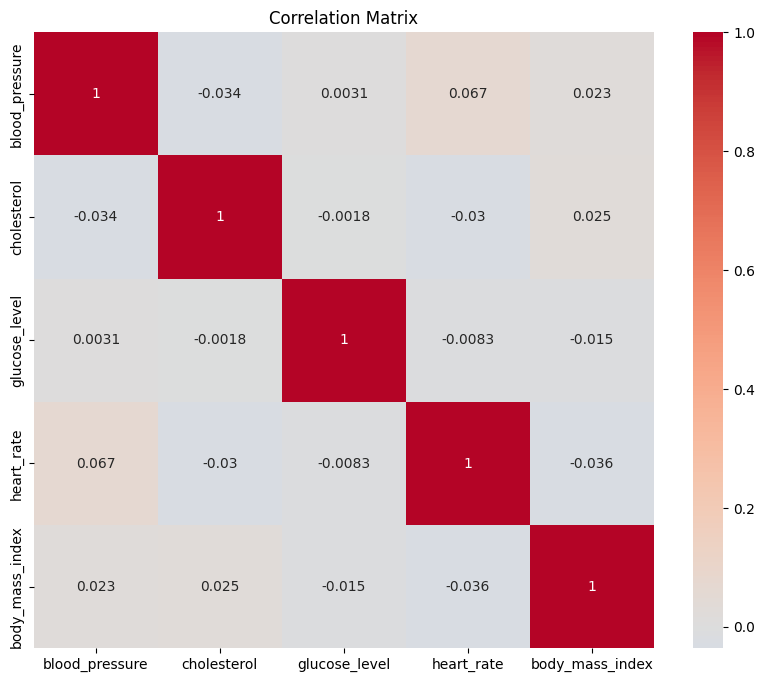
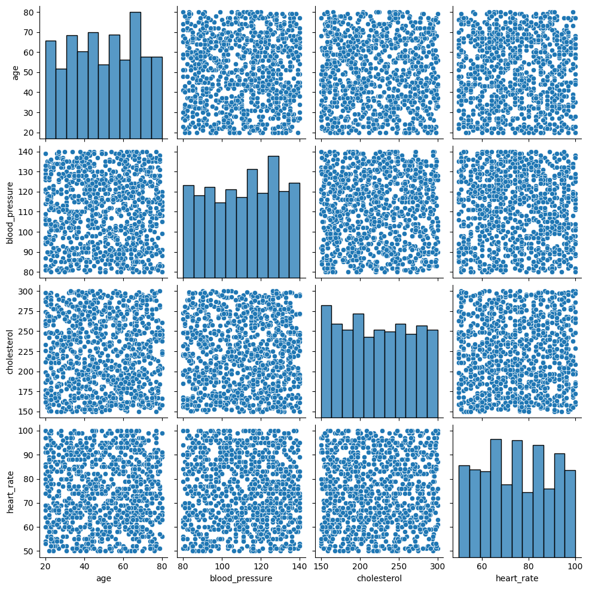
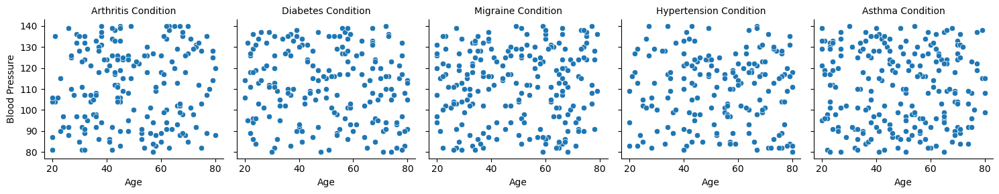
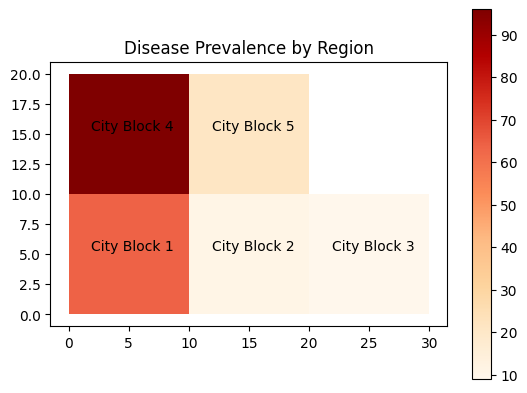
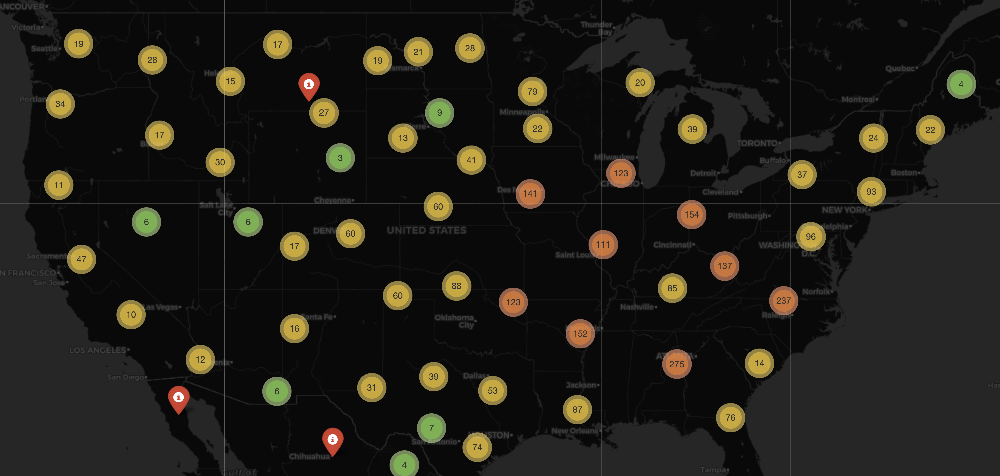

# 4.4 Advanced Visualization Techniques

This section covers advanced visualization methods that can uncover intricate patterns, relationships, and trends in health data. It explores techniques such as heatmaps, correlation matrices, pair plots, facet grids, and geographic visualizations using Python libraries like seaborn, matplotlib, GeoPandas, and Plotly. These techniques are essential for gaining a comprehensive understanding of complex healthcare datasets.

Advanced visualization techniques enable deeper exploration and communication of complex health data. This section delves into more sophisticated visualization methods that can uncover intricate patterns, trends, and relationships in healthcare datasets.

## Heatmaps and Correlation Matrices

Heatmaps are powerful tools to visualize relationships between multiple variables. They are particularly useful for displaying correlations between numerical variables in a matrix format. Seaborn provides a simple way to create informative heatmaps:

```python
import pandas as pd
import random
import seaborn as sns
import matplotlib.pyplot as plt

# Generate fake data
data = {
    'blood_pressure': [random.randint(80, 140) for _ in range(1000)],
    'cholesterol': [random.randint(150, 300) for _ in range(1000)],
    'glucose_level': [random.randint(70, 180) for _ in range(1000)],
    'heart_rate': [random.randint(50, 100) for _ in range(1000)],
    'body_mass_index': [random.uniform(18.5, 30) for _ in range(1000)]
}

# Convert the data dictionary to a pandas DataFrame
df = pd.DataFrame(data)

# Compute the correlation matrix
correlation_matrix = df.corr()

# Create the heatmap
plt.figure(figsize=(10, 8))
sns.heatmap(correlation_matrix, annot=True, cmap='coolwarm', center=0)
plt.title('Correlation Matrix')
plt.show()

```




## Pair Plots and Facet Grids

Pair plots display pairwise relationships between multiple numerical variables. Seaborn's pairplot function can automatically create scatter plots for all combinations of variables and histograms along the diagonal:

```python
import pandas as pd
import random
import seaborn as sns
import matplotlib.pyplot as plt

# Sample medical conditions
conditions = ['Diabetes', 'Hypertension', 'Asthma', 'Migraine', 'Arthritis']

# Generate fake data
data = {
    'age': [random.randint(20, 80) for _ in range(1000)],
    'blood_pressure': [random.randint(80, 140) for _ in range(1000)],
    'cholesterol': [random.randint(150, 300) for _ in range(1000)],
    'heart_rate': [random.randint(50, 100) for _ in range(1000)],
    'condition': [random.choice(conditions) for _ in range(1000)]
}

# Convert the data dictionary to a pandas DataFrame
df = pd.DataFrame(data)

# Create the pair plot for numerical variables
sns.pairplot(df)
plt.show()
```



And then similarly, a FacetGrid:

```python

# Create a FacetGrid for 'blood_pressure' vs. 'age' across different 'condition' values
g = sns.FacetGrid(df, col='condition')
g.map_dataframe(sns.scatterplot, x='age', y='blood_pressure')
g.set_axis_labels('Age', 'Blood Pressure')
g.set_titles(col_template='{col_name} Condition')
plt.show()

```




## Geographic Visualization
Geographic visualization is crucial for analyzing health data with a spatial component, such as disease prevalence across regions. Libraries like GeoPandas and Plotly provide tools for creating interactive maps and choropleth visualizations:

```python
import geopandas as gpd
import matplotlib.pyplot as plt
from shapely.geometry import Polygon
import random

# Mock polygons representing different regions
polygons = [
    Polygon([(0, 0), (0, 10), (10, 10), (10, 0)]),
    Polygon([(10, 0), (10, 10), (20, 10), (20, 0)]),
    Polygon([(20, 0), (20, 10), (30, 10), (30, 0)]),
    Polygon([(0, 10), (0, 20), (10, 20), (10, 10)]),
    Polygon([(10, 10), (10, 20), (20, 20), (20, 10)])
]

# Names for each region
block_names = ["City Block 1", "City Block 2", "City Block 3", "City Block 4", "City Block 5"]

# Mock disease_prevalence data for each region
disease_prevalence = [random.randint(1, 100) for _ in range(len(polygons))]

# Create a GeoDataFrame
gdf = gpd.GeoDataFrame({'Block_Name': block_names, 'disease_prevalence': disease_prevalence, 'geometry': polygons})

# Create a choropleth map
ax = gdf.plot(column='disease_prevalence', cmap='OrRd', legend=True)
plt.title('Disease Prevalence by Region')

# Annotate the names on each polygon
for x, y, label in zip(gdf.geometry.centroid.x, gdf.geometry.centroid.y, gdf["Block_Name"]):
    ax.annotate(text=label, xy=(x, y), xytext=(3, 3), textcoords="offset points", ha='center')

plt.show()

```



As an other example, with many of these geospatial packages they also come with built-in maps that we can use to overlay are data points on. We have a dedicated chapter to geospatial data, where we will cover the differing types of data points that can be expressed on maps. In this example below, we use the package `folium` to look at a subset of some old 2021 COVID-19 data. 

```python

import folium
from folium.plugins import MarkerCluster
import pandas as pd

# Load the data
df = pd.read_csv('https://raw.githubusercontent.com/CSSEGISandData/COVID-19/master/csse_covid_19_data/csse_covid_19_daily_reports/01-01-2021.csv')

# Filter out rows with NaN values for 'Lat' or 'Long_'
df = df.dropna(subset=['Lat', 'Long_'])

m = folium.Map(location=[15.4529, 90.797], zoom_start=4)
folium.TileLayer('cartodbdark_matter').add_to(m) # Sets Tile Theme to (Dark Theme)

mc = MarkerCluster()
for index, row in df.iterrows():
    # Add marker
    mc.add_child(folium.Marker(location=[row['Lat'], row['Long_']], 
                                tooltip="Put anything you want here!",
                                icon=folium.Icon(color="red", icon="info-sign", clustered_marker=True)))
    
    # Add circle for number of confirmed cases
    folium.Circle(location=[row['Lat'], row['Long_']], color='Red', fill=True, fill_color='Red',
                  radius=int(row['Confirmed']) * 30).add_to(m)
m.add_child(mc)

m

```




