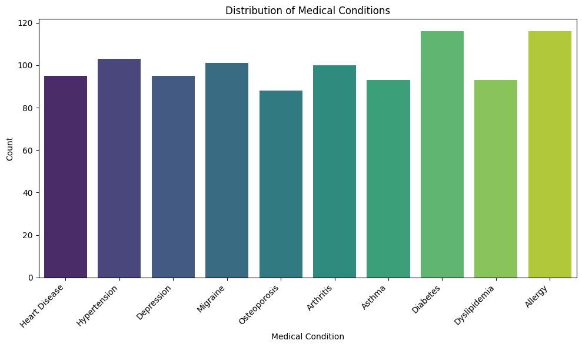
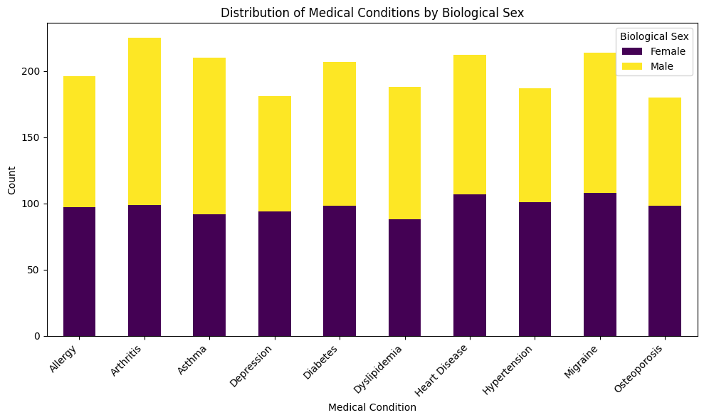
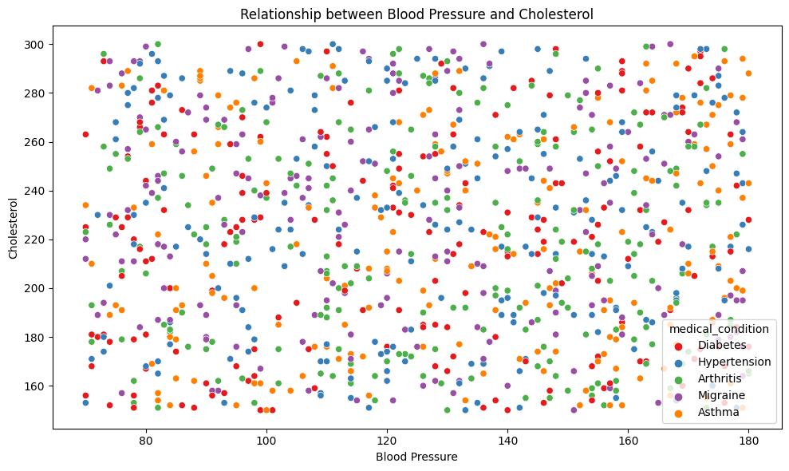
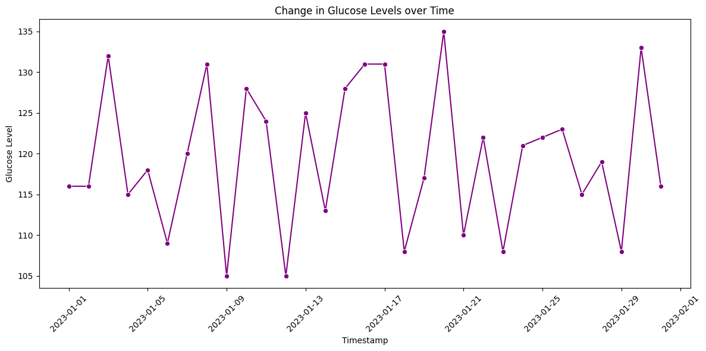

# 4.3 Visualizing Categorical or Numerical Health Data

This section covers various visualization techniques for both categorical and numerical health data. It demonstrates how to create bar plots, histograms, scatter plots, pair plots, and time series plots using Python and libraries like seaborn and matplotlib. These visualizations provide a comprehensive understanding of data patterns and relationships in a healthcare context.

Visualizing categorical and numerical health data is crucial for gaining insights and communicating findings effectively. This section explores techniques to visualize different types of health data, including demographic information, medical conditions, treatment outcomes, and more.

## Visualizing Categorical Data (non-stacked)

Categorical data includes variables that represent discrete categories or groups, such as patient gender, medical conditions, or types of treatments. Bar plots, pie charts, and heatmaps are common visualization methods for categorical data.

Here's an example of using seaborn to create a bar plot for visualizing the distribution of medical conditions. 

```python
import pandas as pd
import random
import seaborn as sns
import matplotlib.pyplot as plt

# Sample medical conditions
conditions = ['Diabetes', 'Hypertension', 'Asthma', 'Migraine', 'Arthritis', 'Heart Disease', 'Allergy', 'Dyslipidemia', 'Osteoporosis', 'Depression']

# Generate fake data
data = {
    'medical_condition': [random.choice(conditions) for _ in range(1000)]
}

# Convert the data dictionary to a pandas DataFrame
df = pd.DataFrame(data)

# Create a bar plot for medical conditions
plt.figure(figsize=(10, 6))
sns.countplot(data=df, x='medical_condition', palette='viridis')
plt.xticks(rotation=45, ha='right')
plt.xlabel('Medical Condition')
plt.ylabel('Count')
plt.title('Distribution of Medical Conditions')
plt.tight_layout()
plt.show()

```



## Visualizing Categorical Data (stacked)

Now typically, we may want to view not only the disease frequency counts, but then also view this information with another variable, lets say a demographic variable like sex. 

This code below will produce a stacked bar plot displaying counts for each medical condition split by biological sex. 


```python

import pandas as pd
import random
import seaborn as sns
import matplotlib.pyplot as plt

# Sample medical conditions
conditions = ['Diabetes', 'Hypertension', 'Asthma', 'Migraine', 'Arthritis', 'Heart Disease', 'Allergy', 'Dyslipidemia', 'Osteoporosis', 'Depression']
sexes = ['Male', 'Female']

# Generate fake data
data = {
    'medical_condition': [random.choice(conditions) for _ in range(2000)],
    'biological_sex': [random.choice(sexes) for _ in range(2000)]
}

# Convert the data dictionary to a pandas DataFrame
df = pd.DataFrame(data)

# Create a pivot table for stacked bar plot
pivot_df = df.groupby(['medical_condition', 'biological_sex']).size().unstack().fillna(0)

# Plot
pivot_df.plot(kind='bar', stacked=True, figsize=(10, 6), colormap='viridis')
plt.xticks(rotation=45, ha='right')
plt.xlabel('Medical Condition')
plt.ylabel('Count')
plt.title('Distribution of Medical Conditions by Biological Sex')
plt.tight_layout()
plt.legend(title='Biological Sex')
plt.show()


```



## Visualizing Relationships
Health data often involves exploring relationships between different variables. Scatter plots and pair plots can help visualize how two or more numerical variables are related.

For instance, to visualize the relationship between blood pressure and cholesterol levels:

```python
# Create a scatter plot for blood pressure and cholesterol
import pandas as pd
import random
import seaborn as sns
import matplotlib.pyplot as plt

# Sample medical conditions
conditions = ['Diabetes', 'Hypertension', 'Asthma', 'Migraine', 'Arthritis']

# Generate fake data
data = {
    'blood_pressure': [random.randint(70, 180) for _ in range(1000)],
    'cholesterol': [random.randint(150, 300) for _ in range(1000)],
    'medical_condition': [random.choice(conditions) for _ in range(1000)]
}

# Convert the data dictionary to a pandas DataFrame
df = pd.DataFrame(data)

# Create the scatter plot
plt.figure(figsize=(10, 6))
sns.scatterplot(data=df, x='blood_pressure', y='cholesterol', hue='medical_condition', palette='Set1')
plt.xlabel('Blood Pressure')
plt.ylabel('Cholesterol')
plt.title('Relationship between Blood Pressure and Cholesterol')
plt.tight_layout()
plt.show()

```




## Visualizing Time Series Data
Time series data is common in healthcare, such as patient vitals recorded over time. Line plots and area plots are suitable for visualizing temporal trends.

For example, to visualize the change in glucose levels over time:

```python

import pandas as pd
import random
import seaborn as sns
import matplotlib.pyplot as plt

# Generate date range for a month
date_range = pd.date_range(start="2023-01-01", end="2023-01-31", freq="D")

# Generate glucose levels, adding some randomness to simulate real-world variations
base_glucose = 120
glucose_level = [(base_glucose + random.randint(-15, 15)) for _ in range(len(date_range))]

# Create the DataFrame
df = pd.DataFrame({
    'timestamp': date_range,
    'glucose_level': glucose_level
})

# Create the line plot
plt.figure(figsize=(12, 6))
sns.lineplot(data=df, x='timestamp', y='glucose_level', marker='o', color='purple')
plt.xlabel('Timestamp')
plt.ylabel('Glucose Level')
plt.title('Change in Glucose Levels over Time')
plt.xticks(rotation=45)
plt.tight_layout()
plt.show()

```



By applying these visualization techniques, you can better understand patterns, trends, and relationships within your health data, leading to meaningful insights for clinical decision-making and research.

