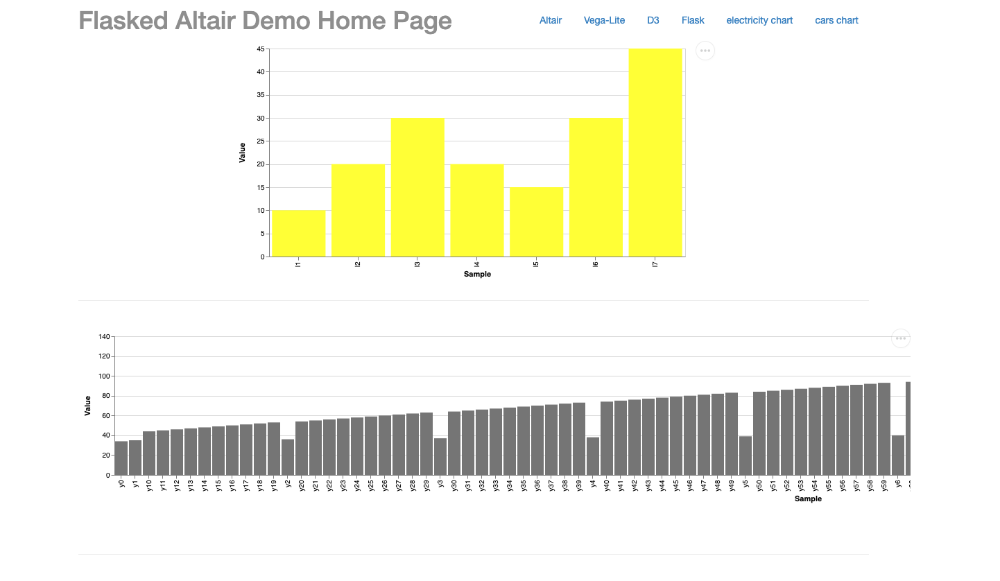

---

sidebar_position: 9

---

# 4.9 Dashboards - Flask + Altair (Advanced)

Altair is a declarative statistical visualization library for Python, based on Vega and Vega-Lite visualization grammars. It allows for easy construction of insightful visualizations with just a few lines of Python code. When combined with Flask, you can quickly set up a web-based dashboard that showcases interactive plots created using Altair.

## Why Use Altair with Flask?

1. **Declarative Visualization:** Altair allows you to focus on what you want the visualization to represent, rather than how to create it. This can simplify the visualization creation process.

2. **Interactive Plots:** Altair's underlying Vega-Lite grammar supports a wide range of user interactions, such as clicking, hovering, and zooming.

3. **Flexibility with Flask:** By combining Altair with Flask, you can integrate your visualizations into a fully-fledged web application, opening up possibilities for enhanced interactivity and data-driven applications.

## **Potential Challenges**

As this section is labeled "Advanced," be prepared to encounter some complexities:

1. **Integration with Web Technologies:** To fully exploit the capabilities of Flask and Altair, you may need to delve into some basic HTML, JavaScript, and CSS. These are essential for styling and adding interactivity to your dashboard.

2. **Data Transformation:** Altair requires data in a specific format (typically a Pandas DataFrame). Sometimes, you might need to preprocess or reshape your data to fit Altair's requirements.

3. **Performance:** While Altair is excellent for many types of visualizations, it may not be the best choice for very large datasets. This is due to its underlying reliance on browser-based rendering.

## Example of a Flask + Altair Dashboard

Let's consider a simple example where we set up a Flask route to display an Altair plot:

```python
from flask import Flask, render_template
import altair as alt
import pandas as pd

app = Flask(__name__)

@app.route('/')
def index():
    # Sample data
    data = pd.DataFrame({
        'x': ['A', 'B', 'C', 'D', 'E'],
        'y': [5, 7, 9, 11, 13]
    })

    # Create an Altair chart
    chart = alt.Chart(data).mark_bar().encode(
        x='x',
        y='y'
    ).interactive()

    # Convert the Altair chart to a JSON format
    chart_json = chart.to_json()

    return render_template('altair.html', chart=chart_json)

if __name__ == "__main__":
    app.run(debug=True)
```

Here's a sample `altair.html` what might look like: 


```html
<!DOCTYPE html>
<html lang="en">
<head>
    <meta charset="UTF-8">
    <meta name="viewport" content="width=device-width, initial-scale=1.0">
    <title>Altair Visualization with Flask</title>
    <!-- Import the Vega-Embed library -->
    <script src="https://cdn.jsdelivr.net/npm/vega@5"></script>
    <script src="https://cdn.jsdelivr.net/npm/vega-lite@5"></script>
    <script src="https://cdn.jsdelivr.net/npm/vega-embed@6"></script>
</head>
<body>
    <div id="vis"></div>
    
    <script>
        // Parse the Altair JSON chart data passed from Flask
        var chartData = {{ chart|safe }};

        // Use Vega-Embed to render the chart
        vegaEmbed('#vis', chartData);
    </script>
</body>
</html>
```

A few important points to highlight:

1. The `altair.html` file imports the necessary Vega and Vega-Embed JavaScript libraries, which are needed to render Altair visualizations.
   
2. The JSON chart data from the Flask application is passed to the template using the `{{ chart|safe }}` syntax. The `|safe` filter ensures that the JSON is correctly parsed as raw JSON rather than as a string.

3. The `vegaEmbed` function from the Vega-Embed library is used to render the visualization inside the `div` with the id `vis`.

To run the application, ensure this `altair.html` file is saved inside the `templates` directory of your Flask project. When you visit the root route (`/`), you should see a bar chart rendered in the browser. This is just a simple example to illustrate the integration. Real-world applications can involve more intricate designs, interactions, and data manipulations.

---

Altair, with its expressive grammar, combined with Flask's robustness, can be a potent combination for creating insightful, interactive web-based dashboards. However, be prepared to dip your toes into the world of web technologies to truly harness their combined power.

---

## Another example (external on github): 
- https://github.com/lemoncyb/flasked-altair 
- In your google shell:
    - `git clone https://github.com/lemoncyb/flasked-altair.git`
    - install any requirements needed (`pip install flask altair vega-datasets`)
    - then run: `python app.py`

