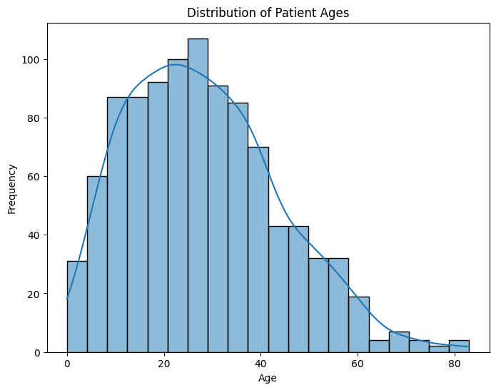
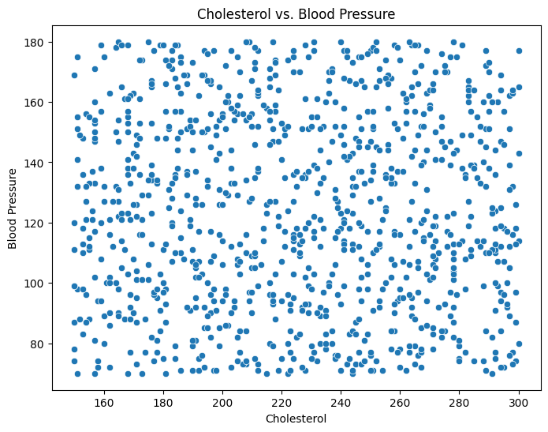
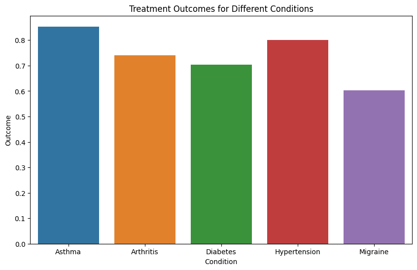

# 4.2 Basic Plotting Techniques with Seaborn in a Health Context

This section introduces basic plotting techniques using the Seaborn library in a health context. It covers histograms and KDE plots for exploring data distribution, scatter plots for visualizing relationships between continuous variables, and bar plots for comparing categorical variables. The provided code snippets demonstrate how to create these plots using Seaborn and Matplotlib.

Seaborn is a popular Python data visualization library built on top of Matplotlib. It simplifies the creation of aesthetically pleasing and informative plots, making it a valuable tool for healthcare data analysis. In this section, we'll explore some basic plotting techniques using Seaborn in a health context.

## Installing Seaborn

Before you begin, make sure you have Seaborn installed. If not, you can install it using the following command:

```bash
pip install seaborn
```
## Exploring Distribution with Histograms and KDE Plots
Histograms and Kernel Density Estimation (KDE) plots are useful for understanding the distribution of continuous variables in healthcare data. For instance, you can visualize the distribution of patient ages or blood pressure levels.

```python
import pandas as pd
import random
import seaborn as sns
import matplotlib.pyplot as plt

# Generate left-skewed ages using the Beta distribution
data = {
    'age': [int(random.betavariate(2, 5) * 100) for _ in range(1000)]
}

# Convert the data dictionary to a pandas DataFrame
df = pd.DataFrame(data)

# Create a histogram
plt.figure(figsize=(8, 6))
sns.histplot(data=df, x='age', bins=20, kde=True)
plt.title('Distribution of Patient Ages')
plt.xlabel('Age')
plt.ylabel('Frequency')
plt.show()

```



## Visualizing Relationships with Scatter Plots
Scatter plots are effective for visualizing relationships between two continuous variables. You can examine correlations between medical metrics, such as height and weight, or cholesterol levels and blood pressure.

```python
import pandas as pd
import random
import seaborn as sns
import matplotlib.pyplot as plt

# Generate fake data for cholesterol and blood pressure
data = {
    'cholesterol': [random.randint(150, 300) for _ in range(1000)],   # Typically, cholesterol values can range from 150-300 mg/dL
    'blood_pressure': [random.randint(70, 180) for _ in range(1000)]  # Blood pressure systolic values can range from 70-180 mmHg
}

# Convert the data dictionary to a pandas DataFrame
df = pd.DataFrame(data)

# Create a scatterplot
plt.figure(figsize=(8, 6))
sns.scatterplot(data=df, x='cholesterol', y='blood_pressure')
plt.title('Cholesterol vs. Blood Pressure')
plt.xlabel('Cholesterol')
plt.ylabel('Blood Pressure')
plt.show()

```



## Comparing Categories with Bar Plots
Bar plots are great for comparing categorical variables, such as medical conditions or treatment outcomes. You can use them to visualize the frequency of different conditions or the effectiveness of different treatments.

```python
import pandas as pd
import random
import seaborn as sns
import matplotlib.pyplot as plt

# Sample medical conditions
conditions = ['Diabetes', 'Hypertension', 'Asthma', 'Migraine', 'Arthritis']

# Function to get a simulated outcome based on the condition
def get_outcome(condition):
    if condition == 'Diabetes':
        return random.gauss(0.7, 0.1)  # 70% average success with 10% std dev
    elif condition == 'Hypertension':
        return random.gauss(0.8, 0.08)  # 80% average success with 8% std dev
    elif condition == 'Asthma':
        return random.gauss(0.85, 0.07)  # 85% average success with 7% std dev
    elif condition == 'Migraine':
        return random.gauss(0.6, 0.12)  # 60% average success with 12% std dev
    elif condition == 'Arthritis':
        return random.gauss(0.75, 0.09)  # 75% average success with 9% std dev
    return 0.5

data = {
    'condition': [random.choice(conditions) for _ in range(500)],
    'outcome': []
}

for condition in data['condition']:
    outcome = get_outcome(condition)
    # Make sure the outcome stays between 0 and 1
    data['outcome'].append(min(max(0, outcome), 1))

# Convert the data dictionary to a pandas DataFrame
df = pd.DataFrame(data)

# Create a bar plot
plt.figure(figsize=(10, 6))
sns.barplot(data=df, x='condition', y='outcome', ci=None)  # ci=None removes the confidence interval bars
plt.title('Treatment Outcomes for Different Conditions')
plt.xlabel('Condition')
plt.ylabel('Outcome')
plt.show()

```



Seaborn offers a wide range of customization options to fine-tune your plots. As we delve into more advanced visualization techniques, Seaborn's capabilities will become even more apparent, helping you uncover insights within complex healthcare data.


