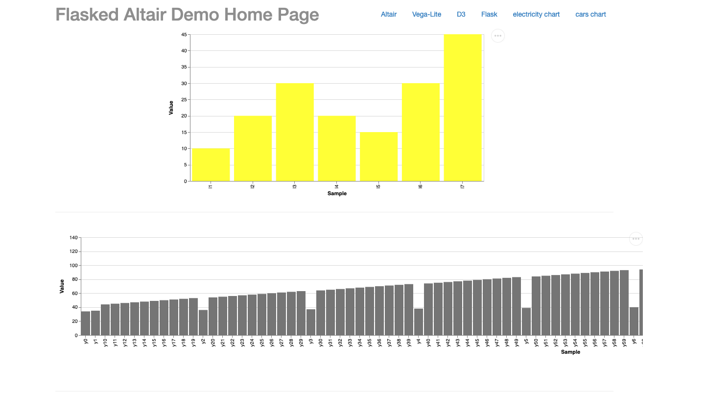

# 4.8 Interactive Health Data Dashboards using Vega-Altair 

## Example code
- https://github.com/lemoncyb/flasked-altair 
- In your google shell:
    - `git clone https://github.com/lemoncyb/flasked-altair.git`
    - install any requirements needed (`pip install flask altair vega-datasets`)
    - then run: `python app.py`

