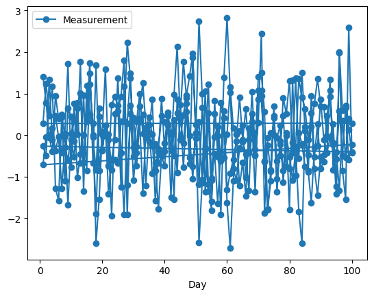

# 5.1 Introduction: Assumptions and Datatypes

This chapter explores the significance of inferential statistics in health informatics, covering topics such as understanding population parameters from sample statistics, hypothesis testing, confidence intervals, p-values and significance, regression analysis, and a case study that demonstrates how these techniques are applied to analyze clinical trial data.

Inferential statistics play a critical role in drawing conclusions and making predictions about health data based on a sample. This section delves into the significance of inferential statistics in health informatics and explores how these techniques enable us to make informed decisions about the larger population using sample data.

## Understanding Population Parameters from Sample Statistics

In health informatics, it's often not feasible or practical to collect data from an entire population. Instead, we work with samples from the population and use inferential statistics to estimate and draw conclusions about population parameters. For example, we might use the mean blood pressure of a sample to estimate the mean blood pressure of the entire patient population.

When working with inferential statistics, it's essential to recognize that the relationship between a sample and its corresponding population is intricate. The insights we gain from a sample might provide valuable information about the broader population, but this extrapolation is subject to certain conditions. These conditions, known as statistical assumptions, underpin the reliability of our inferences and guide the choice of appropriate statistical methods.

## Importance of Statistical Assumptions
Statistical assumptions provide a foundation for making accurate and meaningful conclusions about population parameters from sample data. They serve as guidelines for selecting the right statistical techniques and interpreting the results effectively. However, they also come with inherent challenges and limitations that must be considered.

### Representativeness
One of the key assumptions is that the sample accurately represents the population. This implies that the sample is randomly selected and has characteristics that are similar to those of the population. If this assumption is violated, the results might not generalize well beyond the sample.

To check for representativeness, we can compare the characteristics of the sample to those of the population and assess whether they are similar. One way to do this is by visualizing the distributions of key variables in both the sample and the population.

Fake Dataset:
Let's assume we have a dataset of patients' ages and blood pressure readings.

```python
import pandas as pd
from faker import Faker
import random

fake = Faker()

# Generate a fake dataset of patients
num_patients = 1000
data = {
    "Age": [random.randint(18, 90) for _ in range(num_patients)],
    "Systolic_BP": [random.randint(90, 180) for _ in range(num_patients)],
    "Diastolic_BP": [random.randint(60, 100) for _ in range(num_patients)],
}

df = pd.DataFrame(data)
```

Checking for represenitives:
```python
import matplotlib.pyplot as plt

# Simulate population distribution of ages
population_age = [random.randint(18, 90) for _ in range(10000)]

# Plot age distribution in the sample and population
plt.hist(df["Age"], bins=20, alpha=0.5, label="Sample")
plt.hist(population_age, bins=20, alpha=0.5, label="Population")
plt.xlabel("Age")
plt.ylabel("Frequency")
plt.title("Age Distribution Comparison")
plt.legend()
plt.show()
```


This code generates a histogram comparing the age distribution in the sample to the population. A similar approach can be taken for other variables of interest.

### Normality
Many inferential techniques, such as t-tests and ANOVA, assume that the data follows a normal distribution characterized by a symmetric bell-shaped curve.. Deviations from normality can impact the validity of conclusions drawn from these methods.

Fake Dataset:
Continuing with the previous dataset of patients' ages and blood pressure readings:

```python
import matplotlib.pyplot as plt
import scipy.stats as stats

# Check normality of Systolic BP using a Q-Q plot
stats.probplot(df["Systolic_BP"], plot=plt)
plt.title("Q-Q Plot for Systolic Blood Pressure")
plt.show()

# Perform Shapiro-Wilk test for normality
shapiro_test_result = stats.shapiro(df["Systolic_BP"])
print("Shapiro-Wilk Test p-value:", shapiro_test_result.pvalue)
```


```yaml
Shapiro-Wilk Test p-value: 4.431016488429029e-16
```
In this code example, we first use a Q-Q plot to visually assess the normality of the Systolic BP variable. A straight line in the Q-Q plot indicates normality. We also use the Shapiro-Wilk test, which is a statistical test for normality. If the p-value of the test is greater than a certain significance level (e.g., 0.05), we can assume normality.

In the case of the p-value you provided (Shapiro-Wilk Test p-value: 4.431016488429029e-16), the p-value is extremely small (close to 0). This suggests strong evidence against the null hypothesis of normality. In other words, the data does not follow a normal distribution.

When interpreting the p-value:
- If the p-value is less than a chosen significance level (commonly 0.05), you would reject the null hypothesis and conclude that the data is not normally distributed.
- If the p-value is greater than the significance level, you would fail to reject the null hypothesis, indicating that there is not enough evidence to conclude that the data is not normally distributed.


### Independence
Another important assumption is that observations in the sample are independent of each other. 

The independence assumption in inferential statistics states that observations in the dataset are independent of each other. This means that the value of one observation should not be influenced by the value of another observation. Violations of this assumption can arise when there are temporal or spatial correlations present in the data. In healthcare studies, this might occur when measurements from the same patient are taken at different time points or when observations are collected from spatially clustered units.

To check the independence assumption, you can visually inspect your data for any patterns or trends over time or space. Additionally, you can use statistical tests that assess correlation or autocorrelation between observations.

Here's an example of how to check for independence using Python:

```python
import pandas as pd
import numpy as np

# Generate a fake dataset with temporal correlation
np.random.seed(0)
num_patients = 100
days = np.arange(1, 101)
data = {
    "Patient_ID": np.repeat(np.arange(1, num_patients+1), len(days)),
    "Day": np.tile(days, num_patients),
    "Measurement": np.random.normal(0, 1, num_patients * len(days))
}
df = pd.DataFrame(data)

# Visualize data for a few patients
sample_patients = df["Patient_ID"].sample(n=5, random_state=0)
sample_data = df[df["Patient_ID"].isin(sample_patients)]
sample_data.plot(x="Day", y="Measurement", kind="line", marker="o")
```



In this example, we generate a dataset with temporal correlation, where each patient has measurements taken on different days. We then visualize the data for a few randomly selected patients to identify any patterns over time, and as you can see, it can be difficult to discern what is going on based on the image alone. So, you can extend this approach to detect spatial correlations or use statistical tests like autocorrelation tests to quantitatively assess the degree of correlation between observations.

Autocorrelation measures the correlation between a time series observation and its lagged values. If the autocorrelation values exceed the threshold, it suggests temporal correlation in the data. The specific threshold used here (2 / sqrt(num_samples)) is a common guideline, but you might need to adjust it based on your specific dataset and the significance level you choose.

Heres an example of how to perform an autocorrelation test on another fake dataset:

```python
import pandas as pd
import numpy as np
from statsmodels.tsa.stattools import acf
import matplotlib.pyplot as plt

# Generate a fake dataset with autocorrelation
np.random.seed(0)
num_samples = 200
data = {
    "Measurement": np.sin(np.linspace(0, 4*np.pi, num_samples)) + np.random.normal(0, 0.2, num_samples)
}
df = pd.DataFrame(data)

# Calculate autocorrelation
autocorrelation = acf(df["Measurement"], nlags=20)

# Plot autocorrelation function
plt.figure(figsize=(10, 5))
plt.stem(range(len(autocorrelation)), autocorrelation, use_line_collection=True)
plt.xlabel("Lag")
plt.ylabel("Autocorrelation")
plt.title("Autocorrelation Function")
plt.show()

# Check significance of autocorrelation values
significant_lags = np.where(np.abs(autocorrelation) > (2 / np.sqrt(num_samples)))[0]
print("Significant Lags:", significant_lags)
```


```yaml
Significant Lags: [ 0  1  2  3  4  5  6  7  8  9 10 11 12 13 14 15 16 17 18 19 20]
```

The significance of these lags implies above (0 to 20) that the observations in the dataset are not independent and are influenced by their previous values. This could have implications for statistical analyses that assume independence, and it might be necessary to consider time series modeling techniques or account for autocorrelation in the analysis.

Lastly, on addition to autocorrelation tests, you might consider cross-correlation analysis and the Durbin-Watson test. Here's an example of how to perform these tests using Python:

```python
import pandas as pd
import numpy as np
from statsmodels.tsa.stattools import adfuller, acf, pacf

# Calculate autocorrelation and partial autocorrelation
autocorrelation = acf(df["Measurement"], nlags=20)
partial_autocorrelation = pacf(df["Measurement"], nlags=20)

# Perform Augmented Dickey-Fuller test for stationarity
adf_test = adfuller(df["Measurement"])
adf_statistic, adf_p_value = adf_test[0], adf_test[1]

print("Autocorrelation:")
print(autocorrelation)
print("\nPartial Autocorrelation:")
print(partial_autocorrelation)
print("\nAugmented Dickey-Fuller Test p-value:", adf_p_value)
```
```yaml
Autocorrelation:
[1.         0.92920635 0.92846746 0.91681295 0.8932404  0.88931847
 0.86424096 0.8517982  0.82381179 0.7881826  0.76410642 0.71765335
 0.69051566 0.64934708 0.61488293 0.566911   0.51772675 0.47021183
 0.43239908 0.38618945 0.32940699]

Partial Autocorrelation:
[ 1.          0.93387572  0.51395092  0.26686117 -0.01119538  0.08947983
 -0.07410319 -0.0250549  -0.17153451 -0.29220841 -0.21602375 -0.36264795
 -0.27046094 -0.35596954 -0.3039029  -0.59891267 -1.33621937  3.88094658
  0.86524999  0.59716742  0.45811651]

Augmented Dickey-Fuller Test p-value: 0.00012258228075460418
```

*Autocorrelation*: The autocorrelation values gradually decrease as the lag increases. This pattern suggests that the data points are correlated with their past values up to a certain lag, but the correlation weakens as the lag increases. The autocorrelation values being close to 1 at the start and then decreasing indicate a decreasing trend of correlation with time lags

*Partial Autocorrelation*: Partial autocorrelation measures the direct relationship between an observation and its lagged values, while controlling for the effects of the intervening observations. In these results, the partial autocorrelation values start with a high positive value at lag 0 and then gradually decrease. The significant spike at lag 1 indicates a strong positive correlation between the observation and its immediate previous value. The partial autocorrelation values after lag 1 show diminishing correlation.

*Augmented Dickey-Fuller Test p-value*: The Augmented Dickey-Fuller (ADF) test is used to determine whether a time series is stationary or non-stationary. The null hypothesis of the test is that the time series has a unit root (it is non-stationary). A p-value lower than a significance level (commonly 0.05) indicates that the null hypothesis can be rejected, suggesting that the time series is stationary. In our case, the very low p-value (0.00012258228075460418) indicates that you can reject the null hypothesis and conclude that the time series is stationary. Stationarity is a desirable property for many time series analyses, as it simplifies modeling and helps ensure reliable results.

If you identify significant temporal or spatial correlations, it's important to account for them in your analysis to ensure valid inferential results.

### Homogeneity of Variance
The assumption of homogeneity of variance, also known as homoscedasticity, is important in various statistical analyses, including analysis of variance (ANOVA) and regression. It implies that the variance of the dependent variable is consistent across different groups or levels of an independent variable. Violations of homogeneity of variance can impact the reliability and validity of statistical tests, leading to biased results and incorrect conclusions.

Interpretation of the results:
- If the p-value is greater than a chosen significance level (e.g., 0.05), you do not have enough evidence to reject the null hypothesis of homogeneity of variance. This indicates that the assumption is met, and you can proceed with ANOVA or regression analyses assuming homogeneity of variance.
- If the p-value is smaller than the significance level, you have evidence to reject the null hypothesis. This suggests that the assumption of homogeneity of variance is violated, and you should consider alternative methods or transformations that are more appropriate for unequal variances.


```python
from faker import Faker
import pandas as pd
from scipy import stats

fake = Faker()

# Generate a fake healthcare dataset with two groups
num_samples_per_group = 50

data = {
    "Group": ["Control"] * num_samples_per_group + ["Treatment"] * num_samples_per_group,
    "Blood_Pressure": [fake.random_int(100, 140) for _ in range(num_samples_per_group)] +
                      [fake.random_int(110, 150) for _ in range(num_samples_per_group)],
    "Cholesterol": [fake.random_int(150, 250) for _ in range(num_samples_per_group)] +
                   [fake.random_int(160, 280) for _ in range(num_samples_per_group)]
}

df = pd.DataFrame(data)

# Convert the columns to numeric
df["Blood_Pressure"] = pd.to_numeric(df["Blood_Pressure"])
df["Cholesterol"] = pd.to_numeric(df["Cholesterol"])

# check homogeneous variance with Levene's test
print(stats.levene(df[df["Group"] == "Control"]["Blood_Pressure"],
                     df[df["Group"] == "Treatment"]["Blood_Pressure"]))
print(stats.levene(df[df["Group"] == "Control"]["Cholesterol"],
                        df[df["Group"] == "Treatment"]["Cholesterol"]))

```

```yaml
LeveneResult(statistic=3.2909427292741142, pvalue=0.07272293233835961)
LeveneResult(statistic=2.118265182315856, pvalue=0.148747268991412)
```

Interpretation for `LeveneResult(statistic=3.2909427292741142, pvalue=0.07272293233835961)`:
- The Levene's statistic for this test is approximately 3.29.
- The p-value associated with the test is approximately 0.0727.
- The p-value (0.0727) is greater than the typical significance level of 0.05 (or 5%). This suggests that we fail to reject the null hypothesis. In other words, there isn't enough evidence to conclude that the variances of the groups are significantly different. This indicates that the assumption of homogeneity of variances is likely met.

Interpretation for `LeveneResult(statistic=2.118265182315856, pvalue=0.148747268991412)`:
- The Levene's statistic for this test is approximately 2.12.
- The p-value associated with the test is approximately 0.1487.
- Similarly, in this case, the p-value (0.1487) is greater than the significance level of 0.05. As a result, we again fail to reject the null hypothesis, indicating that there isn't sufficient evidence to conclude that the variances of the groups are significantly different.

In both cases, the p-values are above the chosen significance level, suggesting that there is no strong evidence to suggest that the variances differ between the groups. This indicates that the assumption of homogeneity of variances is likely met, which is important when performing certain statistical tests, such as ANOVA, which assume equal variances across groups.

Keep in mind that if the assumption of homogeneity of variance is violated, you might need to use robust statistical methods or transformations to address the issue and ensure the validity of your analyses.


### Linearity
The linearity assumption is a critical assumption when using regression models. It assumes that the relationship between the independent variables (predictors) and the dependent variable (outcome) is linear. In other words, the change in the dependent variable for a one-unit change in an independent variable should be consistent across all levels of that variable.

To check for linearity, you can create scatter plots of the dependent variable against each independent variable. If the scatter plots show a clear and consistent pattern that approximates a straight line, the linearity assumption is likely met. On the other hand, if the scatter plots show a curved or non-linear pattern, it might indicate a violation of the linearity assumption.

Additionally, you can use residual plots to assess linearity after fitting a regression model. Residuals are the differences between the observed and predicted values. A scatter plot of residuals against the predicted values can reveal patterns that suggest non-linearity.

If the scatter plot shows a relatively linear pattern with points distributed closely around a straight line, the linearity assumption is likely met. If the scatter plot exhibits a non-linear pattern, it may indicate a violation of the linearity assumption.

```python
import matplotlib.pyplot as plt
import pandas as pd
import numpy as np

# Generate fake healthcare data
np.random.seed(42)
num_samples = 100
age = np.random.randint(18, 80, num_samples)
blood_pressure = np.random.randint(100, 180, num_samples)
cholesterol = np.random.randint(150, 300, num_samples)

# Create a DataFrame
data = pd.DataFrame({'Age': age, 'Blood_Pressure': blood_pressure, 'Cholesterol': cholesterol})

# Check for linearity using scatter plot
plt.figure(figsize=(10, 6))

plt.subplot(1, 2, 1)
plt.scatter(data['Age'], data['Blood_Pressure'])
plt.title('Scatter Plot of Age vs. Blood Pressure')
plt.xlabel('Age')
plt.ylabel('Blood Pressure')

plt.subplot(1, 2, 2)
plt.scatter(data['Age'], data['Cholesterol'])
plt.title('Scatter Plot of Age vs. Cholesterol')
plt.xlabel('Age')
plt.ylabel('Cholesterol')

plt.tight_layout()
plt.show()
```


With our scatter plots, we notice that neither age vs. blood pressure nor age vs. cholesterol exhibits a clear linear pattern. Instead, the data points appear to be randomly distributed without a consistent linear trend. This suggests that the linearity assumption may not be met in this dataset.

To rigorously evaluate the linearity assumption, we could also turn to the Spearman rank correlation coefficient. Unlike Pearson correlation, the Spearman correlation assesses monotonic relationships, which capture non-linear associations as well. It calculates the strength and direction of the monotonic relationship between two variables. The Spearman correlation value ranges from -1 to 1, where values closer to 1 (or -1) indicate a strong increasing (or decreasing) monotonic correlation, and values close to 0 imply no monotonic correlation.

By conducting the Spearman rank correlation test between age and each health-related variable, we can obtain a numerical measure of their monotonic association. This information will guide our decision on whether the linearity assumption holds or whether alternative modeling approaches should be considered to capture the underlying patterns in the data.

```python
from scipy.stats import spearmanr
# Calculate Spearman correlation between Age and Blood Pressure
spearman_bp, pvalue_bp = spearmanr(data["Age"], data["Blood_Pressure"])

# Calculate Spearman correlation between Age and Cholesterol
spearman_chol, pvalue_chol = spearmanr(data["Age"], data["Cholesterol"])

print("Spearman Correlation between Age and Blood Pressure:", spearman_bp)
print("P-value:", pvalue_bp)

print("Spearman Correlation between Age and Cholesterol:", spearman_chol)
print("P-value:", pvalue_chol)
```

```yaml
Spearman Correlation between Age and Blood Pressure: -0.09473080632026672
P-value: 0.3484970381324344
Spearman Correlation between Age and Cholesterol: -0.020582531267445567
P-value: 0.838932524530284
```

The Spearman correlation coefficient of -0.0947 indicates a very weak negative monotonic correlation between age and blood pressure. This means that as age increases, there is a slight tendency for blood pressure to decrease, but the correlation is not strong. The p-value of 0.3485 suggests that this correlation is not statistically significant. Therefore, based on the data, there is no strong evidence to conclude that age and blood pressure are significantly correlated.

The Spearman correlation coefficient of -0.0206 suggests a negligible negative monotonic correlation between age and cholesterol levels. This implies that there is very little tendency for cholesterol levels to decrease as age increases, and the correlation is almost negligible. The high p-value of 0.8389 indicates that the correlation is not statistically significant. In other words, there is insufficient evidence to conclude a significant relationship between age and cholesterol levels.

Keep in mind that linearity is not always required for every type of analysis. In some cases, non-linear relationships can be modeled using polynomial regression or other non-linear modeling techniques. However, for traditional linear regression, meeting the linearity assumption is important for the validity of the results.

### Absence of Outliers
Outliers can disproportionately affect results, especially when calculating means and variances. Assessing and handling outliers is crucial to maintaining the integrity of the analysis.

In addition to these examples below, you can also re-visit Chapter 3.3: Handling Outliers 

Example using box-whisker plot: In the box plot, potential outliers can be identified as individual data points that fall outside the "whiskers" of the box plot. These whiskers usually extend to 1.5 times the interquartile range (IQR) above and below the box. Points outside this range are considered potential outliers.


```python
import pandas as pd
import matplotlib.pyplot as plt

# Sample healthcare dataset
data = {
    "Patient_ID": [0, 1, 2, 3, 4, 5, 6, 7, 8, 9, 10, 11, 12, 13, 14, 15, 16, 17],
    "Cholesterol": [50, 180, 190, 200, 205, 210, 215, 220, 225, 230, 235, 240, 245, 250, 255, 260, 300, 330]
}

df = pd.DataFrame(data)

# A Basic box plot to visualize cholesterol distribution
plt.figure(figsize=(8, 6))
plt.boxplot(df["Cholesterol"], vert=False)
plt.title("Box Plot of Cholesterol Levels")
plt.xlabel("Cholesterol")
plt.show()

# Sowing outliers as red dots
plt.figure(figsize=(8, 6))
plt.boxplot(df["Cholesterol"], vert=False, showfliers=True, flierprops={"marker": "o", "markerfacecolor": "red"})
plt.title("Box Plot of Cholesterol Levels")
plt.xlabel("Cholesterol")
plt.show()

# Superomposing a histogram on top of the box plot
plt.figure(figsize=(8, 6))
plt.boxplot(df["Cholesterol"], vert=False, showfliers=True, flierprops={"marker": "o", "markerfacecolor": "red"})
plt.hist(df["Cholesterol"], bins=10, alpha=0.5)
plt.title("Box Plot of Cholesterol Levels")
plt.xlabel("Cholesterol")
plt.show()

```


Another approach to detecting outliers is to use statistical methods that quantify the degree of deviation from the typical data distribution. One common method is the Z-score, which measures how many standard deviations a data point is away from the mean. Z-scores can help you identify data points that are significantly different from the rest of the data.

```python
import numpy as np

# Calculate Z-scores for Cholesterol
df["Z_Score"] = np.abs((df["Cholesterol"] - df["Cholesterol"].mean()) / df["Cholesterol"].std())

# Set a threshold for Z-score to identify outliers (e.g., Z-Score > 2)
outliers = df[df["Z_Score"] > 2]

print("Outliers:")
print(outliers)
```

```yaml

	Patient_ID	Cholesterol	Z_Score
0	0	50	3.055966
1	1	180	0.778590
2	2	190	0.603407
3	3	200	0.428225
4	4	205	0.340633
5	5	210	0.253042
6	6	215	0.165450
7	7	220	0.077859
8	8	225	0.009732
9	9	230	0.097324
10	10	235	0.184915
11	11	240	0.272507
12	12	245	0.360098
13	13	250	0.447689
14	14	255	0.535281
15	15	260	0.622872
16	16	300	1.323603
17	17	330	1.849151

Outliers:
   Patient_ID  Cholesterol   Z_Score
0           0           50  3.055966
```

In this example, we see that only one of the values exceed 2 SD. 

Overall, the complex interplay of these assumptions can impact the validity of conclusions. Deviations from these assumptions can lead to biased estimates, incorrect inferences, and flawed decisions. Therefore, understanding the assumptions associated with the chosen statistical method is essential for robust data analysis.

**ML note for assumptions:** While these assumptions are pivotal in traditional inferential statistics, the advent of machine learning (ML) has introduced alternative approaches that don't necessarily rely on them. Many ML algorithms, such as deep learning and ensemble methods, are designed to learn complex patterns directly from the data, often bypassing the need for explicit confirmations of these assumptions. While this can provide more flexibility and adaptability to various data types, it also requires careful consideration of issues such as data quality, overfitting, and interpretability.

## Importance of Data Types 

In statistics, understanding the types of data is a fundamental step that significantly influences the choice of appropriate statistical tests. The nature of data determines the type of analysis that can be performed and helps ensure accurate and meaningful conclusions. In health informatics, where data varies widely in terms of structure and context, identifying the correct data type is essential for making informed decisions.

In the realm of health informatics, where the choice of statistical test directly impacts clinical decisions, it's essential to be well-versed in data types and their implications. This knowledge ensures that analyses are robust, accurate, and actionable for improving patient outcomes and healthcare practices.

### Nominal Data
Nominal data consists of categories without any inherent order or ranking. 

Examples of nominal data in healthcare include:
- Sex (Male, Female)
- Blood types (A, B, AB, O).

```yaml
- Patient_ID: 1
  Gender: Male
- Patient_ID: 2
  Gender: Female
- Patient_ID: 3
  Gender: Male
```

For nominal data, chi-square tests or Fisher's exact tests are commonly used to assess associations between variables or groups.

### Ordinal Data
Ordinal data represents categories with a meaningful order or ranking, but the intervals between categories may not be uniform or well-defined. 

Examples of ordinal data in healthcare include:
- Patient satisfaction ratings: Very Dissatisfied, Neutral, Very Satisfied
- Pain intensity levels: Mild, Moderate, Severe

```yaml
- Patient_ID: 1
  Satisfaction_Rating: Very Satisfied
- Patient_ID: 2
  Satisfaction_Rating: Neutral
- Patient_ID: 3
  Satisfaction_Rating: Very Dissatisfied
```


When working with ordinal data, specialized non-parametric tests like the Wilcoxon rank-sum test or the Kruskal-Wallis test are appropriate. These tests account for the ranked nature of the data without assuming a normal distribution.

### Categorical Data
Categorical data is a broader category that includes both nominal and ordinal data. 

It involves discrete observations that can be classified into different categories. 

Examples of categorical data in healthcare:
- Medical specialty (e.g., cardiology, neurology, pediatrics).
- Education level: High School, Bachelor's Degree, Master's Degree

```yaml
- Patient_ID: 1
  Specialty: Cardiology
- Patient_ID: 2
  Specialty: Neurology
- Patient_ID: 3
  Specialty: Pediatrics
```

Depending on the context, both chi-square tests and analysis of variance (ANOVA) can be used to analyze categorical data. ANOVA can be extended to handle multiple categories or groups.

### Interval Data
Interval data includes numerical values with a defined order and consistent intervals between them. 

Examples of interval data in healthcare are:
- Temperature readings (in Celsius or Fahrenheit)
- Time intervals between patient visits

```yaml
- Patient_ID: 1
  Temperature: 37.5
- Patient_ID: 2
  Temperature: 36.8
- Patient_ID: 3
  Temperature: 38.2
```

Interval data can be analyzed using parametric tests like t-tests or ANOVA, provided that the assumption of normality is met.