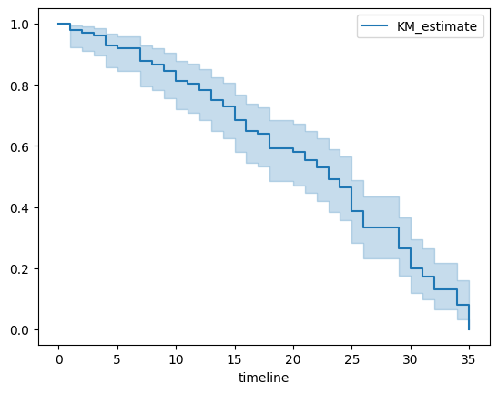
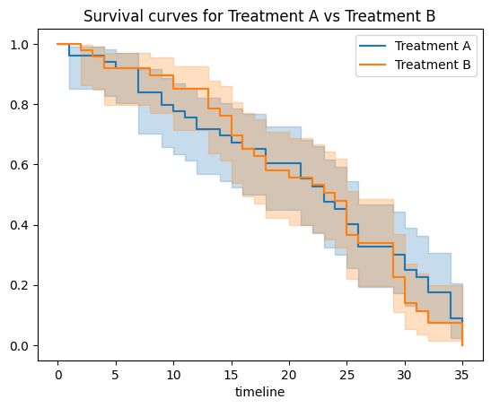

# 5.9 Time to Event (TTE)

## Introduction

**5.9 Time to Event (TTE)**

Time to Event (TTE) analyses, often termed survival analyses, are methods to analyze data where the outcome variable is the time until the occurrence of an event of interest. The event can be anything: death, disease occurrence, recovery, relapse, etc. In clinical studies, TTE analyses are essential because patients often are observed over a period of time to understand how long they 'survive' until some event occurs.

Here are some fundamental concepts in TTE:

- **Survival Function (S(t))**: It represents the probability that a person survives from the start of the study to a specified future time.

- **Hazard Function (h(t))**: This is the event rate at time \( t \), given survival until \( t \).

- **Censoring**: A crucial concept in TTE. It occurs when the information about time to event is partial; for example, if patients drop out of a study before the event occurs or the study ends before the event has happened for everyone.

- **Kaplan-Meier Estimator**: A method to estimate the survival function. It provides probabilities of survival over time.

- **Cox Proportional-Hazards Model**: A regression model used for survival analysis to investigate the effect of several variables upon the time a specified event takes to happen.

In the realm of healthcare:

- Survival analysis can help identify factors that influence time to recovery after surgery.
- It can be employed to assess the efficacy of new cancer treatments by comparing survival rates.
- The method is also beneficial in studying non-fatal events, like hospital readmission or time to relapse in patients.

When linking TTE to other inferential statistics:

- TTE can be combined with regression models (like the Cox model) to account for multiple variables that may influence survival.
- The results from TTE analyses can be further used to calculate relative risks, odds ratios, and other measures of effect size, enhancing its utility.

In essence, TTE provides a nuanced understanding of treatment effects, not just in terms of whether an event happens, but how long it takes to occur. This is especially relevant in chronic conditions and diseases with prolonged progression, common in the medical field.

## Example 1: Time To Recurrence after Surgery 

### Scenario

Let's consider a group of patients who underwent a specific type of surgery to remove benign tumors. The main concern for these patients is the time until recurrence of the tumor. The study aims to understand how long patients typically remain recurrence-free after the surgery and if certain treatments post-surgery can prolong the time to recurrence.

### Data

We have data for 100 patients. Here's how the data might look:

| Patient ID | Time to Recurrence (months) | Treatment | Censored |
|------------|-----------------------------|-----------|----------|
| 1          | 12                          | A         | 0        |
| 2          | 24                          | B         | 0        |
| 3          | 15                          | A         | 1        |
| ...        | ...                         | ...       | ...      |

Here, 
- **Time to Recurrence (months)** is the time in months from the date of surgery to the recurrence of the tumor.
- **Treatment** is the type of post-surgery treatment the patient received (let's say Treatment A is a standard drug, and Treatment B is an experimental drug).
- **Censored** is a binary column where '1' indicates the patient did not have a recurrence during the study period (i.e., their data is censored), and '0' indicates they did.

Here is how we might produce this dataset using faker in python:

```python

import pandas as pd
import numpy as np
from faker import Faker
from random import choice

# Initialize faker
fake = Faker()

# Number of patients
n = 100

# Generate Patient IDs
patient_ids = [fake.uuid4() for _ in range(n)]

# Generate Time to Recurrence (months) - random integers between 1 to 36 months
times_to_recurrence = np.random.randint(1, 37, n)

# Generate Treatments - either A or B
treatments = [choice(['A', 'B']) for _ in range(n)]

# Generate Censored column - 1 if censored, 0 otherwise.
# Assume 20% patients get censored
censored = [1 if i < 0.2*n else 0 for i in range(n)]
np.random.shuffle(censored)  # Shuffling the censored values to distribute randomly

# Creating the dataframe
data = pd.DataFrame({
    'Patient ID': patient_ids,
    'Time to Recurrence (months)': times_to_recurrence,
    'Treatment': treatments,
    'Censored': censored
})

# Display the first few rows of the dataset
print(data.head())


```

**Analysis:**

### Kaplan-Meier Survival Analysis:
   - This will allow us to estimate the survival function for the entire cohort, and also separately for Treatment A and Treatment B groups.
   - Note, you will first need to install lifelines

```bash
pip install lifelines
```
   
```python
from lifelines import KaplanMeierFitter

# Creating an instance of KaplanMeierFitter
kmf = KaplanMeierFitter()

# Fitting the data
kmf.fit(data['Time to Recurrence (months)'], event_observed=1-data['Censored'])

# Plotting the survival curve
kmf.plot()
```



 But besides the visual representation (the survival plot), you can obtain and interpret several pieces of information:

1. **Survival Table:** This table provides a breakdown at each time point, showing the number of individuals still under observation (at risk), the number who experienced the event, and the estimated probability of survival up to that time point.

   ```python
   print(kmf.survival_function_)
   ```

- For our results, it will look like so:

        ```text
                KM_estimate
        timeline             
        0.0          1.000000
        1.0          0.980000
        2.0          0.970000
        3.0          0.960000
        4.0          0.929684
        5.0          0.919468
        6.0          0.919468
        7.0          0.877674
        8.0          0.867225
        9.0          0.845812
        10.0         0.813693
        11.0         0.802986
        12.0         0.781574
        13.0         0.749454
        14.0         0.727731
        15.0         0.683626
        16.0         0.650005
        17.0         0.638601
        18.0         0.591298
        20.0         0.578979
        21.0         0.553806
        22.0         0.528633
        23.0         0.490873
        24.0         0.465038
        25.0         0.385317
        26.0         0.332170
        29.0         0.265736
        30.0         0.199302
        31.0         0.172728
        32.0         0.129546
        33.0         0.129546
        34.0         0.080966
        35.0         0.000000
        ```

2. **Event Table:** This table provides the number of observed events (deaths, failures, etc.) and censored observations at each unique time point.

   ```python
   print(kmf.event_table)
   ```

- This table will look like:

    ```text

            removed  observed  censored  entrance  at_risk
    event_at                                                
    0.0             0         0         0       100      100
    1.0             2         2         0         0      100
    2.0             1         1         0         0       98
    3.0             2         1         1         0       97
    4.0             4         3         1         0       95
    5.0             1         1         0         0       91
    6.0             2         0         2         0       90
    7.0             4         4         0         0       88
    8.0             3         1         2         0       84
    9.0             2         2         0         0       81
    10.0            3         3         0         0       79
    11.0            1         1         0         0       76
    12.0            2         2         0         0       75
    13.0            4         3         1         0       73
    14.0            3         2         1         0       69
    15.0            5         4         1         0       66
    16.0            4         3         1         0       61
    17.0            3         1         2         0       57
    18.0            6         4         2         0       54
    20.0            2         1         1         0       48
    21.0            2         2         0         0       46
    22.0            2         2         0         0       44
    23.0            4         3         1         0       42
    24.0            3         2         1         0       38
    25.0            6         6         0         0       35
    26.0            4         4         0         0       29
    29.0            5         5         0         0       25
    30.0            5         5         0         0       20
    31.0            3         2         1         0       15
    32.0            3         3         0         0       12
    33.0            1         0         1         0        9
    34.0            4         3         1         0        8
    35.0            4         4         0         0        4

    ```

3. **Median Survival Time:** This is the time point at which the survival probability drops to 0.50 (or just below). It can provide an estimate of the "typical" time to event.

   ```python
   median_survival_time = kmf.median_survival_time_
   print(f"Median Survival Time: {median_survival_time}")
   ```

- Resulting in:
    ```text
    Median Survival Time: 23.0
    ```

4. **Pointwise Confidence Intervals:** These provide the range within which we're fairly certain (usually 95% confident) the true survival probability lies at each time point. It can give you an idea of the precision of your survival estimates.

   ```python
   confidence_intervals = kmf.confidence_interval_
   print(confidence_intervals)
   ```

- With the output of:

    ```text
            Treatment B_lower_0.95  Treatment B_upper_0.95
    0.0                 1.000000                1.000000
    2.0                 0.863827                0.997100
    3.0                 0.846502                0.989633
    4.0                 0.796951                0.968553
    6.0                 0.796951                0.968553
    8.0                 0.769991                0.955810
    10.0                0.714263                0.926762
    13.0                0.636424                0.878242
    14.0                0.611569                0.861068
    15.0                0.539553                0.807152
    16.0                0.493378                0.769472
    17.0                0.469687                0.749649
    18.0                0.423422                0.709034
    20.0                0.399554                0.687622
    22.0                0.374669                0.665151
    23.0                0.350285                0.642296
    24.0                0.324694                0.618191
    25.0                0.221244                0.512751
    26.0                0.197209                0.485014
    29.0                0.108828                0.367870
    30.0                0.052481                0.271846
    31.0                0.036341                0.237659
    32.0                0.015988                0.198037
    34.0                0.015988                0.198037
    35.0                0.000000                0.000000
    ```

5. **Comparison with Different Groups:** Often in clinical research, we're interested in comparing the survival curves of two or more groups. Using the Kaplan-Meier estimator, you can stratify by groups and visualize the differences. This usually leads to the log-rank test (which you've already seen) for testing the statistical difference between survival curves.

   ```python
   # Example: If you have two groups "Treatment A" and "Treatment B" in your data
   ax = plt.subplot(111)

   treatmentA = (data['Treatment'] == "A")
   kmf.fit(data['Time to Recurrence (months)'][treatmentA], event_observed=1-data['Censored'][treatmentA], label="Treatment A")
   kmf.plot(ax=ax)

   treatmentB = (data['Treatment'] == "B")
   kmf.fit(data['Time to Recurrence (months)'][treatmentB], event_observed=1-data['Censored'][treatmentB], label="Treatment B")
   kmf.plot(ax=ax)
   
   plt.title("Survival curves for Treatment A vs Treatment B")
   plt.show()
   ```



Overall, while the Kaplan-Meier survival curve provides an intuitive visual representation of time-to-event data, diving deeper into the underlying numbers can provide valuable clinical insights, especially when comparing different groups or treatments.


### Log-Rank Test:
   - To test if there's a statistically significant difference in the survival curves of the two treatment groups.
   
```python
from lifelines.statistics import logrank_test

results = logrank_test(data[data['Treatment']=='A']['Time to Recurrence (months)'], 
                       data[data['Treatment']=='B']['Time to Recurrence (months)'], 
                       event_observed_A=1-data[data['Treatment']=='A']['Censored'], 
                       event_observed_B=1-data[data['Treatment']=='B']['Censored'])
results.print_summary()
```

**Expected results:**

```text
t_0:	                -1
null_distribution:	chi squared
degrees_of_freedom:	1
test_name:	        logrank_test

---

test_statistic	    p	-log2(p)
0.17	            0.68	0.55
```

#### Log-rank test results interpretation:

1. **t_0:** This value of \(-1\) might be a placeholder or default value that indicates there's no specific test statistic value being reported in this part. It doesn't directly contribute to our interpretation.

2. **null_distribution:** The test statistic follows a chi-squared distribution. This tells us about the expected distribution of the test statistic under the null hypothesis (i.e., if there's no difference between groups).

3. **degrees_of_freedom:** The value is \(1\). This typically indicates that there are two groups being compared (like our Treatment A vs Treatment B in the example). The degrees of freedom for a chi-squared test comparing two groups is \(k - 1\), where \(k\) is the number of groups.

4. **test_name:** The test used is the log-rank test, which is specifically designed to compare survival curves.

---

5. **test_statistic:** The value is \(0.17\). This is the observed value of the test statistic. It tells us how much our observed data deviates from what we would expect under the null hypothesis.

6. **p:** The p-value is \(0.68\). This is much larger than the commonly used alpha level of \(0.05\). The p-value tells us the probability of observing data at least as extreme as what we've observed, given that the null hypothesis is true.

7. **-log2(p):** The value is \(0.55\). This is another way to express the p-value, which can sometimes be useful in specific contexts or visualizations. The higher this value, the more significant the result. A value of \(0.55\) here aligns with our p-value of \(0.68\), indicating non-significance.

#### Overall Interpretation:

The log-rank test did not find a statistically significant difference in the survival curves of the two treatment groups (Treatment A vs Treatment B). The p-value of \(0.68\) suggests that any observed differences between the two survival curves could easily have occurred by random chance.

In clinical terms, based on this test, we cannot confidently say that one treatment leads to a longer time to event (or recurrence in our example) than the other treatment.

---

### Cox Proportional Hazards Model:
   - To evaluate the effect of treatment and potentially other covariates on time to recurrence.
   
```python
from lifelines import CoxPHFitter

# Initialize the fitter
cph = CoxPHFitter()

# Fit the model to the data
cph.fit(data, 'Time to Recurrence (months)', event_col='Censored', formula="Treatment")

# Print a summary
cph.print_summary()
```

**Expected results:**

```text

model	lifelines.CoxPHFitter
duration col	'Time to Recurrence (months)'
event col	'Censored'
baseline estimation	breslow
number of observations	100
number of events observed	20
partial log-likelihood	-77.76
time fit was run	2023-09-05 19:50:49 UTC

	coef	exp(coef)	se(coef)	coef lower 95%	coef upper 95%	exp(coef) lower 95%	exp(coef) upper 95%	cmp to	z	p	-log2(p)
Treatment[T.B]	0.35	1.41	0.46	-0.55	1.24	0.58	3.46	0.00	0.75	0.45	1.15

Concordance	0.51
Partial AIC	157.53
log-likelihood ratio test	0.57 on 1 df
-log2(p) of ll-ratio test	1.16

```

#### Cox Proportional Hazards Model results interpretation:

1. **Model Information:**
   - **lifelines.CoxPHFitter:** This indicates the Python package and function used to fit the Cox Proportional Hazards model.
   - **duration col 'Time to Recurrence (months)':** The dependent variable is the time to recurrence measured in months.
   - **event col 'Censored':** This column in the dataset indicates whether an event (recurrence) was observed (1) or if the observation was censored (0).
   - **baseline estimation breslow:** This method was used to estimate the baseline hazard function.
   - **number of observations:** There are 100 observations in the dataset.
   - **number of events observed:** Out of the 100 observations, there were 20 recurrences.
   - **partial log-likelihood:** The value of the partial log-likelihood for the model is \(-77.76\).
   - **time fit was run:** The model was run on 2023-09-05 at 19:50:49 UTC.

2. **Treatment[T.B]:**
   - **coef:** The coefficient for Treatment B relative to the reference group (Treatment A) is \(0.35\). This indicates the logged hazard ratio. A positive value suggests that the hazard rate (risk of recurrence) is higher for Treatment B compared to Treatment A, while a negative value would suggest the opposite.
   - **exp(coef) (Hazard Ratio):** The value is \(1.41\). This is the exponentiated coefficient and represents the hazard ratio. A value greater than 1 indicates that the hazard rate for Treatment B is 1.41 times the hazard rate for Treatment A.
   - **se(coef):** The standard error of the coefficient is \(0.46\).
   - **coef lower 95% and coef upper 95%:** These values provide the 95% confidence interval for the coefficient, ranging from \(-0.55\) to \(1.24\).
   - **exp(coef) lower 95% and exp(coef) upper 95%:** These values provide the 95% confidence interval for the hazard ratio, ranging from \(0.58\) to \(3.46\). Since the range includes 1, the result is not statistically significant at the 0.05 level.
   - **z:** The z-value is \(0.75\), which represents the number of standard errors the coefficient is from 0.
   - **p:** The p-value is \(0.45\). This is higher than the commonly used alpha level of \(0.05\), indicating that the difference in hazard between Treatment A and Treatment B is not statistically significant.

3. **Other Metrics:**
   - **Concordance:** The value is \(0.51\). The concordance statistic (often called the C-index) measures the discriminatory power of the model. A value of 0.5 indicates no discrimination (similar to random chance), while a value of 1 indicates perfect discrimination. The observed value is just slightly better than random chance.
   - **Partial AIC:** The Akaike Information Criterion (with some adjustments) for the model is \(157.53\). AIC is used for model selection, with lower values indicating better fit models when comparing multiple models.
   - **log-likelihood ratio test:** The test statistic is \(0.57\) on 1 degree of freedom. This test is used to compare the fit of our model against a null model with no predictors. The value suggests that the addition of the treatment variable doesn't provide a substantial improvement in model fit.
   - **-log2(p) of ll-ratio test:** The value is \(1.16\). This is another way to express the p-value of the log-likelihood ratio test.

#### Overall Interpretation:

The Cox Proportional Hazards model was used to analyze the relationship between treatment type (Treatment A as reference vs Treatment B) and time to recurrence. The hazard ratio for Treatment B relative to Treatment A is 1.41, suggesting that the risk of recurrence might be 41% higher for individuals under Treatment B compared to those under Treatment A. However, this result is not statistically significant as indicated by the p-value of 0.45. 

Furthermore, the concordance statistic suggests that the model's ability to discriminate between those who experience recurrence and those who don't is just slightly better than random chance. In clinical terms, based on this model, we cannot confidently say that one treatment leads to a different risk of recurrence compared to the other treatment.


**Interpretation:**

Based on the Kaplan-Meier curves, we can determine the median time to recurrence for the overall cohort and by treatment type. The log-rank test will tell us if the difference between treatment groups is statistically significant. The Cox Proportional Hazards model will provide a hazard ratio, which can give insight into the relative risk of recurrence for the two treatment types.

Remember, this is a basic setup, and in real-world scenarios, you may have more covariates and a richer dataset to work with. This framework, however, provides a foundation for conducting survival analyses in clinical settings.