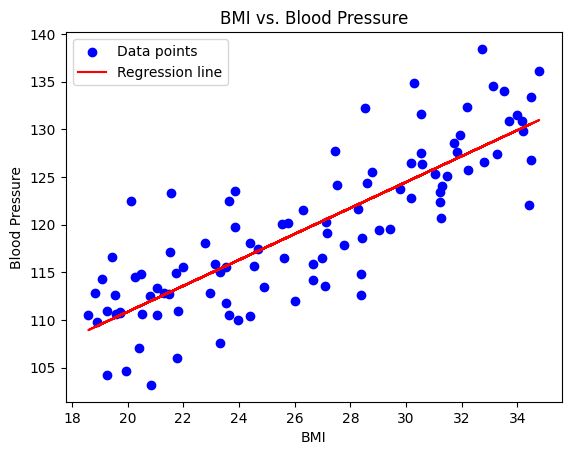

# 6.2 Simple Linear Regression for Health Data

## Introduction to Simple Linear Regression

Simple Linear Regression is a statistical method used to model the relationship between two variables: one independent variable (predictor) and one dependent variable (response). In a health context, it helps us understand how changes in the independent variable impact the dependent variable.
## Packages for Linear Regression in Python

Linear regression is a pivotal tool in statistical modeling and machine learning. While many Python libraries offer linear regression functionality, the approach, functionality, and intended usage vary among them. This section provides an overview of three primary packages: `scikit-learn`, `SciPy.stats`, and `statsmodels`.

### Purpose and Design Philosophy:

- **scikit-learn**:
    - **Purpose**: Predominantly designed for predictive data analysis. Seamlessly integrates with the broader machine learning ecosystem.
    - **Focus**: Prioritizes prediction and model evaluation. Well-suited for large datasets and multidimensional data.

- **SciPy.stats**:
    - **Purpose**: A comprehensive library for statistical analysis, offering detailed statistics about model fit.
    - **Focus**: Tailored for inference, hypothesis testing, and in-depth understanding of variable relationships. Presents comprehensive regression summaries.

- **statsmodels**:
    - **Purpose**: Bridges the gap between machine learning and traditional statistics.
    - **Focus**: Combines the best of both worlds, providing detailed statistics for hypothesis testing and tools for predictive modeling. Particularly renowned for its rich regression outputs.

### Model Assumptions and Diagnostics:

- **scikit-learn**:
    - **Assumptions**: Although it operates on the foundational mathematical assumptions like linearity, independence, and homoscedasticity, there aren't native methods for verifying these.
    - **Diagnostics**: Limited built-in tools for regression diagnostics. Users often integrate with other libraries to visualize residual plots, Q-Q plots, and more.

- **SciPy.stats**:
    - **Assumptions**: Adheres to the standard linear regression assumptions. Offers tools to validate these, such as normality tests for residuals.
    - **Diagnostics**: Delivers a comprehensive regression summary, inclusive of p-values, standard errors, confidence intervals, aiding in potential issue diagnosis.

- **statsmodels**:
    - **Assumptions**: While similar foundational assumptions underpin this package, it provides a suite of diagnostic tools and tests to validate them.
    - **Diagnostics**: Comparable to `SciPy.stats` in richness, offering detailed summaries, with added functionalities for more advanced regression techniques.

### Output and Interpretability:

- **scikit-learn**:
    - **Output**: Yields coefficients, R-squared values, and predictions.
    - **Interpretability**: Often augmented with other libraries like `statsmodels` or `SciPy` to achieve comprehensive statistical analysis and interpretation.

- **SciPy.stats**:
    - **Output**: A rich summary encompassing coefficients, t-values, p-values, standard errors, confidence intervals, and numerous other statistics.
    - **Interpretability**: Its exhaustive output aids easier statistical inference and an in-depth understanding of predictor significance and impact.

- **statsmodels**:
    - **Output**: Provides a detailed summary, much like `SciPy.stats`, but with additional diagnostics and tests.
    - **Interpretability**: Known for its extensive regression outputs, it facilitates thorough statistical analysis and understanding.

### Flexibility and Extensions:

- **scikit-learn**:
    - **Extensions**: Crafted for seamless integration into data pipelines and interoperability with diverse machine learning models. Easily extended to regularized regressions and non-linear models.

- **SciPy.stats**:
    - **Extensions**: Though powerful, it's somewhat limited when extending to non-traditional machine learning models, primarily serving traditional statistical models.

- **statsmodels**:
    - **Extensions**: Maintains flexibility, offering tools for both traditional statistical models and more advanced regression techniques.

---

In conclusion, while `scikit-learn`, `SciPy.stats`, and `statsmodels` all cater to linear regression, their optimal use-cases differ. For tasks pivoting on predictive modeling and interfacing with machine learning algorithms, `scikit-learn` shines. In contrast, for comprehensive statistical analysis, hypothesis testing, and inference, `SciPy.stats` and `statsmodels` provide richer utilities. Deciding on a package often hinges on the precise goals of the analysis at hand.


## Case Study: BMI and Blood Pressure with Scikit-learn

Let's consider a case study where we want to investigate the relationship between Body Mass Index (BMI) and blood pressure. We hypothesize that higher BMI may lead to higher blood pressure levels. Our goal is to build a simple linear regression model to quantify this relationship.

### Gathering Data

We collect data from a sample of individuals, recording their BMI and corresponding blood pressure measurements. This dataset serves as the basis for our analysis.

Using the `Faker` library, we can simulate a dataset of individuals, each with a BMI value and a corresponding blood pressure measurement.

```python
import numpy as np
import pandas as pd
from faker import Faker

fake = Faker()

# Set random seed for reproducibility
np.random.seed(42)

# Generate sample data
num_samples = 100
bmi_values = np.random.uniform(18.5, 35, num_samples)  # Typical range for adults
# Let's assume a simple linear relation with some added noise for blood pressure values
blood_pressure = 80 + 1.5 * bmi_values + np.random.normal(0, 5, num_samples)

# Convert data into a pandas DataFrame
data = pd.DataFrame({
    'BMI': bmi_values,
    'Blood Pressure': blood_pressure
})
```

**Example of test data: **

```text

          BMI  Blood Pressure
0   24.679912      117.455103
1   34.186786      129.785142
2   30.577900      126.325654
3   28.377865      112.628953
4   21.074308      110.513102
..        ...             ...
95  26.647627      115.892390
96  27.125092      120.302129
97  25.554427      120.037400
98  18.919416      109.762577
99  20.280209      114.556229

[100 rows x 2 columns]

```

### Building the Regression Model

Using Python's `scikit-learn` library, we build a simple linear regression model to predict blood pressure based on BMI. The model fits a line that best represents the relationship between these two variables. The slope of the line indicates the change in blood pressure associated with a unit change in BMI.

```python
from sklearn.linear_model import LinearRegression
import matplotlib.pyplot as plt

# Extracting data for regression
X = data[['BMI']]
y = data['Blood Pressure']

# Initialize and fit the model
model = LinearRegression().fit(X, y)

# Get model parameters
slope = model.coef_[0]
intercept = model.intercept_
```

### Interpreting the Results

We analyze the model's coefficients and statistics, including the intercept, slope, and R-squared value. The intercept represents the predicted blood pressure when BMI is zero, which may not have practical significance. The slope quantifies the change in blood pressure for each unit change in BMI.

- **Coefficients (Slope and Intercept)**
  - The coef_ attribute gives the slope of the regression line (for simple linear regression). The intercept_ attribute provides the y-intercept of the line.
- **R-squared Value**
  - The score() method of the linear regression object returns the R-squared value, which indicates the proportion of the variance in the dependent variable that is predictable from the independent variable.
- **Predictions**
  - The predict() method can be used to get predicted values of the dependent variable based on new (or the same) independent variable values.

```python
# Extract model parameters
slope = model.coef_[0]
intercept = model.intercept_
r_squared = model.score(X, y)

# Display results
print(f"Slope (Coefficient for BMI): {slope:.2f}")
print(f"Intercept: {intercept:.2f}")
print(f"R-squared value: {r_squared:.2f}")

# If you want to display predictions for the first 5 individuals
predictions = model.predict(X)
print("\nPredicted Blood Pressure for the first 5 individuals:")
for i, prediction in enumerate(predictions[:5]):
    print(f"Individual {i + 1}: {prediction:.2f}")
```

```text

Slope (Coefficient for BMI): 1.36
Intercept: 83.65
R-squared value: 0.69

Predicted Blood Pressure for the first 5 individuals:
Individual 1: 117.23
Individual 2: 130.17
Individual 3: 125.26
Individual 4: 122.27
Individual 5: 112.33

```

**Interpretation**:

Let's interpret the provided output step-by-step:

1. **Slope (Coefficient for BMI): 1.36**  
   The slope represents the change in the dependent variable (Blood Pressure) for a unit change in the independent variable (BMI).  
   **Interpretation**: For every one unit increase in BMI, we expect the blood pressure to increase by approximately 1.36 units, holding all other factors constant.

2. **Intercept: 83.65**  
   The intercept represents the value of the dependent variable (Blood Pressure) when the independent variable (BMI) is zero.  
   **Interpretation**: If a person had a BMI of zero (which isn't practically possible or healthy), we'd expect their blood pressure to be 83.65 units, based on this model. Remember, in many cases, especially in healthcare, the intercept might not have a practical interpretation and is more of a mathematical artifact.

3. **R-squared value: 0.69**  
   The R-squared value, often termed the coefficient of determination, provides a measure of how well the observed outcomes are replicated by the model, based on the proportion of total variation of outcomes explained by the model.  
   **Interpretation**: Approximately 69% of the variability in blood pressure can be explained by BMI in our sample. This suggests that BMI is a significant predictor of blood pressure for this dataset. The closer the R-squared value is to 1, the better the fit. An R-squared value of 0.69 is considered reasonably good, indicating that the model has captured a substantial part of the variance in blood pressure related to BMI.

4. **Predicted Blood Pressure for the first 5 individuals:**  
   These are the predicted values of blood pressure for the first 5 individuals in the dataset, based on their BMI and the model we've built.  
   **Interpretation**:  
   - For **Individual 1**, based on their BMI, we predict a blood pressure of 117.23 units.  
   - For **Individual 2**, the predicted blood pressure is 130.17 units.  
   - For **Individual 3**, the predicted blood pressure is 125.26 units.  
   - ... and so forth.

In summary, this linear regression model suggests a positive association between BMI and blood pressure. As BMI increases, blood pressure tends to increase as well. The model seems to fit the data relatively well, given the R-squared value, but it's crucial to consider other diagnostic tests and plots (like residuals) to confirm the model's appropriateness.

### Visualization

We create scatter plots with the regression line overlaid to visually depict the relationship between BMI and blood pressure. This visualization helps us understand how closely the data points align with the regression line.

```python
plt.scatter(X, y, color='blue', label='Data points')
plt.plot(X, model.predict(X), color='red', label='Regression line')
plt.title('BMI vs. Blood Pressure')
plt.xlabel('BMI')
plt.ylabel('Blood Pressure')
plt.legend()
plt.show()
```



### Drawing Conclusions

With the regression analysis and visualization in hand, we draw conclusions about the relationship between BMI and blood pressure. The R-squared value tells us how well the model fits the data. A higher R-squared indicates a stronger fit, suggesting that BMI is a good predictor of blood pressure in our dataset.

Simple linear regression provides a foundational framework for understanding relationships between variables in health data. By applying this technique to the BMI and blood pressure case study, we demonstrate how it can help us quantify and interpret the impact of one variable on another in a healthcare context.


## Case Study: BMI and Blood Pressure with Statsmodels

### Gathering Data

... *(This section remains unchanged)* ...

### Building the Regression Model with Statsmodels

Using the `statsmodels` library, we can construct a regression model that provides comprehensive statistics and insights. The library allows us to fit a line that represents the relationship between the two variables and extract important metrics from the regression.

```python
import statsmodels.api as sm
import matplotlib.pyplot as plt

# Extracting data for regression
X = data[['BMI']]
X = sm.add_constant(X)  # Add an intercept to our model
y = data['Blood Pressure']

# Fit the regression model
model = sm.OLS(y, X).fit()
```

### Interpreting the Results

The `statsmodels` library produces a comprehensive summary that includes coefficients (like the intercept and slope), standard errors, t-values, p-values, confidence intervals, and several other statistics.

- **Coefficients (Slope and Intercept)**
  - The `.params` attribute provides the coefficients of the regression.
- **R-squared Value**
  - The `.rsquared` attribute gives the R-squared value, indicating the proportion of variance in the dependent variable explained by the independent variables.
- **Summary**
  - The `.summary()` method provides a detailed summary of the regression.
- **Predictions**
  - The `.predict()` method can be used to obtain predicted values based on the independent variable values.

```python
# Extract model parameters
slope = model.params['BMI']
intercept = model.params['const']
r_squared = model.rsquared

# Display results
print(f"Slope (Coefficient for BMI): {slope:.2f}")
print(f"Intercept: {intercept:.2f}")
print(f"R-squared value: {r_squared:.2f}")

# For a detailed summary:
print(model.summary())

# If you want to display predictions for the first 5 individuals
predictions = model.predict(X)
print("\nPredicted Blood Pressure for the first 5 individuals:")
for i, prediction in enumerate(predictions[:5]):
    print(f"Individual {i + 1}: {prediction:.2f}")
```

```text

Slope (Coefficient for BMI): 1.36
Intercept: 83.65
R-squared value: 0.69
                            OLS Regression Results                            
==============================================================================
Dep. Variable:         Blood Pressure   R-squared:                       0.687
Model:                            OLS   Adj. R-squared:                  0.683
Method:                 Least Squares   F-statistic:                     214.6
Date:                Wed, 06 Sep 2023   Prob (F-statistic):           1.99e-26
Time:                        01:10:25   Log-Likelihood:                -292.09
No. Observations:                 100   AIC:                             588.2
Df Residuals:                      98   BIC:                             593.4
Df Model:                           1                                         
Covariance Type:            nonrobust                                         
==============================================================================
                 coef    std err          t      P>|t|      [0.025      0.975]
------------------------------------------------------------------------------
const         83.6530      2.481     33.723      0.000      78.730      88.576
BMI            1.3607      0.093     14.650      0.000       1.176       1.545
==============================================================================
Omnibus:                        0.900   Durbin-Watson:                   2.285
Prob(Omnibus):                  0.638   Jarque-Bera (JB):                0.808
Skew:                           0.217   Prob(JB):                        0.668
Kurtosis:                       2.929   Cond. No.                         146.
==============================================================================

Notes:
[1] Standard Errors assume that the covariance matrix of the errors is correctly specified.

Predicted Blood Pressure for the first 5 individuals:
Individual 1: 117.23
Individual 2: 130.17
Individual 3: 125.26
Individual 4: 122.27
Individual 5: 112.33

```

By using `statsmodels`, we gain an edge in detailed statistical analysis, hypothesis testing, and understanding the significance of predictors. The `.summary()` method, in particular, offers an in-depth view of the regression results, making it a powerful tool for statistical inference.

**Interpretation:**

1. **Coefficients**:
    - **Intercept (const):** The estimated intercept is 83.65. This implies that for an individual with a BMI of 0 (which is not practically possible, but theoretically), their predicted blood pressure would be 83.65 units. Typically, this is not a value that would have practical significance, but it's a necessary part of the regression equation.
    - **Slope (Coefficient for BMI):** The estimated slope is 1.36. This suggests that for each additional unit increase in BMI, we can expect an average increase of 1.36 units in blood pressure, holding other factors constant.

2. **Model Fit**:
    - **R-squared value:** The R-squared value is 0.69 or 69%. This indicates that approximately 69% of the variance in blood pressure can be explained by the BMI. In other words, BMI explains a significant portion of the variation we see in blood pressure, but there's still around 31% of the variance that is unexplained by this model.

3. **Statistical Significance**:
    - **P-values:** Both the intercept and the slope for BMI have p-values less than 0.05 (in fact, they're very close to 0), suggesting that these coefficients are statistically significant. The p-value for the BMI coefficient indicates that the relationship between BMI and blood pressure is statistically significant at common significance levels.
    - **Confidence Intervals:** The 95% confidence interval for the BMI coefficient is [1.176, 1.545], which means that we are 95% confident that the true coefficient lies within this interval.

4. **Other Diagnostics**:
    - **Durbin-Watson:** The value is 2.285, which is close to 2. This suggests that there is no significant autocorrelation in the residuals. Autocorrelation can indicate that the data is following a trend or that there is seasonality.
    - **Omnibus/Prob(Omnibus):** These tests are used to check the normality of the residuals. The Omnibus value is 0.900 with a p-value of 0.638, indicating that the residuals are approximately normally distributed.
    - **Skew:** The value of 0.217 suggests that the residuals are almost symmetrically distributed around the mean.
    - **Kurtosis:** The value of 2.929 is close to 3, suggesting that the tails of the residual distribution are similar to a normal distribution.

5. **Predicted Blood Pressure for Selected Individuals**:
    - Using our model, the predicted blood pressure values for the first five individuals are as follows:
        - **Individual 1:** 117.23
        - **Individual 2:** 130.17
        - **Individual 3:** 125.26
        - **Individual 4:** 122.27
        - **Individual 5:** 112.33

These predictions are based on the individual's BMI and the relationship that the model has determined between BMI and blood pressure.

### Visualization

... *(This section remains mostly unchanged, given it's about visualization)* ...

```python
plt.scatter(X['BMI'], y, color='blue', label='Data points')
plt.plot(X['BMI'], predictions, color='red', label='Regression line')
plt.title('BMI vs. Blood Pressure')
plt.xlabel('BMI')
plt.ylabel('Blood Pressure')
plt.legend()
plt.show()
```


### Drawing Conclusions

... *(This section remains untouched as it pertains to your final interpretation based on results)* ...

Rhe results from the regression model provide strong evidence to support our hypothesis that there is a significant relationship between BMI and blood pressure. However, as with any statistical model, it's crucial to consider other potential confounding variables and the limitations of the data when drawing broader conclusions.

## Case Study: BMI and Blood Pressure with SciPy.stats

### Building the Regression Model

Using Python's `SciPy.stats` library, we can perform a simple linear regression. This will fit a line that represents the relationship between BMI and blood pressure. The slope of the line will indicate the change in blood pressure associated with a unit change in BMI.

```python
import numpy as np
import pandas as pd
import matplotlib.pyplot as plt
from scipy import stats

# Assuming the data generation is same as above

# Perform regression
slope, intercept, r_value, p_value, std_err = stats.linregress(data['BMI'], data['Blood Pressure'])
```

### Interpreting the Results

Given the regression results:

1. **Coefficients**:
    - **Intercept:** The estimated intercept is given by the `intercept` value. This is the predicted blood pressure when the BMI is zero. As mentioned earlier, this isn't a practically feasible value for BMI, but is theoretically necessary for the regression equation.
    - **Slope:** The estimated slope is given by the `slope` value. This represents the change in blood pressure for each additional unit of BMI.

2. **Model Fit**:
    - **R-squared value:** The square of `r_value` gives the R-squared value, which represents the proportion of the variance in the dependent variable (blood pressure) that's predictable from the independent variable (BMI).

3. **Statistical Significance**:
    - **P-value:** The `p_value` is a test of the null hypothesis that the slope is zero (no effect). A low p-value (< 0.05) indicates that you can reject the null hypothesis. In other words, a predictor that has a low p-value is likely to be a meaningful addition to your model.

4. **Standard Error**:
    - **Standard Error:** The `std_err` represents the standard error of the estimated gradient.

```python
# Display results
print(f"Slope (Coefficient for BMI): {slope:.2f}")
print(f"Intercept: {intercept:.2f}")
print(f"R-squared value: {r_value**2:.2f}")
print(f"P-value: {p_value:.5f}")
print(f"Standard Error: {std_err:.5f}")
```

```text

Slope (Coefficient for BMI): 1.36
Intercept: 83.65
R-squared value: 0.69
P-value: 0.00000
Standard Error: 0.09288

```

Of course! Let's interpret the results obtained from the linear regression using `SciPy.stats`.

---

**Interpretation**:

1. **Coefficients (Intercept and Slope)**:
    - **Intercept (83.65)**: The intercept value of 83.65 suggests that, theoretically, if an individual had a Body Mass Index (BMI) of 0, their predicted blood pressure would be 83.65 units (e.g., mmHg). However, remember that a BMI of 0 isn't practically meaningful. The intercept essentially helps position the regression line correctly on the graph.
  
    - **Slope (1.36)**: The slope of 1.36 implies that for every unit increase in BMI, we expect an increase of approximately 1.36 units in blood pressure. This coefficient signifies the strength and direction of the relationship between BMI and blood pressure. Given our hypothesis, this result suggests that higher BMI is indeed associated with higher blood pressure.

2. **R-squared value (0.69)**:
    - The R-squared value of 0.69 (or 69%) indicates that about 69% of the variability in blood pressure can be explained by its relationship with BMI. In other words, BMI is a good predictor of blood pressure for the given dataset, as it explains a significant portion of the blood pressure variance.

3. **P-value (0.00000)**:
    - The extremely low p-value (essentially 0) for the slope suggests that the relationship between BMI and blood pressure is statistically significant. This means that the observed relationship (captured by the slope) is very unlikely to have occurred by random chance. A common threshold for significance is 0.05; any p-value below this threshold suggests that there is strong evidence against the null hypothesis, and we can conclude that BMI does have an effect on blood pressure.

4. **Standard Error (0.09288)**:
    - The standard error of the slope (0.09288) gives us an idea of how much the estimate might "bounce around" if we were to choose a different sample from the same population. A smaller standard error suggests that the estimate is more precise. Here, the standard error indicates the average amount our slope (1.36) might deviate due to sampling variability. Given the scale of our coefficients, this standard error seems reasonably small, further reinforcing our confidence in the slope estimate.

### Predictions:

Using the derived regression coefficients, predictions can be made for new data or the existing data.

```python
# Predictions for the first 5 individuals
predictions = intercept + slope * data['BMI'].head(5)
for i, prediction in enumerate(predictions):
    print(f"Individual {i + 1}: {prediction:.2f}")
```

```text

Individual 1: 117.23
Individual 2: 130.17
Individual 3: 125.26
Individual 4: 122.27
Individual 5: 112.33

```

### Visualization:

The data and regression line can be visualized to understand the fit.

```python
plt.scatter(data['BMI'], data['Blood Pressure'], color='blue', label='Data points')
plt.plot(data['BMI'], intercept + slope * data['BMI'], color='red', label='Regression line')
plt.title('BMI vs. Blood Pressure')
plt.xlabel('BMI')
plt.ylabel('Blood Pressure')
plt.legend()
plt.show()
```


### Conclusions:

Given these results, we have strong evidence that BMI is positively associated with blood pressure. As BMI increases, blood pressure is also likely to increase, and this relationship is statistically significant. The model explains a significant proportion (69%) of the variability in blood pressure, making BMI a valuable predictor in this context.


---

Interpreting the output from `SciPy.stats` is more direct than `statsmodels` since it's primarily designed for simple regressions and doesn't offer the comprehensive suite of statistics and diagnostics that `statsmodels` provides. However, it's a quick and easy way to get essential regression statistics without diving deep into the nuances of regression diagnostics.

## Comparison of predicted BP values

Here's a table comparing the predicted blood pressure values for the first 5 individuals across the three models. From this table, it's evident that all three models (Scikit-learn, Statsmodel, and SciPy) gave the exact same predictions for the first 5 individuals. This is expected since they all fundamentally use ordinary least squares for linear regression and the data and method applied were consistent across all three.

| Individual | Scikit-learn Prediction | Statsmodel Prediction | SciPy Prediction |
|------------|--------------------------|-----------------------|------------------|
| 1          | 117.23                   | 117.23                | 117.23           |
| 2          | 130.17                   | 130.17                | 130.17           |
| 3          | 125.26                   | 125.26                | 125.26           |
| 4          | 122.27                   | 122.27                | 122.27           |
| 5          | 112.33                   | 112.33                | 112.33           |

